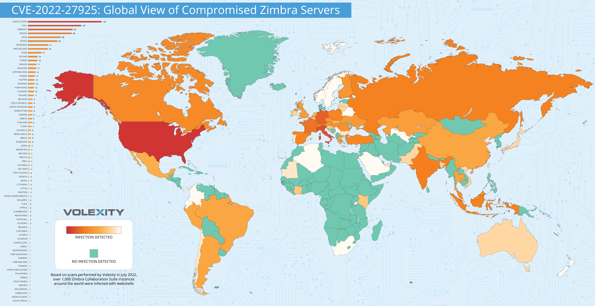
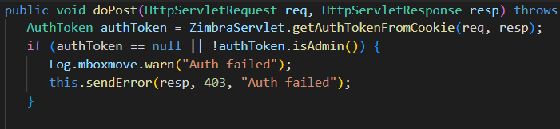

（CVE-2022-27925）Zimbra mboximport未授权RCE漏洞链
==========================================

一、漏洞简介
------------

CVE-2022-27925 是 Zimbra Collaboration Suite 的 mboximport 组件 ZIP 路径遍历漏洞：
解压 ZIP 时未校验文件名，管理员可将任意文件写入文件系统任意位置（Zimbra 用户权限）。
该漏洞最初被认为仅管理员可利用（CVSS 7.8），但 Volexity 在 2022 年 8 月 10 日披露，
攻击者找到了绕过管理员鉴权的办法——MailboxImportServlet 的 doPost 在鉴权失败后缺少
return 语句，未授权请求返回 401 的同时仍会执行文件写入，该绕过被编号为 CVE-2022-37042。

两漏洞组合后，攻击者可经默认 7071 管理端口**未授权**上传 JSP webshell，再链式提权到 root。
Volexity 报告全球 1000+ Zimbra 实例被植入后门。CISA 已将两者列入 KEV。


*图：Volexity 统计的全球被植入后门的 Zimbra 服务器分布*

二、漏洞影响
------------

-   产品：Zimbra Collaboration Suite **Network Edition**（付费版；开源版无 mboximport 端点，不受影响）
-   版本：**8.8.15 Patch 30 及更早 / 9.0.0 Patch 23 及更早**
    （修复版：8.8.15 P31 / 9.0.0 P24 修复 27925；8.8.15 P33 / 9.0.0 P26 修复 37042）
-   组件/攻击向量：7071 端口 MailboxImportServlet，ZIP 路径遍历写 `mailboxd/webapps/` 下 JSP webshell
-   前提条件：无（组合利用后无需认证）

三、复现过程
------------

### 漏洞分析

`doPost` 的问题代码逻辑形如：鉴权失败 → 返回 401 → **缺少 return** → 继续执行导入写入。
攻击者构造包含 `../../../../mailboxd/webapps/zimbraAdmin/` 路径的恶意 ZIP，
经 mboximport 解压后 JSP webshell 落到可被 Web 访问的目录，直接 getshell（Zimbra 用户），
再利用未修补的本地提权漏洞到 root。


*图：Volexity 展示的 doPost 鉴权缺陷关键代码*

### PoC（来源：https://github.com/Josexv1/CVE-2022-27925，仅限授权测试）

```bash
python exploit.py -t https://zimbra.example.com
```

运行输出示例：

```
[!] Testing URL: https://zimbra.example.com
[!] Target is up!
[!] Creating malicious ZIP path: ../../../../mailboxd/webapps/zimbraAdmin/
[!] Exploiting!
[!] Testing webshell...
```

也支持批量：`python exploit.py -l targets.txt`。

四、修复建议
------------

1.  升级到 8.8.15 P33+ / 9.0.0 P26+（同时修复 27925 与 37042）；
2.  限制 7071 管理端口仅内网可达；
3.  排查入侵：检查 `mailboxd/webapps/` 下未知 JSP 文件、异常定时任务与后门账号；
    Volexity 建议疑似被入侵的服务器按官方步骤重建。

### 附录

参考链接：

-   公开 PoC：https://github.com/Josexv1/CVE-2022-27925
-   Volexity 分析：https://www.volexity.com/blog/2022/08/10/mass-exploitation-of-unauthenticated-zimbra-rce-cve-2022-27925/
-   Rapid7 分析：https://attackerkb.com/topics/dSu4KGZiFd/cve-2022-27925/rapid7-analysis
