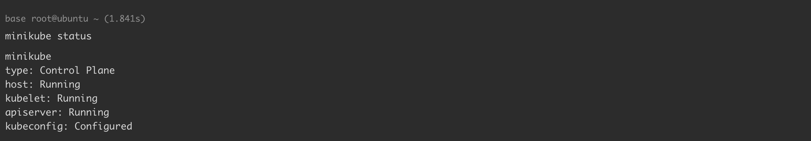
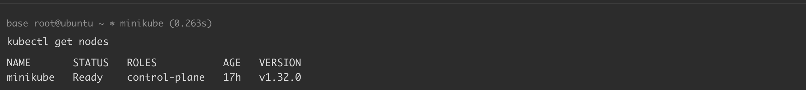
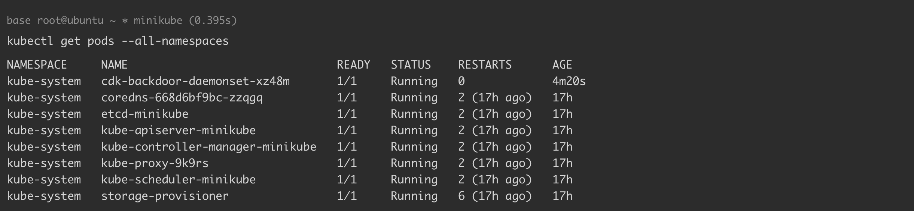

# Kubernetes + Ubuntu 18.04 漏洞环境搭建

> 图片资源校订（2026-10-04）：本篇曾被目录维护重新加入为空文件的图片，已按同篇历史 Git 引用及迁移记录恢复原始图像字节，并逐张查看像素；没有替换为其他文章截图，也没有修改图中原值。后文“未查看/仅保留引用”的旧说明描述此次校订前状态；来源截图不等于维护者复现，图片中未展示的结果仍未知。

<!-- vulwiki-editorial-rebuild:system-misc -->
## 条目范围与校订

- 本文对象：Kubernetes / Docker / containerd / Ubuntu
- 文献类型：漏洞实验环境搭建索引
- 版本、权限及部署边界：Ubuntu18.04、Docker18.09.3/19.03.6、minikube1.35.0、kubectl1.32.3/server1.32.0；需隔离实验虚机和管理权限
- 核验状态：仅重建文本校订；未执行文中代码、PoC 或扫描，未把截图或转载声明记为本站复现

### 具体结论与待核项

以下为原归档的逐项勘误与证据缺口；可由文本确定的问题已在下文订正，仍缺来源的事实保持待核。

1. frontmatter将索引中首个CVE当主漏洞，实际是多场景环境指南，应移云/容器实验环境而非单漏洞Linux条目
2. 安装脚本固定Docker但containerd.io未固定，minikube用latest、kubectl可选latest、启动未固定Kubernetes版本，无法保证复现指定旧漏洞
3. 表中配置错误/持久化技巧与CVE混列，应按场景类型区分，不能认为一套默认集群自动满足全部条件
4. 依赖外链场景与本地.resource图片；图片未查看且需验证迁移后路径完整
5. 卸载组件/改软件源/锁定旧版本脚本已有非生产警告，应补一次性虚机隔离和版本清单；未执行

### 操作风险

表中配置错误/持久化技巧与CVE混列，应按场景类型区分，不能认为一套默认集群自动满足全部条件

技术请求、代码与实验方法按原文保留；其中的破坏性动作仅限授权、可恢复的隔离环境。缺失代码、参数或版本事实不猜补。

### 来源追溯

- 原文参考链接（未重新核验）：<https://github.com/Threekiii/Awesome-POC/tree/master/%E4%BA%91%E5%AE%89%E5%85%A8%E6%BC%8F%E6%B4%9E>
- 原文参考链接（未重新核验）：<https://github.com/Xyntax/CDK/wiki/Exploit:-docker-sock-check>
- 原文参考链接（未重新核验）：<https://github.com/Xyntax/CDK/wiki/Exploit:-docker-sock-pwn>
- 原文参考链接（未重新核验）：<https://github.com/Threekiii/Awesome-POC/blob/master/%E4%BA%91%E5%AE%89%E5%85%A8%E6%BC%8F%E6%B4%9E/%E6%8C%82%E8%BD%BD%20docker.sock%20%E5%AF%BC%E8%87%B4%E5%AE%B9%E5%99%A8%E9%80%83%E9%80%B8.md>
- 原文参考链接（未重新核验）：<https://github.com/Threekiii/Awesome-POC/blob/master/%E4%BA%91%E5%AE%89%E5%85%A8%E6%BC%8F%E6%B4%9E/%E6%8C%82%E8%BD%BD%20log%20%E7%9B%AE%E5%BD%95%E5%AF%BC%E8%87%B4%E5%AE%B9%E5%99%A8%E9%80%83%E9%80%B8.md>
- 原文参考链接（未重新核验）：<https://github.com/Xyntax/CDK/wiki/Exploit:-mount-procfs>
- 原始披露 URL 未确认；既有归档来源标签保留，不能替代原始公告

### 归档技术正文

## 前置知识

本 Kubernetes + Ubuntu 18.04 漏洞环境适用于 [Awesome-POC](https://github.com/Threekiii/Awesome-POC/tree/master/%E4%BA%91%E5%AE%89%E5%85%A8%E6%BC%8F%E6%B4%9E) 中与 Kubernetes 相关的部分云安全漏洞。

各组件版本如下：

```
Docker version: 18.09.3/19.03.6
minikube version: v1.35.0
Kubectl Client Version: v1.32.3
Kubectl Server Version: v1.32.0
```

本环境可用于复现以下漏洞：

| 类别   | 漏洞名称                                                      | CDK(v1.5.5) Exploit                                                                                                                                                  | 文档链接                                                                                                                                                                                                                                                                |
| ---- | --------------------------------------------------------- | -------------------------------------------------------------------------------------------------------------------------------------------------------------------- | ------------------------------------------------------------------------------------------------------------------------------------------------------------------------------------------------------------------------------------------------------------------- |
| 容器逃逸 | 挂载 docker.sock 导致容器逃逸                                     | [docker-sock-check](https://github.com/Xyntax/CDK/wiki/Exploit:-docker-sock-check)<br>[docker-sock-pwn](https://github.com/Xyntax/CDK/wiki/Exploit:-docker-sock-pwn) | [link](https://github.com/Threekiii/Awesome-POC/blob/master/%E4%BA%91%E5%AE%89%E5%85%A8%E6%BC%8F%E6%B4%9E/%E6%8C%82%E8%BD%BD%20docker.sock%20%E5%AF%BC%E8%87%B4%E5%AE%B9%E5%99%A8%E9%80%83%E9%80%B8.md)                                                             |
| 容器逃逸 | 挂载 log 目录导致容器逃逸                                           | -                                                                                                                                                                    | [link](https://github.com/Threekiii/Awesome-POC/blob/master/%E4%BA%91%E5%AE%89%E5%85%A8%E6%BC%8F%E6%B4%9E/%E6%8C%82%E8%BD%BD%20log%20%E7%9B%AE%E5%BD%95%E5%AF%BC%E8%87%B4%E5%AE%B9%E5%99%A8%E9%80%83%E9%80%B8.md)                                                   |
| 容器逃逸 | 挂载宿主机 procfs 系统导致容器逃逸                                     | [mount-procfs](https://github.com/Xyntax/CDK/wiki/Exploit:-mount-procfs)                                                                                             | [link](https://github.com/Threekiii/Awesome-POC/blob/master/%E4%BA%91%E5%AE%89%E5%85%A8%E6%BC%8F%E6%B4%9E/%E6%8C%82%E8%BD%BD%E5%AE%BF%E4%B8%BB%E6%9C%BA%20procfs%20%E7%B3%BB%E7%BB%9F%E5%AF%BC%E8%87%B4%E5%AE%B9%E5%99%A8%E9%80%83%E9%80%B8.md)                     |
| 容器逃逸 | Containerd 漏洞导致容器逃逸 CVE-2020-15257                        | [shim-pwn](https://github.com/Xyntax/CDK/wiki/Exploit:-shim-pwn)                                                                                                     | [link](https://github.com/Threekiii/Awesome-POC/blob/master/%E4%BA%91%E5%AE%89%E5%85%A8%E6%BC%8F%E6%B4%9E/Containerd%20%E6%BC%8F%E6%B4%9E%E5%AF%BC%E8%87%B4%E5%AE%B9%E5%99%A8%E9%80%83%E9%80%B8%20CVE-2020-15257.md)                                                |
| 容器逃逸 | Docker copy 漏洞导致容器逃逸 CVE-2019-14271                       | [docker-api-pwn](https://github.com/Xyntax/CDK/wiki/Exploit:-docker-api-pwn)                                                                                         | [link](https://github.com/Threekiii/Awesome-POC/blob/master/%E4%BA%91%E5%AE%89%E5%85%A8%E6%BC%8F%E6%B4%9E/Docker%20copy%20%E6%BC%8F%E6%B4%9E%E5%AF%BC%E8%87%B4%E5%AE%B9%E5%99%A8%E9%80%83%E9%80%B8%20CVE-2019-14271.md)                                             |
| 容器逃逸 | 挂载重写 cgroup devices.allow 导致容器逃逸                          | [rewrite-cgroup-devices](https://github.com/cdk-team/CDK/wiki/Exploit:-rewrite-cgroup-devices)                                                                       | [link](https://github.com/Threekiii/Awesome-POC/blob/master/%E4%BA%91%E5%AE%89%E5%85%A8%E6%BC%8F%E6%B4%9E/%E6%8C%82%E8%BD%BD%E9%87%8D%E5%86%99%20cgroup%20devices.allow%20%E5%AF%BC%E8%87%B4%E5%AE%B9%E5%99%A8%E9%80%83%E9%80%B8.md)                                |
| 容器逃逸 | Linux 内核 cgroups v1 逻辑错误导致容器逃逸 CVE-2022-0492              | [mount-cgroup](https://github.com/Xyntax/CDK/wiki/Exploit:-mount-cgroup)                                                                                             | [link](https://github.com/Threekiii/Awesome-POC/blob/master/%E4%BA%91%E5%AE%89%E5%85%A8%E6%BC%8F%E6%B4%9E/Linux%20%E5%86%85%E6%A0%B8%20cgroup%20v1%20%E9%80%BB%E8%BE%91%E9%94%99%E8%AF%AF%E5%AF%BC%E8%87%B4%E5%AE%B9%E5%99%A8%E9%80%83%E9%80%B8%20CVE-2022-0492.md) |
| 容器逃逸 | Kubernetes privileged 特权容器导致容器逃逸                          | [mount-disk](https://github.com/Xyntax/CDK/wiki/Exploit:-mount-disk)                                                                                                 | [link](https://github.com/Threekiii/Awesome-POC/blob/master/%E4%BA%91%E5%AE%89%E5%85%A8%E6%BC%8F%E6%B4%9E/Kubernetes%20privileged%20%E7%89%B9%E6%9D%83%E5%AE%B9%E5%99%A8%E5%AF%BC%E8%87%B4%E5%AE%B9%E5%99%A8%E9%80%83%E9%80%B8.md)                                  |
| 持久化  | Kubernetes 部署 Shadow API Server                           | [k8s-shadow-apiserver](https://github.com/cdk-team/CDK/wiki/Exploit:-k8s-shadow-apiserver)                                                                           | [link](https://github.com/Threekiii/Awesome-POC/blob/master/%E4%BA%91%E5%AE%89%E5%85%A8%E6%BC%8F%E6%B4%9E/Kubernetes%20%E9%83%A8%E7%BD%B2%20Shadow%20API%20Server.md)                                                                                               |
| 持久化  | Kubernetes 部署后门 CronJob                                   | [k8s-cronjob](https://github.com/cdk-team/CDK/wiki/Exploit:-k8s-cronjob)                                                                                             | [link](https://github.com/Threekiii/Awesome-POC/blob/master/%E4%BA%91%E5%AE%89%E5%85%A8%E6%BC%8F%E6%B4%9E/Kubernetes%20%E9%83%A8%E7%BD%B2%E5%90%8E%E9%97%A8%20CronJob.md)                                                                                           |
| 持久化  | Kubernetes 部署后门 Daemonset                                 | [k8s-backdoor-daemonset](https://github.com/cdk-team/CDK/wiki/Exploit:-k8s-backdoor-daemonset)                                                                       | [link](https://github.com/Threekiii/Awesome-POC/blob/master/%E4%BA%91%E5%AE%89%E5%85%A8%E6%BC%8F%E6%B4%9E/Kubernetes%20%E9%83%A8%E7%BD%B2%E5%90%8E%E9%97%A8%20Daemonset.md)                                                                                         |
| 权限提升 | Kubernetes 利用 nodes proxy 子资源进行权限提升                       | -                                                                                                                                                                    | [link](https://github.com/Threekiii/Awesome-POC/blob/master/%E4%BA%91%E5%AE%89%E5%85%A8%E6%BC%8F%E6%B4%9E/Kubernetes%20%E5%88%A9%E7%94%A8%20nodes%20proxy%20%E5%AD%90%E8%B5%84%E6%BA%90%E8%BF%9B%E8%A1%8C%E6%9D%83%E9%99%90%E6%8F%90%E5%8D%87.md)                   |
| 命令执行 | Docker build 漏洞导致命令执行 CVE-2019-13139                      | -                                                                                                                                                                    | [link](https://github.com/Threekiii/Awesome-POC/blob/master/%E4%BA%91%E5%AE%89%E5%85%A8%E6%BC%8F%E6%B4%9E/Docker%20build%20%E6%BC%8F%E6%B4%9E%E5%AF%BC%E8%87%B4%E5%91%BD%E4%BB%A4%E6%89%A7%E8%A1%8C%20CVE-2019-13139.md)                                            |
| 命令执行 | Docker daemon api 未授权访问漏洞 RCE                             | -                                                                                                                                                                    | [link](https://github.com/Threekiii/Awesome-POC/blob/master/%E4%BA%91%E5%AE%89%E5%85%A8%E6%BC%8F%E6%B4%9E/Docker%20daemon%20api%20%E6%9C%AA%E6%8E%88%E6%9D%83%E8%AE%BF%E9%97%AE%E6%BC%8F%E6%B4%9E%20RCE.md)                                                         |
| 命令执行 | Kubernetes Ingress-nginx admission 远程代码执行漏洞 CVE-2025-1974 | -                                                                                                                                                                    | [link](https://github.com/Threekiii/Awesome-POC/blob/master/%E4%BA%91%E5%AE%89%E5%85%A8%E6%BC%8F%E6%B4%9E/Kubernetes%20Ingress-nginx%20admission%20%E8%BF%9C%E7%A8%8B%E4%BB%A3%E7%A0%81%E6%89%A7%E8%A1%8C%E6%BC%8F%E6%B4%9E%20CVE-2025-1974.md)                     |
| 命令执行 | Kubernetes API Server 未授权命令执行                             | -                                                                                                                                                                    | [link](https://github.com/Threekiii/Awesome-POC/blob/master/%E4%BA%91%E5%AE%89%E5%85%A8%E6%BC%8F%E6%B4%9E/Kubernetes%20API%20Server%20%E6%9C%AA%E6%8E%88%E6%9D%83%E5%91%BD%E4%BB%A4%E6%89%A7%E8%A1%8C.md)                                                           |
| 信息窃取 | Kubernetes etcd 未授权访问                                     | -                                                                                                                                                                    | [link](https://github.com/Threekiii/Awesome-POC/blob/master/%E4%BA%91%E5%AE%89%E5%85%A8%E6%BC%8F%E6%B4%9E/Kubernetes%20etcd%20%E6%9C%AA%E6%8E%88%E6%9D%83%E8%AE%BF%E9%97%AE.md)                                                                                     |

## 环境搭建

### Docker 18.09.3

> 注意，此版本是一个较老的版本（发布于 2019 年 3 月），它存在多个已知的安全漏洞。**安装脚本仅限于漏洞环境，请勿用于生产环境。**

安装脚本 `install_docker_18.09.03.sh`：

```
#!/bin/bash

set -e

echo "🔧 卸载旧版本 Docker（如果有）..."
sudo apt remove -y docker docker-engine docker.io containerd runc || true

echo "🔓 解除版本锁定 (如果有)..."
sudo apt-mark unhold docker-ce docker-ce-cli containerd.io || true

echo "🧹 删除错误的 Docker 源..."
sudo rm -f /etc/apt/sources.list.d/docker.list || true
sudo sed -i '/download.docker.com/d' /etc/apt/sources.list

echo "🌐 添加清华大学 Docker 镜像源 GPG key..."
wget -qO - https://mirrors.tuna.tsinghua.edu.cn/docker-ce/linux/ubuntu/gpg | sudo apt-key add -

echo "📚 添加清华大学 Docker 镜像源..."
echo "deb [arch=amd64] https://mirrors.tuna.tsinghua.edu.cn/docker-ce/linux/ubuntu bionic stable" \
  | sudo tee /etc/apt/sources.list.d/docker.list

echo "📦 更新软件包索引..."
sudo apt update

echo "🔍 查找 Docker 18.09.3..."
VERSION_STRING=$(apt-cache madison docker-ce | grep 18.09.3 | head -n1 | awk '{print $3}')
if [ -z "$VERSION_STRING" ]; then
  echo "❌ 找不到 Docker 18.09.3"
  exit 1
fi
echo "✅ 找到版本：$VERSION_STRING"

echo "⬇️ 安装 Docker 版本 $VERSION_STRING ..."
sudo apt install -y docker-ce=$VERSION_STRING docker-ce-cli=$VERSION_STRING containerd.io

echo "📌 锁定版本，防止自动升级..."
sudo apt-mark hold docker-ce docker-ce-cli containerd.io

echo "✅ 安装完成，当前版本："
docker --version
```

> 其他版本 Docker 修改 `18.09.3` 版本号即可。

### Kubectl v1.32.3

安装最新版本：

```
curl -LO "https://dl.k8s.io/release/$(curl -L -s https://dl.k8s.io/release/stable.txt)/bin/linux/amd64/kubectl"
```

或直接安装 v1.32.3：

```
curl -LO "https://dl.k8s.io/release/v1.32.3/bin/linux/amd64/kubectl"
```

将下载的 `kubectl` 安装到系统路径 `/usr/local/bin/`：

```
sudo install -o root -g root -m 0755 kubectl /usr/local/bin/kubectl 
```

### Minikube v1.35.0

安装最新版本：

```
curl -LO https://storage.googleapis.com/minikube/releases/latest/minikube-linux-amd64
```

将下载的 `minikube` 安装到系统路径 `/usr/local/bin/`：

```
sudo install minikube-linux-amd64 /usr/local/bin/minikube
```

## 环境启动

### 启动 Minikube 集群

```
minikube start --force
```

由于网络原因，国内可以拉取 `kicbase`，自定义基础镜像源启动 minikube：

```
docker pull registry.cn-hangzhou.aliyuncs.com/google_containers/kicbase:v0.0.46
minikube start --force --base-image='registry.cn-hangzhou.aliyuncs.com/google_containers/kicbase:v0.0.46'
```

### 查看 Minikube 集群状态

```
minikube status
```



### 查看集群节点状态

```
kubectl get nodes
```



### 查看所有 Pod 状态

```
kubectl get pods --all-namespaces
```



### 停止 Minikube 集群

```
minikube stop
```

### 删除 Minikube 集群

```
minikube delete
```


---

> 来源：Threekiii/Awesome-POC
