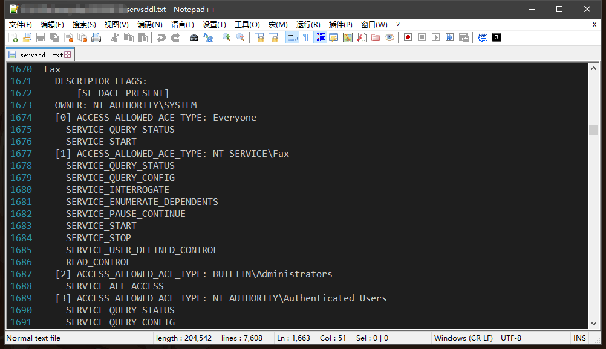
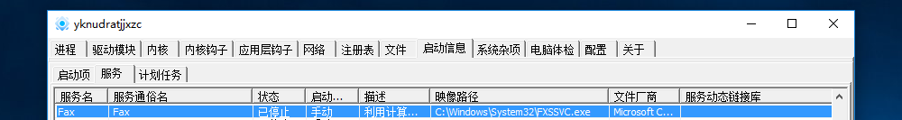
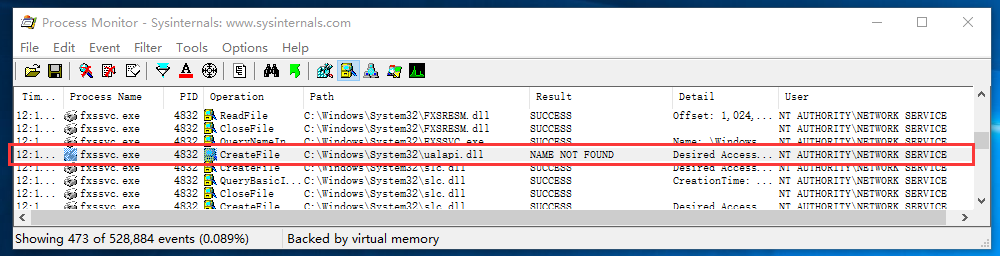
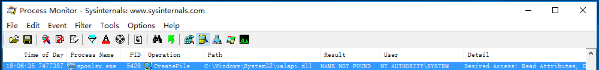
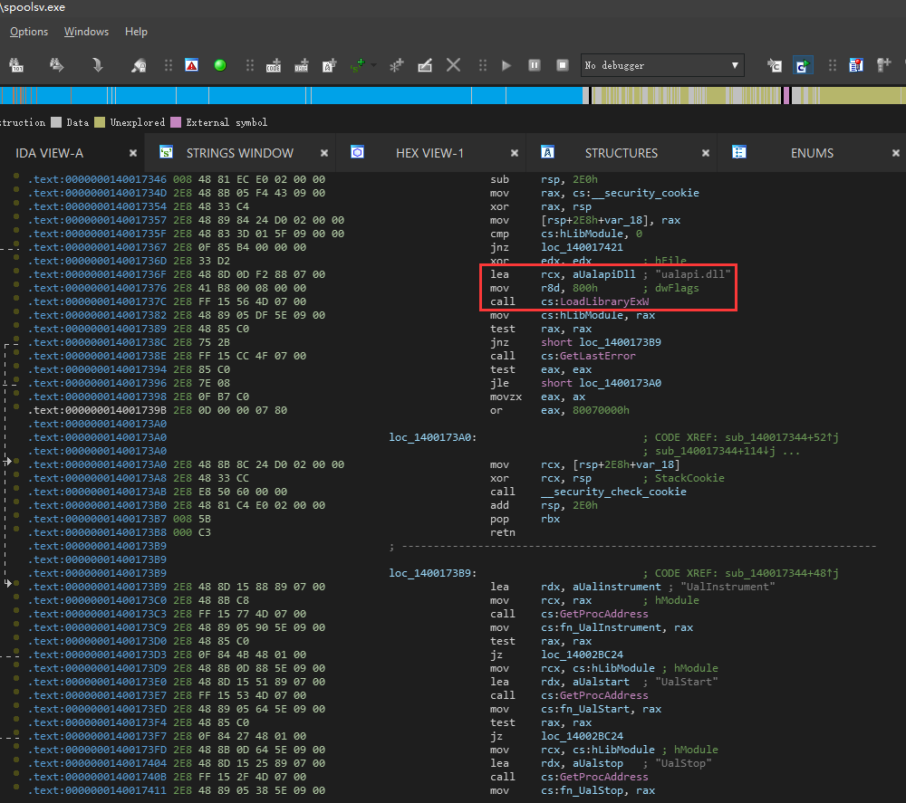
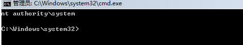
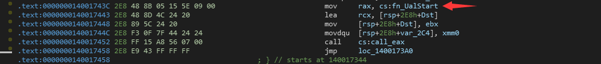

# CVE-2020-1337

<!-- vulwiki-editorial-rebuild:system-misc -->
## 条目范围与校订

- 本文对象：Windows Print Spooler / Fax服务
- 文献类型：补丁绕过及DLL劫持分析
- 版本、权限及部署边界：本地普通用户；Windows10未指明构建，Spooler可用，目录junction及可启动Fax服务权限条件
- 核验状态：仅重建文本校订；未执行文中代码、PoC 或扫描，未把截图或转载声明记为本站复现

### 具体结论与待核项

以下为原归档的逐项勘误与证据缺口；可由文本确定的问题已在下文订正，仍缺来源的事实保持待核。

1. 原理涉及先验证路径后junction替换，正文myfolder与mytarg5命名不同且切换时序不完整，应恢复一致路径与步骤
2. 补丁修好后已有恶意DLL持续存在属于入侵持久化/清理问题，不代表漏洞补丁无效或所有系统永久后门
3. PowerShell与ACL片段有多余反引号；主要结果依赖未视检图片，未给完整测试构建和官方修复矩阵
4. 检测仅看注册表文件端口并不足以证明系统清洁，需分开漏洞整改与入侵排查；不能将扫描建议视为审阅已执行
5. 原始Windows Internals、faxhell和样例源码链接有溯源价值，未固定提交；与1048保留前后关联

### 操作风险

补丁修好后已有恶意DLL持续存在属于入侵持久化/清理问题，不代表漏洞补丁无效或所有系统永久后门

技术请求、代码与实验方法按原文保留；其中的破坏性动作仅限授权、可恢复的隔离环境。缺失代码、参数或版本事实不猜补。

### 来源追溯

- 原文参考链接（未重新核验）：<https://github.com/math1as/cve-2020-1337-exploit>
- 原文参考链接（未重新核验）：<https://github.com/ionescu007/faxhell>
- 原文参考链接（未重新核验）：<https://mp.weixin.qq.com/s/LLzIlKrrfpJuk6CGBRZMvw>
- 原文参考链接（未重新核验）：<https://windows-internals.com/faxing-your-way-to-system/>
- 原文参考链接（未重新核验）：<https://windows-internals.com/printdemon-cve-2020-1048/>
- 原始披露 URL 未确认；既有归档来源标签保留，不能替代原始公告

### 归档技术正文

## CVE-2020-1337

经过补丁后，紧随CVE-2020-1048其后的CVE-2020-1337又有姿势可以绕检查

从github上获取样本分析

https://github.com/math1as/cve-2020-1337-exploit

```
powershell -ep bypass ``-F` `C:\CVE-2020-1337-exploit-master\exploit.ps1
```


在查看了公布的脚本文件可以发现

它的命令也是非常的简单，在执行上述过程中添加了一条命令创建一个系统目录软联接

```
cmd /c mklink /J c:\users\test\mytarg5 C:\Windows\system32
```


无论是AddPort还是修复后的XcvData函数进行检查时，都是判断当前用户是否具有对目标路径的访问权限的。
将port name指向 c:\users\test\myfolder\xxx.dll ，通过检查后，再将mytarg5作为一个软链接重定向到目标的系统路径中，即可完成对补丁的绕过。

创建一个软连接，将文件打印位置改为 c:\users\test\mytarg5，便会在C:\Windows\system32下成功创建ualapi.dll


## 为什么是ualapi.dll 

首先能够将这位置释放文件所以我们就要想尽办法利用上，显然容易受到dll劫持尝试攻击的服务第一个突破口，
运行Process Monitor，启动所有服务进行尝试，不过我们要在做的时候需要一些限制，我们现在想提高特权。因此，我们需要尚未启动的服务或者寻找一个可以被标准用户停止的服务。
启动服务通常需要管理权限，这不是我们想要的，通过accesschk工具我们可以很方便的获取所有服务的权限。
accesschk.exe -c * -L > servsddl.txt
servsddl.txt中会记录所有服务输出
在FAX服务中我们发现了

```
 ``[0] ACCESS_ALLOWED_ACE_TYPE: Everyone`` ``SERVICE_QUERY_STATUS`` ``SERVICE_START
```


服务中我们可以看到它



现在让我们启动FAX服务，并通过ProcessMonitor监控他



在启动打印这个服务时，他会尝试寻找ualapi.dll

所以我门将这个dll放置到这个位置，然后惊喜的发现，启动spoolsv时会发现也会寻找这个dll



经过对比他们都有相同的寻找ualapi.dll的代码，在下面的IDA中可以看到 ，该服务使用GetProcAddress查找ualapi.dll一些导出




既然能够加载我们先前释放的动态库，dllmain中就可以执行我们想要执行的代码，从github上拿到的示例运行（运行在windows10系统上），他释放了一个PE在system32下，代码也非常简单的运行whoami查看权限。


执行后权限是system，这就代表你能做很多事情。



正当我想着如何利用dll被加载起来后，惊喜的在后面的代码中发现，在spoolsv.exe中也有调用导出函数，这只需要我们稍微构造一下，就能制造一个永久后门，即使补丁修正后它依然存在。



## 如何避免 


如果你不幸被该漏洞利用了，由于即使补丁修正后它依然存在，所以你需要在PowerShell中扫描所有基于文件的端口，查看HKEY_LOCAL_MACHINE\SOFTWARE\Microsoft\Windows NT\CurrentVersion\Ports其中包含文件路径的任何端口，尤其是以.DLL或扩展名结尾的端口。

这是一个非常容易利用的漏洞，你完全可以将一份后门代码构造出现在spoolsv.exe的调用中。

##  参考文献

https://github.com/math1as/cve-2020-1337-exploit
https://github.com/ionescu007/faxhell
https://mp.weixin.qq.com/s/LLzIlKrrfpJuk6CGBRZMvw
https://windows-internals.com/faxing-your-way-to-system/
https://windows-internals.com/printdemon-cve-2020-1048/


---

> 来源：白阁文库 BaizeSec/bylibrary
