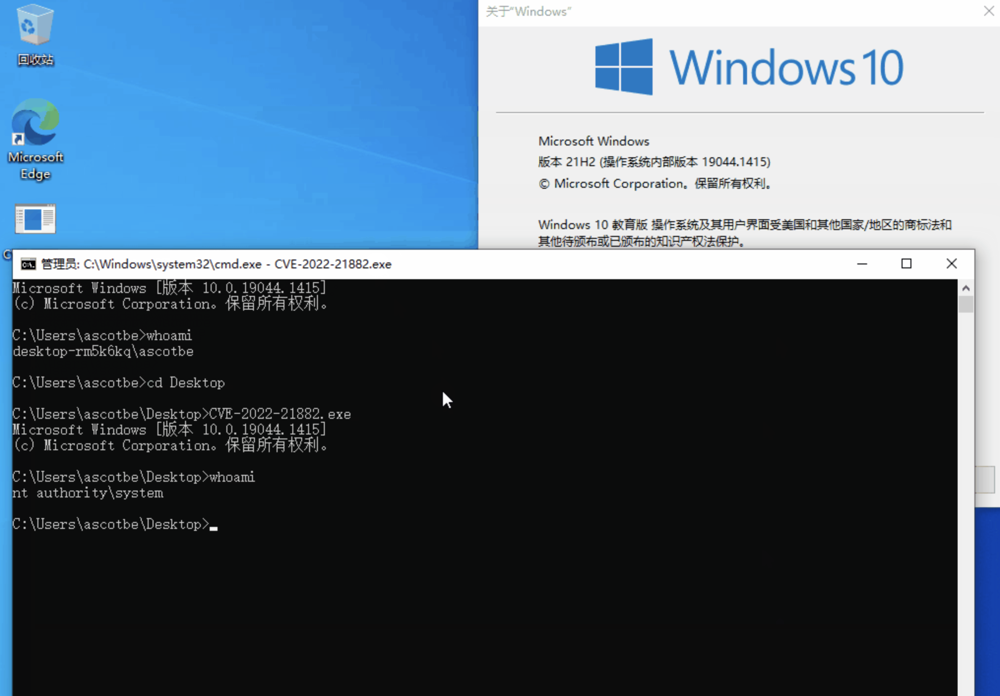

# Windows-Win32k-内核提权漏洞-CVE-2022-21882

<!-- vulwiki-editorial-rebuild:system-misc -->
## 条目范围与校订

- 本文对象：Windows Win32k
- 文献类型：漏洞根因摘要与PoC占位
- 版本、权限及部署边界：本地GUI回调、KernelCallbackTable/NtUserConsoleControl；列Windows10/11/Server分支，具体构建未给
- 核验状态：仅重建文本校订；未执行文中代码、PoC 或扫描，未把截图或转载声明记为本站复现

### 具体结论与待核项

以下为原归档的逐项勘误与证据缺口；可由文本确定的问题已在下文订正，仍缺来源的事实保持待核。

1. 补丁绕过1732与新CVE21882应独立关联，类型混淆pExtraBytes指针/偏移解释清楚
2. 仅说下载PoC运行却无下载链接/源码，复现完全依赖一张图，无法独立复现
3. 影响表Windows11/Server行版本架构空白，缺补丁KB及官方公告/原研究来源
4. KernelCallbackTable符号命名与实际用户回调/内核调用需对照源码确认；仅摘要不可当完整利用链
5. 文件源只有汇编库标记，截图未视检，优先补可追溯来源

### 操作风险

原文技术操作的实际副作用未复现核验；按其请求/代码评估状态变更、凭据暴露和业务影响

技术请求、代码与实验方法按原文保留；其中的破坏性动作仅限授权、可恢复的隔离环境。缺失代码、参数或版本事实不猜补。

### 来源追溯

- 原文参考链接（未重新核验）：<https://github.com/Threekiii/Vulnerability-Wiki>
- 原始披露 URL 未确认；既有归档来源标签保留，不能替代原始公告

### 归档技术正文

## 漏洞描述

CVE-2022-21882是对CVE-2021-1732漏洞的绕过，属于win32k驱动程序中的一个类型混淆漏洞。

攻击者可以在user_mode调用相关的GUI API进行内核调用，如xxxMenuWindowProc、xxxSBWndProc、xxxSwitchWndProc、xxxTooltipWndProc等，这些内核函数会触发回调xxxClientAllocWindowClassExtraBytes。攻击者可以通过hook KernelCallbackTable 中 xxxClientAllocWindowClassExtraBytes 拦截该回调，并使用 NtUserConsoleControl 方法设置 tagWNDK 对象的 ConsoleWindow 标志，从而修改窗口类型。

最终回调后，系统不检查窗口类型是否发生变化，由于类型混淆而引用了错误的数据。flag修改前后的区别在于，在设置flag之前，系统认为tagWNDK.pExtraBytes保存了一个user_mode指针；flag设置后，系统认为tagWNDK.pExtraBytes是内核桌面堆的偏移量，攻击者可以控制这个偏移量，从而导致越界R&W。

## 漏洞影响

| **Product**         | **CPU Architecture** | **Version** |
| ------------------- | -------------------- | ----------- |
| Windows 10          | x86/x64/ARM64        | 1809        |
| Windows 10          | x86/x64/ARM64        | 1909        |
| Windows 10          | x86/x64/ARM64        | 20H2        |
| Windows 10          | x86/x64/ARM64        | 21H1        |
| Windows 10          | x86/x64/ARM64        | 21H2        |
| Windows 11          | x64/ARM64            |             |
| Windows Server 2019 |                      |             |
| Windows Server 2022 |                      |             |
| Windows Server      |                      | 20H2        |

## 漏洞复现

下载POC文件, 在Windows中运行

---

> 来源：Threekiii/Vulnerability-Wiki（https://github.com/Threekiii/Vulnerability-Wiki）
