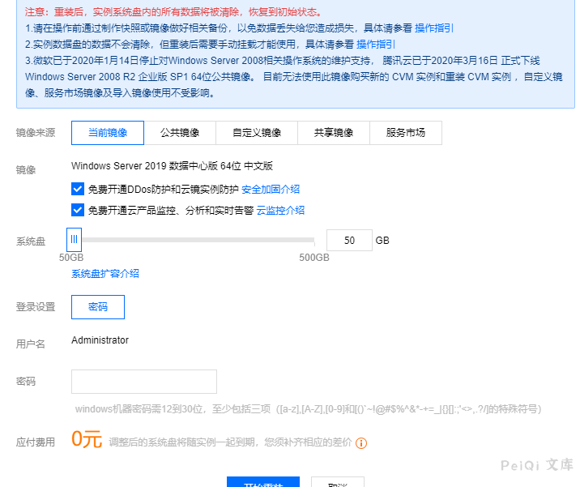
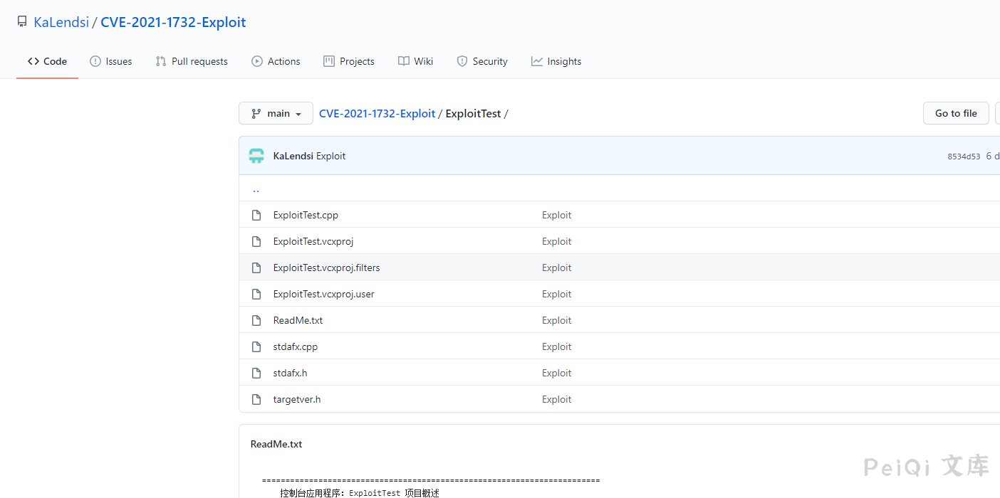
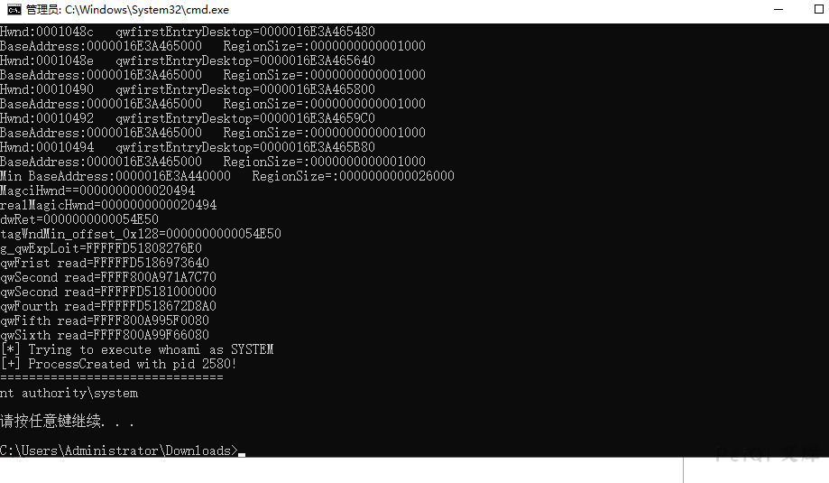

# Windows-Win32k-本地提权漏洞-CVE-2021-1732

<!-- vulwiki-editorial-rebuild:system-misc -->
## 条目范围与校订

- 本文对象：Windows Win32k
- 文献类型：Win32k工具复现转载
- 版本、权限及部署边界：腾讯云Server2019示例，影响列表多分支；无精确构建/起始用户身份
- 核验状态：仅重建文本校订；未执行文中代码、PoC 或扫描，未把截图或转载声明记为本站复现

### 具体结论与待核项

以下为原归档的逐项勘误与证据缺口；可由文本确定的问题已在下文订正，仍缺来源的事实保持待核。

1. 与不带连字符《Windows Win32k 本地提权漏洞 CVE-2021-1732》核心描述、腾讯云步骤、同样错命令1723高度一致，属于转载同文；本篇补文本版本表可保留主稿
2. frontmatter version只取第一行Server20H2，不代表完整范围；CVE-2021-1723命令应纠正为1732工具名
3. 缺MSRC和修复KB/测试补丁；截图未视检，不能单凭上传运行称已证明低权到SYSTEM
4. 保留源KaLendsi仓库及蓝屏警告，去免杀宣传；整合时追溯原微信作者并保留版本表

### 操作风险

原文技术操作的实际副作用未复现核验；按其请求/代码评估状态变更、凭据暴露和业务影响

技术请求、代码与实验方法按原文保留；其中的破坏性动作仅限授权、可恢复的隔离环境。缺失代码、参数或版本事实不猜补。

### 来源追溯

- 原文参考链接（未重新核验）：<https://github.com/KaLendsi/CVE-2021-1732-Exploit**](https://github.com/KaLendsi/CVE-2021-1732-Exploit>
- 原文参考链接（未重新核验）：<https://github.com/Threekiii/Vulnerability-Wiki>
- 原始披露 URL 未确认；既有归档来源标签保留，不能替代原始公告

### 归档技术正文

## 漏洞描述

2021年2月10日，微软每月的例行补丁包中修复了一个Windows系统本地提权漏洞，本地攻击者可以利用此漏洞提升到system权限，据称此漏洞被用于定向攻击活动。

奇安信息威胁情报中心红雨滴团队第一时间跟进该漏洞并确认其可用性，漏洞相应的利用程序已经公开，有可能被改造来执行大范围的攻击，已经构成现实的威胁。目前微软已经修补了此漏洞，奇安信息威胁情报中心提醒相关用户及时安装2月补丁。

## 漏洞影响

```
Windows Server, version 20H2 (Server Core Installation) 
Windows 10 Version 20H2 for ARM64-based Systems 
Windows 10 Version 20H2 for 32-bit Systems 
Windows 10 Version 20H2 for x64-based Systems 
Windows Server, version 2004 (Server Core installation) 
Windows 10 Version 2004 for x64-based Systems 
Windows 10 Version 2004 for ARM64-based Systems 
Windows 10 Version 2004 for 32-bit Systems 
Windows Server, version 1909 (Server Core installation) 
Windows 10 Version 1909 for ARM64-based Systems 
Windows 10 Version 1909 for x64-based Systems 
Windows 10 Version 1909 for 32-bit Systems 
Windows Server 2019 (Server Core installation) 
Windows Server 2019 
Windows 10 Version 1809 for ARM64-based Systems 
Windows 10 Version 1809 for x64-based Systems 
Windows 10 Version 1809 for 32-bit Systems 
Windows 10 Version 1803 for ARM64-based Systems 
Windows 10 Version 1803 for x64-based Systems
```

## 漏洞复现

这里使用腾讯云的Windows 2019 Server 搭建环境




目前EXP已经公开了

**Github公开地址:**[**https://github.com/KaLendsi/CVE-2021-1732-Exploit**](https://github.com/KaLendsi/CVE-2021-1732-Exploit)

**厉害的师傅可以做一下免杀，现在一上传就会被杀了**




上传到服务器运行, 此时是以**System权限**运行

注意有蓝屏概率

```
CVE-2021-1723 whoami
```




---

> 来源：Threekiii/Vulnerability-Wiki（https://github.com/Threekiii/Vulnerability-Wiki）
