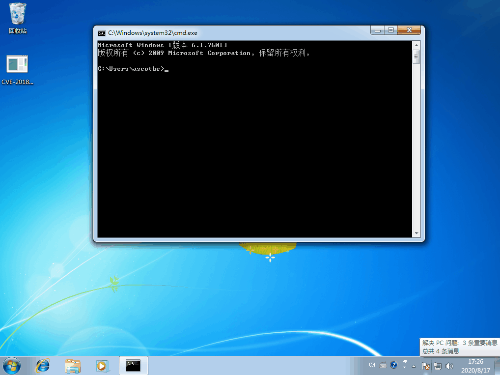

# （CVE-2018-8120）Windows本地提权漏洞

<!-- vulwiki-editorial-rebuild:system-misc -->
## 条目范围与校订

- 本文对象：Windows Win32k SetImeInfoEx
- 文献类型：Kernelhub编译与演示索引
- 版本、权限及部署边界：Windows7 SP1/Server2008；样例Win7x64；VS2019需额外v120工具集，x86移除汇编文件
- 核验状态：仅重建文本校订；未执行文中代码、PoC 或扫描，未把截图或转载声明记为本站复现

### 具体结论与待核项

以下为原归档的逐项勘误与证据缺口；可由文本确定的问题已在下文订正，仍缺来源的事实保持待核。

1. 本地空指针内核提权类型明确，非远程；表将Itanium/x64放Edition应改架构字段
2. 只有GIF演示，缺命令/初始身份/具体build和补丁状态，Tested勾不等于所有版本验证
3. MSRC与Kernelhub源码链接有来源，需固定提交和具体修复KB；VS2019不默认含v120，安装要求应列
4. 标题多余.md，GIF未视检，作为工具索引而非完整根因文章保留

### 操作风险

原文技术操作的实际副作用未复现核验；按其请求/代码评估状态变更、凭据暴露和业务影响

技术请求、代码与实验方法按原文保留；其中的破坏性动作仅限授权、可恢复的隔离环境。缺失代码、参数或版本事实不猜补。

### 来源追溯

- 原文参考链接（未重新核验）：<https://portal.msrc.microsoft.com/en-US/security-guidance/advisory/CVE-2018-8120>
- 原文参考链接（未重新核验）：<https://github.com/Ascotbe/Kernelhub/tree/master/CVE-2018-8120>
- 原始披露 URL 未确认；既有归档来源标签保留，不能替代原始公告

### 归档技术正文

#### 描述

Microsoft Windows中存在提权漏洞，该漏洞源于Win32k组件NtUserSetImeInfoEx函数内部SetImeInfoEx函数的没有正确的处理内存中的空指针对象。攻击者可利用该空指针漏洞在内核模式下以提升的权限执行任意代码。

#### 影响版本

| Product             | Version | Update | Edition | Tested |
| ------------------- | ------- | ------ | ------- | ------ |
| Windows 7           | -       | SP1    |         | ✔️      |
| Windows Server 2008 | -       | SP2    |         |        |
| Windows Server 2008 | R2      | SP1    | itanium |        |
| Windows Server 2008 | R2      | SP1    | x64     | ✔️      |

#### 修复补丁

```
https://portal.msrc.microsoft.com/en-US/security-guidance/advisory/CVE-2018-8120
```

#### 利用方式

编译环境

- VS2019（V120）X64 Release
- VS2019（V120）X32 Release，需要移除shellcode.asm这个文件后编译

当前测试系统Windows 7 x64

[](.resource/CVE-2018-8120Windows%E6%9C%AC%E5%9C%B0%E6%8F%90%E6%9D%83%E6%BC%8F%E6%B4%9E/media/CVE-2018-8120_win7_x64.gif)（原外链图片暂未找回，点击查看已存本地图；原链接：` https://github.com/Ascotbe/Random-img/blob/master/WindowsKernelExploits/CVE-2018-8120_win7_x64.gif?raw=true `）


> https://github.com/Ascotbe/Kernelhub/tree/master/CVE-2018-8120