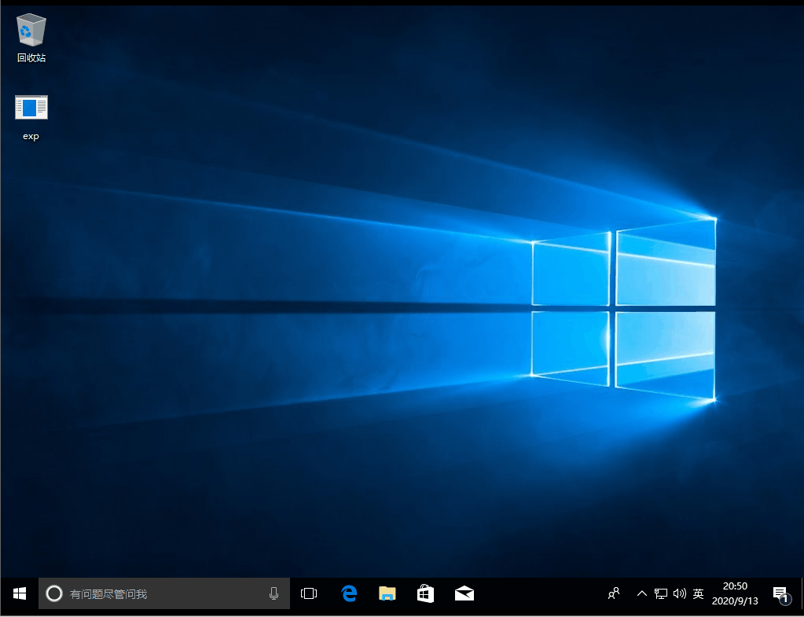

# （CVE-2018-8453）Windows 本地提权漏洞

<!-- vulwiki-editorial-rebuild:system-misc -->
## 条目范围与校订

- 本文对象：Windows Win32k
- 文献类型：Kernelhub编译与演示索引
- 版本、权限及部署边界：本地低权；测试Windows10 1709x64，VS2019/v140 Release；其他范围仅清单
- 核验状态：仅重建文本校订；未执行文中代码、PoC 或扫描，未把截图或转载声明记为本站复现

### 具体结论与待核项

以下为原归档的逐项勘误与证据缺口；可由文本确定的问题已在下文订正，仍缺来源的事实保持待核。

1. 实际测试只有1709x64，受影响矩阵不能视为全部已测；Server2016 1709/1803应核产品命名/分支
2. 根因只有通用内存对象描述，缺具体函数/类型，完整技术依赖ze0r外链源码，需固定提交
3. MSRC修复链接存在但无对应KB/测试构建及运行参数/权限前后证明
4. VS2019需兼容v140工具集，标题.md噪声清理，GIF未视检

### 操作风险

原文技术操作的实际副作用未复现核验；按其请求/代码评估状态变更、凭据暴露和业务影响

技术请求、代码与实验方法按原文保留；其中的破坏性动作仅限授权、可恢复的隔离环境。缺失代码、参数或版本事实不猜补。

### 来源追溯

- 原文参考链接（未重新核验）：<https://portal.msrc.microsoft.com/en-US/security-guidance/advisory/CVE-2018-8453>
- 原文参考链接（未重新核验）：<https://github.com/ze0r/cve-2018-8453-exp>
- 原文参考链接（未重新核验）：<https://github.com/Ascotbe/Kernelhub/tree/master/CVE-2018-8453>
- 原始披露 URL 未确认；既有归档来源标签保留，不能替代原始公告

### 归档技术正文

#### 描述

Microsoft Windows中存在提权漏洞，该漏洞源于Win32k组件没有正确的处理内存对象。本地攻击者可通过登录系统并运行特制的应用程序，利用该漏洞在内核模式下以提升的权限执行代码。

#### 影响版本

| Product             | Version | Update | Edition | Tested |
| ------------------- | ------- | ------ | ------- | ------ |
| Windows 10          | -       |        |         |        |
| Windows 10          | 1607    |        |         |        |
| Windows 10          | 1703    |        |         |        |
| Windows 10          | 1709    |        |         | ✔️      |
| Windows 10          | 1803    |        |         |        |
| Windows 10          | 1809    |        |         |        |
| Windows 7           | -       | SP1    |         |        |
| Windows 8.1         |         |        |         |        |
| Windows Rt 8.1      | -       |        |         |        |
| Windows Server 2008 | -       | SP2    |         |        |
| Windows Server 2008 | R2      | SP1    |         |        |
| Windows Server 2012 | -       |        |         |        |
| Windows Server 2012 | R2      |        |         |        |
| Windows Server 2016 | -       |        |         |        |
| Windows Server 2016 | 1709    |        |         |        |
| Windows Server 2016 | 1803    |        |         |        |
| Windows Server 2019 | -       |        |         |        |

#### 修复补丁

```
https://portal.msrc.microsoft.com/en-US/security-guidance/advisory/CVE-2018-8453
```

#### 利用方式

编译环境

- VS2019 （V140）X64 Release

测试系统Windows 10 1709 x64

[](.resource/CVE-2018-8453Windows%E6%9C%AC%E5%9C%B0%E6%8F%90%E6%9D%83%E6%BC%8F%E6%B4%9E/media/CVE-2018-8453_win10_1709_x64.gif)（原外链图片暂未找回，点击查看已存本地图；原链接：` https://github.com/Ascotbe/Random-img/raw/master/WindowsKernelExploits/CVE-2018-8453_win10_1709_x64.gif?raw=true `）

#### 项目来源

- [ze0r](https://github.com/ze0r/cve-2018-8453-exp)

> https://github.com/Ascotbe/Kernelhub/tree/master/CVE-2018-8453