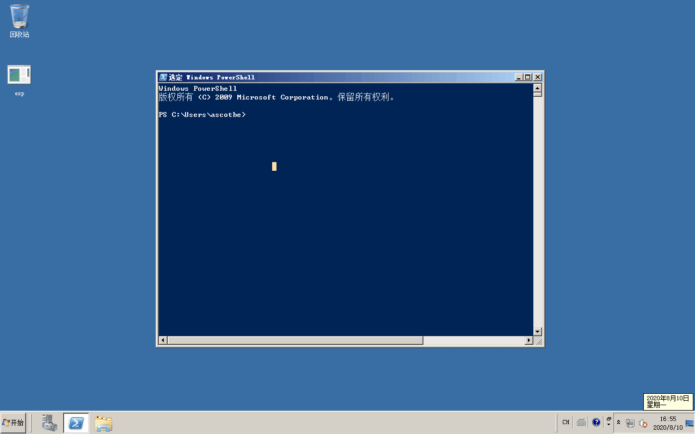
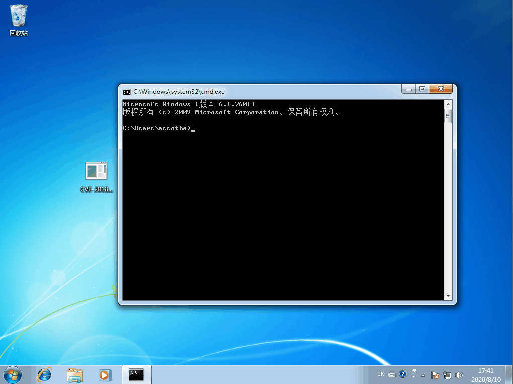

# （CVE-2018-8639）Windows 本地提权漏洞

<!-- vulwiki-editorial-rebuild:system-misc -->
## 条目范围与校订

- 本文对象：Windows Win32k 窗口类对象
- 文献类型：Kernelhub双平台编译索引
- 版本、权限及部署边界：称Server2008x64与Win7x64通过；分别v140Release/v120Debug；具体SP/build未列
- 核验状态：仅重建文本校订；未执行文中代码、PoC 或扫描，未把截图或转载声明记为本站复现

### 具体结论与待核项

以下为原归档的逐项勘误与证据缺口；可由文本确定的问题已在下文订正，仍缺来源的事实保持待核。

1. 主因写Double-free可作为待核类型，但无技术函数或独立证据，须引用原研究
2. 表Tested全空却正文两个系统测试成功，需统一测试状态并精确Server2008/R2/SP
3. 两种不同编译配置/样例需映射具体源目录/提交，Debug运行库依赖与微软下载包作用应说明
4. MSRC与Kernelhub入口存在，缺KB、命令/前后身份；两GIF未视检，不据此认定成功
5. 影响表架构在Edition混填且SP遗漏，标题.md可清理

### 操作风险

原文技术操作的实际副作用未复现核验；按其请求/代码评估状态变更、凭据暴露和业务影响

技术请求、代码与实验方法按原文保留；其中的破坏性动作仅限授权、可恢复的隔离环境。缺失代码、参数或版本事实不猜补。

### 来源追溯

- 原文参考链接（未重新核验）：<https://portal.msrc.microsoft.com/en-US/security-guidance/advisory/CVE-2018-8639>
- 原文参考链接（未重新核验）：<https://www.microsoft.com/zh-cn/download/confirmation.aspx?id=40770>
- 原文参考链接（未重新核验）：<https://github.com/Ascotbe/Kernelhub/tree/master/CVE-2018-8639>
- 原始披露 URL 未确认；既有归档来源标签保留，不能替代原始公告

### 归档技术正文

#### 描述

这个漏洞属于未正确处理窗口类成员对象导致的Double-free类型本地权限提升漏洞

#### 影响版本

| Product             | Version | Update | Edition | Tested |
| ------------------- | ------- | ------ | ------- | ------ |
| Windows 10          | -       |        |         |        |
| Windows 10          | 1607    |        |         |        |
| Windows 10          | 1703    |        |         |        |
| Windows 10          | 1709    |        |         |        |
| Windows 10          | 1803    |        |         |        |
| Windows 10          | 1809    |        |         |        |
| Windows 7           | -       | SP1    |         |        |
| Windows 8.1         | -       |        | pro N   |        |
| Windows Rt 8.1      | -       |        |         |        |
| Windows Server 2008 | -       | SP2    |         |        |
| Windows Server 2008 | R2      |        | itanium |        |
| Windows Server 2008 | R2      |        | x64     |        |
| Windows Server 2012 | -       |        |         |        |
| Windows Server 2012 | R2      |        |         |        |
| Windows Server 2016 | -       |        |         |        |
| Windows Server 2016 | 1709    |        |         |        |
| Windows Server 2016 | 1803    |        |         |        |
| Windows Server 2019 | -       |        |         |        |

#### 修复补丁

```
https://portal.msrc.microsoft.com/en-US/security-guidance/advisory/CVE-2018-8639
```

#### 利用方式

编译环境

- VS2019（V140）X64 Release

在Windows 2008 X64上测试通过的EXP，直接上GIF图

[](.resource/CVE-2018-8639Windows%E6%9C%AC%E5%9C%B0%E6%8F%90%E6%9D%83%E6%BC%8F%E6%B4%9E/media/7.gif)（原外链图片暂未找回，点击查看已存本地图；原链接：` https://github.com/Ascotbe/Random-img/blob/master/WindowsKernelExploits/7.gif?raw=true `）

编译环境

- VS2019（V120）X64 Debug，需要安装如下包作为支撑

    ```
    https://www.microsoft.com/zh-cn/download/confirmation.aspx?id=40770
    ```

Windows 7 X64测试通过的EXP，上GIF图

[](.resource/CVE-2018-8639Windows%E6%9C%AC%E5%9C%B0%E6%8F%90%E6%9D%83%E6%BC%8F%E6%B4%9E/media/8.gif)（原外链图片暂未找回，点击查看已存本地图；原链接：` https://github.com/Ascotbe/Random-img/blob/master/WindowsKernelExploits/8.gif?raw=true `）


> https://github.com/Ascotbe/Kernelhub/tree/master/CVE-2018-8639