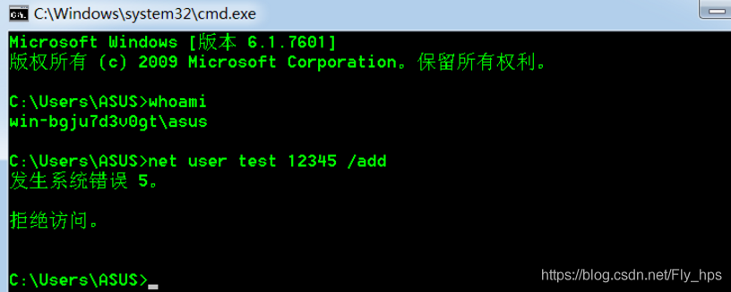
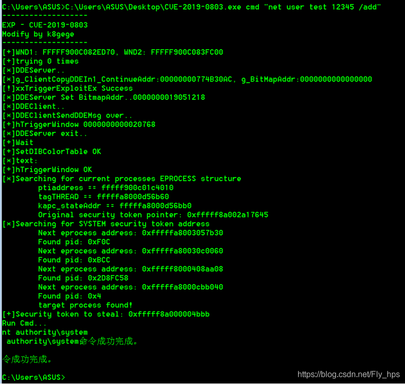
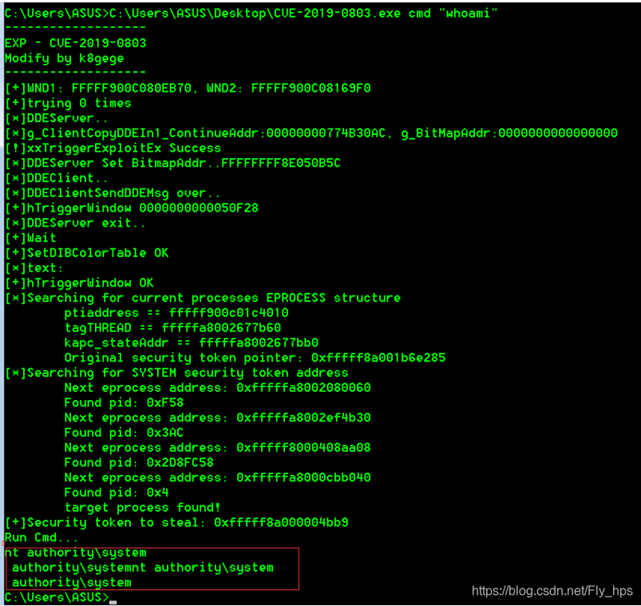

# （CVE-2019-0803）Win32K组件提权

<!-- vulwiki-editorial-rebuild:system-misc -->
## 条目范围与校订

- 本文对象：Windows Win32k
- 文献类型：Win32k二进制利用演示
- 版本、权限及部署边界：本地Win7虚拟机，未列SP/build/架构；公开二进制执行
- 核验状态：仅重建文本校订；未执行文中代码、PoC 或扫描，未把截图或转载声明记为本站复现

### 具体结论与待核项

以下为原归档的逐项勘误与证据缺口；可由文本确定的问题已在下文订正，仍缺来源的事实保持待核。

1. version元数据只取Server2019并带0，正文大量末尾0是列表抽取噪声不应当版本号
2. 仅给第三方预编译exe无源码/提交/摘要，需追溯二进制来源；不执行该文件
3. 创建新test账号是持久系统改动，不是最低限度提权证明；需前后身份日志/清理说明
4. 根因仅通用内存对象介绍，缺具体测试补丁状态及官方MSRC/KB，不能从win7例子泛化全矩阵
5. 原CSDN链接保留，关键命令/结果在未视检图片，正文与命令模板有缺口

### 操作风险

创建新test账号是持久系统改动，不是最低限度提权证明；需前后身份日志/清理说明

技术请求、代码与实验方法按原文保留；其中的破坏性动作仅限授权、可恢复的隔离环境。缺失代码、参数或版本事实不猜补。

### 来源追溯

- 原文参考链接（未重新核验）：<https://github.com/k8gege/K8tools/raw/master/CVE-2019-0803.exe>
- 原文参考链接（未重新核验）：<https://blog.csdn.net/Fly_hps/article/details/104236695>
- 原始披露 URL 未确认；既有归档来源标签保留，不能替代原始公告

### 归档技术正文

## 影响范围

```
Microsoft Windows Server 2019 0
Microsoft Windows Server 2016 0
Microsoft Windows Server 2012 R2 0
Microsoft Windows Server 2012 0
Microsoft Windows Server 2008 R2 for x64-based Systems SP1
Microsoft Windows Server 2008 R2 for Itanium-based Systems SP1
Microsoft Windows Server 2008 for x64-based Systems SP2
Microsoft Windows Server 2008 for Itanium-based Systems SP2
Microsoft Windows Server 2008 for 32-bit Systems SP2
Microsoft Windows Server 1803 0
Microsoft Windows Server 1709 0
Microsoft Windows RT 8.1
Microsoft Windows 8.1 for x64-based Systems 0
Microsoft Windows 8.1 for 32-bit Systems 0
Microsoft Windows 7 for x64-based Systems SP1
Microsoft Windows 7 for 32-bit Systems SP1
Microsoft Windows 10 Version 1809 for x64-based Systems 0
Microsoft Windows 10 Version 1809 for ARM64-based Systems 0
Microsoft Windows 10 Version 1809 for 32-bit Systems 0
Microsoft Windows 10 Version 1803 for x64-based Systems 0
Microsoft Windows 10 Version 1803 for ARM64-based Systems 0
Microsoft Windows 10 Version 1803 for 32-bit Systems 0
Microsoft Windows 10 version 1709 for x64-based Systems 0
Microsoft Windows 10 Version 1709 for ARM64-based Systems 0
Microsoft Windows 10 version 1709 for 32-bit Systems 0
Microsoft Windows 10 version 1703 for x64-based Systems 0
Microsoft Windows 10 version 1703 for 32-bit Systems 0
Microsoft Windows 10 Version 1607 for x64-based Systems 0
Microsoft Windows 10 Version 1607 for 32-bit Systems 0
Microsoft Windows 10 for x64-based Systems 0
Microsoft Windows 10 for 32-bit Systems 0
```


## 漏洞简介

Win32k 组件无法正确处理内存中的对象时，可导致特权提升。成功利用此漏洞的攻击者可以在内核模式中运行任意代码、安装任意程序、查看、更改或删除数据、或者创建拥有完全用户权限的新帐户。

## 漏洞复现

下载EXP：https://github.com/k8gege/K8tools/raw/master/CVE-2019-0803.exe

CVE-2019-0803使用方法：

 

```
CVE-2019-0803.exe cmd "cmdline"
```

上传EXP到win 7虚拟机内，之后查看一下当前用户发现是普通用户且无法建立新的用户：



把上传的CVE-2019-0803拖进cmd里，创建新用户test



查看当前用户——"whoami"，成功晋升为系统管理权限，成功提权！



### **漏洞EXP**

https://github.com/k8gege/K8tools/raw/master/CVE-2019-0803.exe


> https://blog.csdn.net/Fly_hps/article/details/104236695

