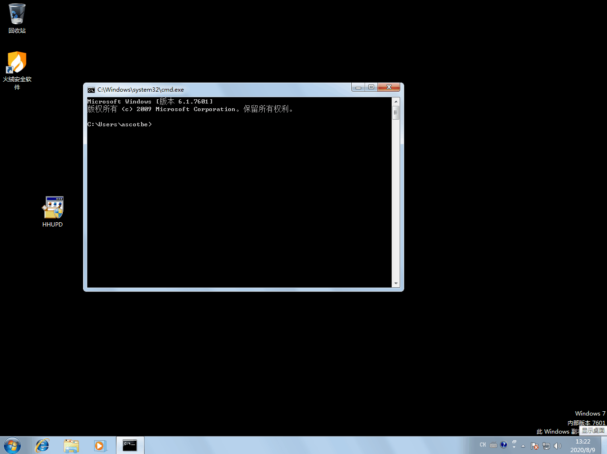

# （CVE-2019-1388）Windows UAC提权漏洞

<!-- vulwiki-editorial-rebuild:system-misc -->
## 条目范围与校订

- 本文对象：Windows UAC consent.exe Secure Desktop
- 文献类型：UAC漏洞摘要与GIF索引
- 版本、权限及部署边界：本地GUI交互；签名文件HHUPD.EXE、证书界面/关联浏览器等链条件正文缺失；具体测试版本未列
- 核验状态：仅重建文本校订；未执行文中代码、PoC 或扫描，未把截图或转载声明记为本站复现

### 具体结论与待核项

以下为原归档的逐项勘误与证据缺口；可由文本确定的问题已在下文订正，仍缺来源的事实保持待核。

1. 只解释安全桌面原则，没有具体UI触发/浏览器/证书链步骤，全依赖GIF，无法独立复现
2. version仅首行Server2019，实际多平台清单缺构建/KB和GUI条件；Server Core边界也需说明
3. HHUPD.EXE是触发用二进制不是完整源码，需来源签名/哈希与可信原始来源；不执行
4. MSRC/Kernelhub可追溯，标题.md清理，GIF未视检，不要把一般UAC绕过与本CVE自动同义

### 操作风险

原文技术操作的实际副作用未复现核验；按其请求/代码评估状态变更、凭据暴露和业务影响

技术请求、代码与实验方法按原文保留；其中的破坏性动作仅限授权、可恢复的隔离环境。缺失代码、参数或版本事实不猜补。

### 来源追溯

- 原文参考链接（未重新核验）：<https://portal.msrc.microsoft.com/en-US/security-guidance/advisory/CVE-2019-1388>
- 原文参考链接（未重新核验）：<https://github.com/Ascotbe/WindowsKernelExploits/blob/master/CVE-2019-1388/HHUPD.EXE>
- 原文参考链接（未重新核验）：<https://github.com/Ascotbe/Kernelhub/tree/master/CVE-2019-1388>
- 原始披露 URL 未确认；既有归档来源标签保留，不能替代原始公告

### 归档技术正文

#### 描述

该漏洞位于Windows的UAC（User Account Control，用户帐户控制）机制中。默认情况下，Windows会在一个单独的桌面上显示所有的UAC提示——Secure Desktop。这些提示是由名为consent.exe的可执行文件产生的，该可执行文件以NT AUTHORITY\SYSTEM权限运行，完整性级别为System。因为用户可以与该UI交互，因此必须对UI进行严格限制。否则，低权限的用户可能可以通过UI操作的循环路由以SYSTEM权限执行操作。即使隔离状态的看似无害的UI特征都可能会成为引发任意控制的动作链的第一步。事实上，UAC对话框已被精简，仅包含最少的可单击选项。

#### 影响版本

```
Microsoft Windows Server 2019
Microsoft Windows Server 2016
Microsoft Windows Server 2012
Microsoft Windows Server 2008 R2
Microsoft Windows Server 2008
Microsoft Windows RT 8.1
Microsoft Windows 8.1
Microsoft Windows 7
```

#### 修复补丁

```
https://portal.msrc.microsoft.com/en-US/security-guidance/advisory/CVE-2019-1388
```

#### 利用方式

这边直接贴一个GIF图就好了，利用文件位置

```
https://github.com/Ascotbe/WindowsKernelExploits/blob/master/CVE-2019-1388/HHUPD.EXE
```

[](../../../Web%E5%AE%89%E5%85%A8/.resource/remote/0c1ff7d4895d960c83581b81ad1a951a74f9c70d0f568717fb9869f6746e2f2f.gif)

> https://github.com/Ascotbe/Kernelhub/tree/master/CVE-2019-1388