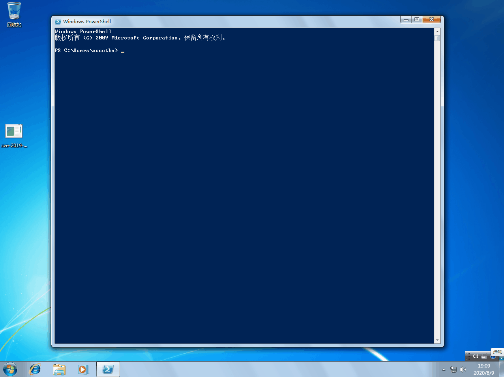

# （CVE-2019-1458）Win32k本地提权

<!-- vulwiki-editorial-rebuild:system-misc -->
## 条目范围与校订

- 本文对象：Windows Win32k
- 文献类型：Win32k编译与GIF索引
- 版本、权限及部署边界：本地低权，v120 x64 Release；测试OS/补丁build未明示，影响清单含多架构
- 核验状态：仅重建文本校订；未执行文中代码、PoC 或扫描，未把截图或转载声明记为本站复现

### 具体结论与待核项

以下为原归档的逐项勘误与证据缺口；可由文本确定的问题已在下文订正，仍缺来源的事实保持待核。

1. version只首行Win10 1607x86与唯一编译x64混淆，应拆受影响与样例架构字段
2. 仅通用根因加文件名/GIF，无命令/前后权限/测试构建；不能作为完整复现
3. VS2019/v120需额外工具集，Kernelhub源码入口应固定提交/具体文件；修复MSRC存在但无KB
4. 表中Itanium等架构与支持范围需官方核验；标题.md噪声清理，GIF未读

### 操作风险

原文技术操作的实际副作用未复现核验；按其请求/代码评估状态变更、凭据暴露和业务影响

技术请求、代码与实验方法按原文保留；其中的破坏性动作仅限授权、可恢复的隔离环境。缺失代码、参数或版本事实不猜补。

### 来源追溯

- 原文参考链接（未重新核验）：<https://portal.msrc.microsoft.com/en-US/security-guidance/advisory/CVE-2019-1458>
- 原文参考链接（未重新核验）：<https://github.com/Ascotbe/Kernelhub/tree/master/CVE-2019-1458>
- 原始披露 URL 未确认；既有归档来源标签保留，不能替代原始公告

### 归档技术正文

#### 描述

CVE-2019-1458是Win32k中的特权提升漏洞，Win32k组件无法正确处理内存中的对象时，导致Windows中存在一个特权提升漏洞。成功利用此漏洞的攻击者可以在内核模式下运行任意代码。然后攻击者可能会安装程序、查看、更改或删除数据；或创建具有完全用户权限的新帐户。

#### 影响版本

```
Microsoft Windows 10 Version 1607 for 32-bit Systems
Microsoft Windows 10 Version 1607 for x64-based Systems
Microsoft Windows 10 for 32-bit Systems
Microsoft Windows 10 for x64-based Systems
Microsoft Windows 7 for 32-bit Systems SP1
Microsoft Windows 7 for x64-based Systems SP1
Microsoft Windows 8.1 for 32-bit Systems
Microsoft Windows 8.1 for x64-based Systems
Microsoft Windows RT 8.1
Microsoft Windows Server 2008 R2 for Itanium-based Systems SP1
Microsoft Windows Server 2008 R2 for x64-based Systems SP1
Microsoft Windows Server 2008 for 32-bit Systems SP2
Microsoft Windows Server 2008 for Itanium-based Systems SP2
Microsoft Windows Server 2008 for x64-based Systems SP2
Microsoft Windows Server 2012
Microsoft Windows Server 2012 R2
Microsoft Windows Server 2016
```

#### 修复补丁

```
https://portal.msrc.microsoft.com/en-US/security-guidance/advisory/CVE-2019-1458
```

#### 利用方式

编译环境

- VS2019（V120）X64 Release

编译好的文件

```
cve-2019-1458.exe
```

然后直接上GIF图

[](../../../Web%E5%AE%89%E5%85%A8/.resource/remote/72c0c924b882c419149771bef74378b62d909a3408523f9c0313a0c2bce52dec.gif)


> https://github.com/Ascotbe/Kernelhub/tree/master/CVE-2019-1458