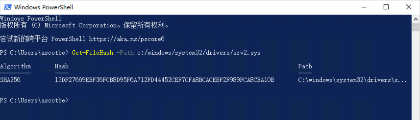
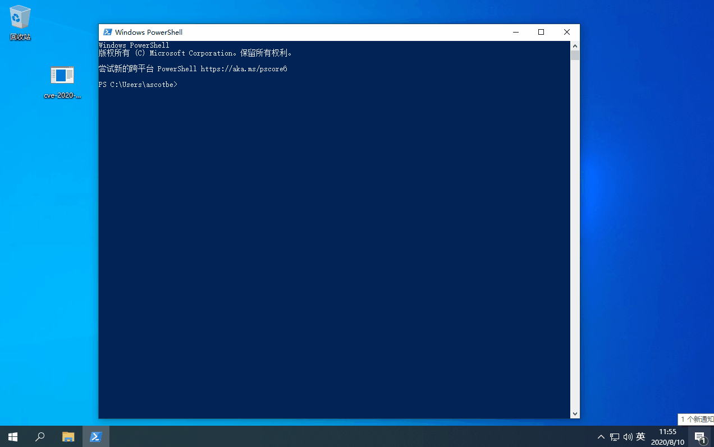

# （CVE-2020-0796）Windows 本地提权漏洞

<!-- vulwiki-editorial-rebuild:system-misc -->
## 条目范围与校订

- 本文对象：Windows SMB压缩 srv2.sys
- 文献类型：SMBGhost本地提权编译索引
- 版本、权限及部署边界：Windows10 1903x64测试；v142 x64 Debug；本地SMB服务/未修复压缩代码，其他1909平台仅范围
- 核验状态：仅重建文本校订；未执行文中代码、PoC 或扫描，未把截图或转载声明记为本站复现

### 具体结论与待核项

以下为原归档的逐项勘误与证据缺口；可由文本确定的问题已在下文订正，仍缺来源的事实保持待核。

1. 影响明确1903/1909但利用段又称Server2016，内部版本冲突需纠正
2. 写查看MD5但Get-FileHash没有-Algorithm，默认算法非MD5，应校正文字或命令
3. 只本地提权样例，开头远程未认证风险与当前方式应区分且加历史日期
4. 与长篇SMBGhost正文互补仅编译/镜像/哈希检查，可并入主记录引用，保留danigargu源码归属
5. 二进制/镜像未固定hash、测试补丁build缺失；MSRC链接有价值，GIF未视检，标题过泛

### 操作风险

原文技术操作的实际副作用未复现核验；按其请求/代码评估状态变更、凭据暴露和业务影响

技术请求、代码与实验方法按原文保留；其中的破坏性动作仅限授权、可恢复的隔离环境。缺失代码、参数或版本事实不猜补。

### 来源追溯

- 原文参考链接（未重新核验）：<https://portal.msrc.microsoft.com/en-US/security-guidance/advisory/CVE-2020-0796>
- 原文参考链接（未重新核验）：<https://github.com/Ascotbe/WindowsKernelExploits/blob/master/CVE-2020-0796/cve-2020-0796-local.exe>
- 原文参考链接（未重新核验）：<https://github.com/danigargu/CVE-2020-0796>
- 原文参考链接（未重新核验）：<https://github.com/Ascotbe/Kernelhub/tree/master/CVE-2020-0796>
- 原始披露 URL 未确认；既有归档来源标签保留，不能替代原始公告

### 归档技术正文

#### 描述

该漏洞无需授权验证即可被远程利用，可能形成蠕虫级漏洞。目前利用方式是提权

#### 影响版本

```
Windows 10 Version 1903 for 32-bit Systems
Windows 10 Version 1903 for x64-based Systems
Windows 10 Version 1903 for ARM64-based Systems
Windows Server, version 1903 (Server Core installation)
Windows 10 Version 1909 for 32-bit Systems
Windows 10 Version 1909 for x64-based Systems
Windows 10 Version 1909 for ARM64-based Systems
Windows Server, version 1909 (Server Core installation)
只影响 SMB v3.1.1，1903和1909
```

#### 修复补丁

```
https://portal.msrc.microsoft.com/en-US/security-guidance/advisory/CVE-2020-0796
```

#### 利用方式

这个有点鸡肋特定的windows10 才行还有一个Windows Server 2016

编译方式

- VS2019（V142）X64 Debug

编译好的文件位置

```
https://github.com/Ascotbe/WindowsKernelExploits/blob/master/CVE-2020-0796/cve-2020-0796-local.exe
```

环境下载，这边用的是windows 10 Version 1903

```
ed2k://|file|cn_windows_10_business_editions_version_1903_x64_dvd_e001dd2c.iso|4815527936|47D4C57E638DF8BF74C59261E2CE702D|/
```

查看MD5值

```
Get-FileHash -Path c:/windows/system32/drivers/srv2.sys
```

[](https://github.com/Ascotbe/Random-img/blob/master/WindowsKernelExploits/5.png?raw=true)

然后就直接上GIF图了

[](https://github.com/Ascotbe/Random-img/blob/master/WindowsKernelExploits/6.gif?raw=true)

#### 项目来源

- [@danigargu](https://github.com/danigargu/CVE-2020-0796)

> https://github.com/Ascotbe/Kernelhub/tree/master/CVE-2020-0796