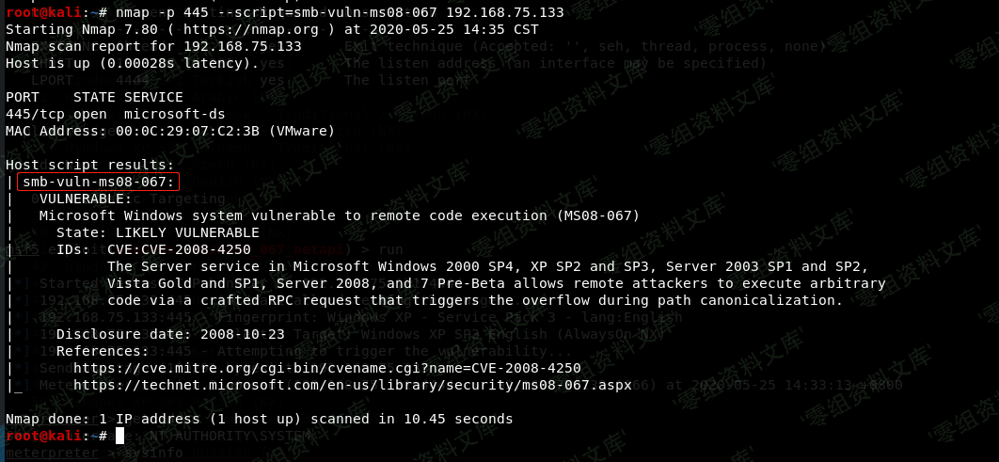
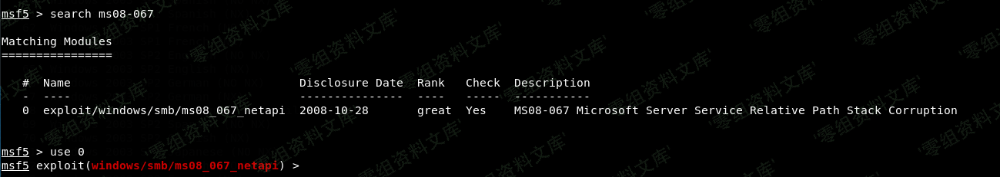
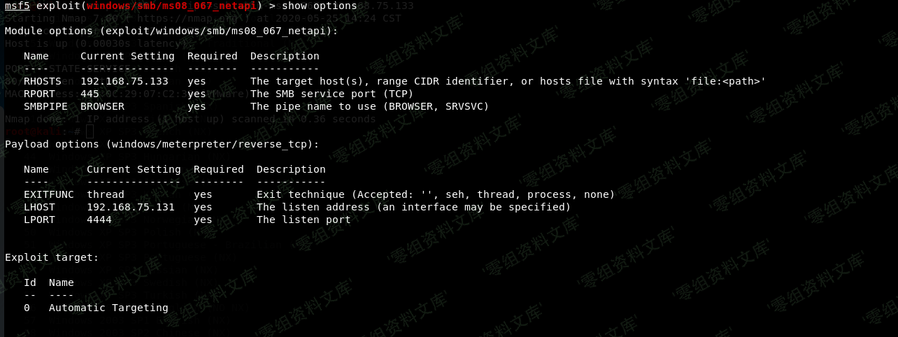
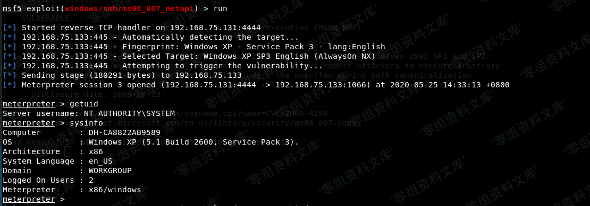
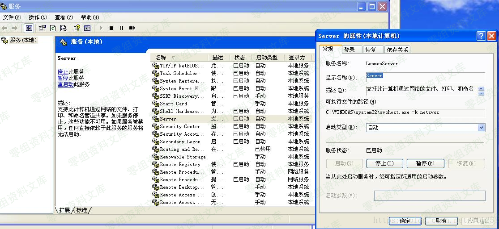

# （） MS08-067 Windows远程溢出漏洞 CVE-2008-4250

<!-- vulwiki-editorial-rebuild:system-misc -->
## 条目范围与校订

- 本文对象：Windows Server Service NetPathCanonicalize
- 文献类型：MS08-067实验与错误排查
- 版本、权限及部署边界：旧Windows、SMB/MSRPC服务可达；文内XP例子但构建/SP/认证模式不详
- 核验状态：仅重建文本校订；未执行文中代码、PoC 或扫描，未把截图或转载声明记为本站复现

### 具体结论与待核项

以下为原归档的逐项勘误与证据缺口；可由文本确定的问题已在下文订正，仍缺来源的事实保持待核。

1. 路径规范化说明把反斜线转成空引号，明显转义损坏；命令/图片链接附重复路径需恢复
2. 具体配置全图，缺可检索target/payload/版本，无法独立复现；Win7 Beta等影响版本需官方原始公告核对
3. 连接失败可能多因，不应统一要求开放445或LocalAccountTokenFilterPolicy=1；后者放宽远程UAC且非MS08-067通用必需条件
4. 利用登录故障与系统安全配置例外应限定隔离实验环境并给恢复/影响，不当通用修复指南
5. 无补丁/正式缓解或原始来源，图未视检；与深度MS08-067教程待关联

### 操作风险

原文技术操作的实际副作用未复现核验；按其请求/代码评估状态变更、凭据暴露和业务影响

技术请求、代码与实验方法按原文保留；其中的破坏性动作仅限授权、可恢复的隔离环境。缺失代码、参数或版本事实不猜补。

### 来源追溯

- 原始披露 URL 未确认；既有归档来源标签保留，不能替代原始公告

### 归档技术正文

（CVE-2008-4250）【MS08-067】Windows远程溢出漏洞
================================================

一、漏洞简介
------------

CVE-2008-4250微软编号为MS08-067，根据微软安全漏洞公告，基本可以了解其原理：\
MS08-067漏洞是通过MSRPC over
SMB通道调用Server服务程序中的NetPathCanonicalize函数时触发的，而NetPathCanonicalize函数在远程访问其他主机时，会调用NetpwPathCanonicalize函数，对远程访问的路径进行规范化（将路径字符串中的\'/\'转换为\'\',同时去除相对路径\".\"和\"..\"），而在NetpwPathCanonicalize函数中发生了栈缓冲区内存错误，造成可被利用实施远程代码执行。

二、漏洞影响
------------

Windows 2000;XP;Server 2003;Server 2008;7 Beta

三、复现过程
------------

**nmap -p 445 \--script=smb-vuln-ms08-067 192.168.75.133**\
【MS08-067】Windows远程溢出漏洞/media/rId24.png)

使用msf，进入ms08-067利用模块

【MS08-067】Windows远程溢出漏洞/media/rId25.png)

配置设置为如下

【MS08-067】Windows远程溢出漏洞/media/rId26.png)

run 运行 成功获得session

【MS08-067】Windows远程溢出漏洞/media/rId27.png)

### 踩坑（一）连接拒绝

    [-] 192.168.48.151:445 - Exploit failed [unreachable]: Rex::ConnectionRefused The connection was refused by the remote host (192.168.48.151:445).

开启Windows XP 的445端口和Server服务

【MS08-067】Windows远程溢出漏洞/media/rId29.png)

### 踩坑（二）登录失败

    [-] 192.168.48.151:445 - Exploit failed [no-access]: Rex::Proto::SMB::Exceptions::LoginError Login Failed: The server responded with error: STATUS_LOGON_FAILURE (Command=115 WordCount=0)

首先检测SMBPass的值是否正确

> Win + R打开gpedit.msc

依次打开

> 本地计算机策略 - \>计算机配置 - \> Windows设置 - \>安全设置 -
> \>本地策略 - \>安全选项

修改网络访问：本地帐户的共享和安全模式为经典 - 本地用户身份验证

### 踩坑（三）共享服务不允许远程访问

较新的Windows系统默认情况下是不允许的

    [-] 192.168.48.144:445 - Exploit failed [no-access]: Rex::Proto::SMB::Exceptions::ErrorCode The server responded with error: STATUS_ACCESS_DENIED (Command=117 WordCount=0)

将注册表中LocalAccountTokenFilterPolicy的值更改为1

    HKEY_LOCAL_MACHINE\SOFTWARE\Microsoft\Windows\CurrentVersion\Policies\System

如果下面没有该文件，直接新建一个（DWORD32位）
